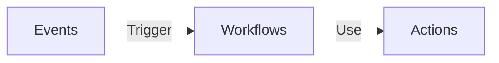

# Learning Documentation

This project hold all the information and knowledge I gathered through my experiences


---

- [Learning Documentation](#learning-documentation)
  - [Tree](#tree)
    - [Installing tree](#installing-tree)
    - [Tree usage](#tree-usage)
    - [Tree options](#tree-options)
  - [SSH](#ssh)
    - [Create SSH](#create-ssh)
      - [SSH-keygen Options](#ssh-keygen-options)
    - [Validate SSH](#validate-ssh)
    - [Check SSH public key](#check-ssh-public-key)
  - [ASDF](#asdf)
    - [ASDF Install](#asdf-install)
    - [ASDF Plugins](#asdf-plugins)
      - [Adding plugin dependencies](#adding-plugin-dependencies)
      - [Adding ASDF Plugins](#adding-asdf-plugins)
      - [Listing versions through ASDF Plugins](#listing-versions-through-asdf-plugins)
    - [Installing through ASDF Plugins](#installing-through-asdf-plugins)
    - [Updating through ASDF Plugins](#updating-through-asdf-plugins)
    - [Set version with ASDF Plugins](#set-version-with-asdf-plugins)
  - [Tableplus](#tableplus)
    - [Tableplus Linux installation](#tableplus-linux-installation)
  - [Git and Github](#git-and-github)
    - [cherry-pick](#cherry-pick)
      - [cherry-pick single commit](#cherry-pick-single-commit)
      - [cherry-pick multiple commits](#cherry-pick-multiple-commits)
    - [Submodules](#submodules)
      - [Adding submodule](#adding-submodule)
      - [Pull for all submodules for the first time](#pull-for-all-submodules-for-the-first-time)
      - [Pull each submodule](#pull-each-submodule)
      - [Submodule issues](#submodule-issues)
    - [Subtrees](#subtrees)
      - [Adding subtree](#adding-subtree)
      - [Updating subtree](#updating-subtree)
        - [Pulling changes](#pulling-changes)
        - [Pushing changes](#pushing-changes)
    - [Tags](#tags)
      - [Listing tags](#listing-tags)
      - [Creating tags](#creating-tags)
      - [Search tags](#search-tags)
    - [Git lfs / Large files on Github](#git-lfs--large-files-on-github)
      - [Extension installation](#extension-installation)
        - [First download the git-lfs file](#first-download-the-git-lfs-file)
        - [Download additional script](#download-additional-script)
        - [First install](#first-install)
      - [Git lfs usage](#git-lfs-usage)
        - [Tracking files](#tracking-files)
    - [Github actions](#github-actions)
      - [Events](#events)
      - [Workflows](#workflows)
    - [Git commands table](#git-commands-table)
    - [Advanced `diff`](#advanced-diff)
  - [Awesome Fonts](#awesome-fonts)
    - [Ruby on Rails install](#ruby-on-rails-install)
      - [Usage on Rails](#usage-on-rails)
  - [Learning Projects](#learning-projects)
  - [Handling Images](#handling-images)
    - [Installing ImageMagick](#installing-imagemagick)
    - [ImageMagick convert](#imagemagick-convert)
      - [SVG TO PNG](#svg-to-png)
      - [PSD TO PNG](#psd-to-png)
      - [Common ImageMagick issue](#common-imagemagick-issue)
    - [Installing Potrace](#installing-potrace)
      - [BMP to SVG](#bmp-to-svg)
  - [Digital Ocean](#digital-ocean)
    - [Adding you SSH public key to Digital Ocean](#adding-you-ssh-public-key-to-digital-ocean)
    - [Adding SSH public key manually for existing Droplets](#adding-ssh-public-key-manually-for-existing-droplets)
    - [Paste SSH key to the `authorized_keys` file](#paste-ssh-key-to-the-authorized_keys-file)
    - [Access Droplet with SSH](#access-droplet-with-ssh)
    - [Copying files from a droplet](#copying-files-from-a-droplet)
    - [Running server from droplet](#running-server-from-droplet)
  - [AWS CLI](#aws-cli)
  - [MinIO](#minio)
  - [Issues](#issues)
    - [Ubuntu sharing entire screen](#ubuntu-sharing-entire-screen)
    - [Note shutdown with lid down even in power](#note-shutdown-with-lid-down-even-in-power)
    - [Increasing-the-amount-of-inotify-watchers](#increasing-the-amount-of-inotify-watchers)
    - [Error](#error)
    - [Fix](#fix)
    - [Deprecated trusted.gpg](#deprecated-trustedgpg)
      - [List source list](#list-source-list)
      - [Backup source list](#backup-source-list)
      - [Remove all source lists](#remove-all-source-lists)
      - [Update and upgrade apts](#update-and-upgrade-apts)
  - [Concepts](#concepts)
    - [Daemon processes](#daemon-processes)
    - [Product Manager vs Product Owner](#product-manager-vs-product-owner)
    - [User Story Framework](#user-story-framework)
      - [Workflow](#workflow)
        - [Theme](#theme)
        - [Initiative](#initiative)
        - [Epic](#epic)
        - [Story](#story)
        - [Task, Subtask, Chores](#task-subtask-chores)
        - [Bug](#bug)
    - [Serialization](#serialization)
    - [Versioning](#versioning)
      - [Build versioning](#build-versioning)
      - [Calendar versioning](#calendar-versioning)
      - [Semantic versioning](#semantic-versioning)
        - [Milestone version](#milestone-version)
    - [File permissions](#file-permissions)
    - [Readme](#readme)
    - [Changelog](#changelog)
      - [Cron jobs](#cron-jobs)
      - [Keep a Changelog](#keep-a-changelog)
    - [What is a Slug?](#what-is-a-slug)
    - [Absolute and Relative paths](#absolute-and-relative-paths)
    - [Public Page No Index](#public-page-no-index)
  - [References](#references)
  - [Gists](#gists)

## Tree

### Installing tree

```shell
sudo apt-get install tree
```

### Tree usage

```shell
tree files/
```

**Output:**

```mono
files/
├── flows.md
├── notes.md
├── scratch.json
└── scratch.md
```

### Tree options

|    Option     | Description                                         |
| :-----------: | :-------------------------------------------------- |
|      -a       | list all files, hidden files included               |
|      -d       | list only subdirectories                            |
|      -f       | list file absolute path                             |
|      -p       | list file with permissions                          |
|  -P pattern   | List only those files that match the pattern given. |
|  -I pattern   | Do not list files that match the given pattern.     |
| --filelimit=N | list files within a limit                           |
|    −−help     | shows tree help                                     |
|   −−version   | shows tree version                                  |

## SSH

### Create SSH

**Basic:**

```shell
ssh-keygen
```

**With options:**

```shell
ssh-keygen -t rsa -b 4096 -C "joe@example.com"
```

#### SSH-keygen Options

### Validate SSH

```shell
eval "$(ssh-agent -s)"
```

### Check SSH public key

```shell
cat ~/.ssh/id_rsa.pub
```

## ASDF

### ASDF Install

> Remember to check current branch to download <https://asdf-vm.com/guide/getting-started.html#_1-install-dependencies>

```shell
git clone https://github.com/asdf-vm/asdf.git ~/.asdf --branch v0.10.2
echo -e '\n. $HOME/.asdf/asdf.sh' >> ~/.bashrc
echo -e '\n. $HOME/.asdf/completions/asdf.bash' >> ~/.bashrc
```

> Reboot OS after install

### ASDF Plugins

#### Adding plugin dependencies

Each plugin has dependencies so we need to check the plugin repo where they should be listed. For asdf-nodejs they are:

```shell
sudo apt-get install dirmngr gpg curl gawk build-essential libssl-dev
```

> some installations might require more of libs

```shell
sudo apt-get install -y make build-essential libssl-dev zlib1g-dev libbz2-dev libreadline-dev libsqlite3-dev wget curl llvm libncurses5-dev libncursesw5-dev xz-utils tk-dev libffi-dev liblzma-dev libreadline-dev
```

#### Adding ASDF Plugins

```shell
asdf plugin add nodejs https://github.com/asdf-vm/asdf-nodejs.git
asdf plugin-add python https://github.com/tuvistavie/asdf-python.git
asdf plugin-add ruby https://github.com/asdf-vm/asdf-ruby.git
asdf plugin-add lua https://github.com/Stratus3D/asdf-lua.git
asdf plugin-add yarn https://github.com/twuni/asdf-yarn.git
asdf plugin-add java https://github.com/halcyon/asdf-java.git
```

#### Listing versions through ASDF Plugins

```shell
asdf list-all ruby
```

### Installing through ASDF Plugins

```shell
asdf install ruby 3.1.0
```

### Updating through ASDF Plugins

```shell
asdf plugin-update --all
```

### Set version with ASDF Plugins

Global

```shell
asdf global nodejs X.X.X
```

Local

```shell
asdf local nodejs X.X.X
```

## Tableplus

### Tableplus Linux installation

```shell
wget -qO - http://deb.tableplus.com/apt.tableplus.com.gpg.key | sudo apt-key add -
sudo add-apt-repository "deb [arch=amd64] https://deb.tableplus.com/debian/22 tableplus main"
sudo apt update
sudo apt install tableplus
```

## Git and Github

### cherry-pick

Cherry pick commits allow you to copy commit from one branch to another

#### cherry-pick single commit

```shell
git cherry-pick COMMIT_HASH
```

#### cherry-pick multiple commits

To get multiple commit we use the two commits hash representing "from", "to" and add operator `^..` between them

```shell
git cherry-pick COMMIT_A^..COMMIT_B
```

- A must be older than B
- If you want get all commits but ignore A, you only `A..B`
- in `ZSH` needs to use `'A^..B` or `'A..B`

### Submodules

Git also allow you to link dependencies as submodules does you can manage  your repos with a project structure

To add a submodule first you need to have a remote repo to be attached as submodule

#### Adding submodule

**Through https - OLD:**

```shell
git submodule add https://github.com/LucasBarretto86/LearningLOVE.git
```

**Through SSH:**

```shell
git submodule add git@github.com:LucasBarretto86/LearningLOVE.git
```

As added a submodule you can control it's versions within the specific module directory

```shell
cd LearningLove

touch test.txt
git add test.txt
git commit -m"Committing directly with a submodule"
git push
```

#### Pull for all submodules for the first time

```shell
git submodule update --init --recursive
git pull --recurse-submodule
```

#### Pull each submodule

```shell
git submodule foreach git pull origin main
```

#### Submodule issues

Sometimes a repo that has submodules does not fully updates so here there's few lines you may use

- Remove `.git` caches Re-adding modules and Re-downloading

Within the modules root folder

```shell
# Cleaning submodules and repo indexes
rm -Rf .git/modules/*
rm .git/index

# Adding modules again, before doing this you can check submodules path within the file .gitmodules
cd *SUBMODULES_FOLDER*
git submodule add git@github.com:*USER_NAME*/*REPO_NAME*.git

# Pull from each submodule
cd ..
git submodule foreach git pull origin main
```

### Subtrees

Subtree is very similar to submodules, however subtree allow you to bring in external repos by merging it and squashing

#### Adding subtree

```shell
git subtree add --prefix {local directory being pulled into} {remote repo URL} {remote branch} --squash
```

#### Updating subtree

To update subtrees you have to use pull and push referring the prefix and the remote repos path

##### Pulling changes

```shell
git subtree pull --prefix {local directory being pulled into} {remote repo URL} {remote branch} --squash
```

##### Pushing changes

```shell
git subtree push --prefix {local directory being pulled into} {remote repo URL} {remote branch}
```

### Tags

#### Listing tags

```shell
git tag
```

#### Creating tags

```shell
git tag -a v2.3.4 -m "[2.3.4] - 2022-04-25"
```

#### Search tags

### Git lfs / Large files on Github

Git has an extension to control larger files

#### Extension installation

First is required to download files

##### First download the git-lfs file

<https://github.com/git-lfs/git-lfs/releases>

##### Download additional script

```shell
curl -s https://packagecloud.io/install/repositories/github/git-lfs/script.deb.sh?os=Ubuntu&dist=kinnect&source=script | sudo bash
```

##### First install

Within the `git-lfs-3.2.0` folder

```shell
sudo ./install.sh
```

#### Git lfs usage

```shell
git lfs install
```

##### Tracking files

Within the repo with large files start tracking files

```shell
git lfs track "*.capx"
```

### Github actions

Actions allows us to set automatization that run over a repository triggered by events, mostly the actions are used to run linters, CI, deploy, builds, and etc...



All configuration is setup using YAML

**Example:**

```yml
on:
  issues:
    types:
      - opened

jobs:
  label_issue:
    runs-on: ubuntu-latest
    steps:
      - env:
          GITHUB_TOKEN: ${{ secrets.MY_TOKEN }}
          ISSUE_URL: ${{ github.event.issue.html_url }}
        run: |
          gh issue edit $ISSUE_URL --add-label "triage"
```

#### Events

Events establishes when a workflow should be triggered

Some of the most common triggers are:

- push
- pull_request
- public
- fork
- label
- workflow_dispatch
- schedule

To automatically trigger a workflow, use on to define which events can cause the workflow to run.

**`schedule` trigger examples:**

```yml
on:
  schedule:
  - cron: 0 12 * * 1 
```

**`label` trigger example:**

```yml
on:
  label:
    types:
      - created
```

It's also possible to define multiple triggers

```yml
on: [push, fork]
  # - do something
```

OR

```yml
on:
  label:
    types:
      - created
  push:
    branches:
      - main
```

It's also possible to have multiple types

```yml
on:
  label:
    types: [created, edited]
```

To see more available workflow triggers go to <https://docs.github.com/en/actions/using-workflows/events-that-trigger-workflows>

#### Workflows

A workflow is a configurable automated process that will run one or more jobs, it is also defined by YAML file, which has to saved under `workflows` directory

```tree
.github
└── workflows
    └── markdown-linter.yml
```

Workflow basically runs sequenced pre-existing actions or shell scripts

**Workflow YAML file example using pre existing:**

```yml
name: Code Linting

on: push

jobs:
  MarkdownLinter:
    runs-on: ubuntu-latest
    steps:
      - uses: actions/checkout@v1

      - name: Markdown Lint
        uses: avto-dev/markdown-lint@v1
        with:
          config: "./.markdownlintrc"
          args: "./README.md ./specifics/*.md"
          ignore: "./CHANGELOG.md ./unorganized_documents/* ./files/*"
```

> In some cases we might to add specific args it depend on the action itself, so we might check the action repo

### Git commands table

| Command                                                                                                                                                                                                                 | Description                                                                                                         |
| :---------------------------------------------------------------------------------------------------------------------------------------------------------------------------------------------------------------------- | :------------------------------------------------------------------------------------------------------------------ |
| `git rm -r --cached .`                                                                                                                                                                                                  | Clear git cache for all files                                                                                       |
| `git branch                                                                | grep -v "main"                                                                                                      | xargs git branch -D` | Clean git branches                                                                                                  |
| `git branch -M NEW_NAME`                                                                                                                                                                                                | Renaming branch and origin                                                                                          |
| `git branch -m NEW_NAME`                                                                                                                                                                                                | Renaming branch locally                                                                                             |
| `git reset --soft HEAD~1`                                                                                                                                                                                               | Retrieve one commit `~1`  and return it to stage                                                                    |
| `git reset --hard`                                                                                                                                                                                                      | Undo every change not committed, also allow you to undo commits with flag `HEAD~1`                                  |
| `git push --force`                                                                                                                                                                                                      | Force push in case it diverge from origin - Careful, no rollback                                                    |
| `git push --set-upstream origin BRANCH_NAME`                                                                                                                                                                            | Push and set upstream                                                                                               |
| `git fetch --prune`                                                                                                                                                                                                     | Updates existing branches                                                                                           |
| `git branch -vv`                                                                                                                                                                                                        | Branch status                                                                                                       |
| `git config --global user.name USER_NAME`                                                                                                                                                                               | Set global user name                                                                                                |
| `git config --global user.email USER_EMAIL`                                                                                                                                                                             | Set global user email                                                                                               |
| `git config --global user.password PASSWORD`                                                                                                                                                                            | Set global user password                                                                                            |
| `git config --global init.defaultBranch BRANCH_NAME`                                                                                                                                                                    | To redefine initial branch name globally                                                                            |
| `git revert -m 1 COMMIT_SHA`                                                                                                                                                                                            | Revert changes from a commit                                                                                        |
| `git rebase BRANCH`                                                                                                                                                                                                     | Sync local branch with another specific branch, conflicts may happen and `git push --force` might be need !Careful! |
| `git remote add origin git@github.com:USER_NAME/REPO_NAME.git`                                                                                                                                                          | Add repo as remote                                                                                                  |
| `git submodule add origin git@github.com:USER_NAME/REPO_NAME.git`                                                                                                                                                       | Add repo as submodule                                                                                               |
| `git submodule update`                                                                                                                                                                                                  | To make pull in every submodule                                                                                     |
| `git submodule update MODULE_PATH`                                                                                                                                                                                      | To make pull in specific submodule                                                                                  |
| `git subtree add --prefix PATH_NAME REMOTE_REPO_URL BRANCH_NAME --squash`                                                                                                                                               | To add a subtree to the project                                                                                     |
| `git subtree pull --prefix PATH_NAME REMOTE_REPO_URL BRANCH_NAME --squash`                                                                                                                                              | To pull changes from original repo                                                                                  |
| `git subtree push --prefix PATH_NAME REMOTE_REPO_URL BRANCH_NAME --squash`                                                                                                                                              | To push changes to a specific repo                                                                                  |

### Advanced `diff`

**Diff to external file:**

```sh
git diff --staged > diff.txt
```

> `>` to create a file `>>` to add to an existing file

**Diff between branches:**

```sh
git diff branch_name..another_branch
```

**Diff truncate:**

```sh
git diff -U5 -w branch_name..another_branch
```

> In this example, `-U5` specifies that only 5 lines of unified context should be included for each change, and `-w` ignores whitespace changes.

## Awesome Fonts

- Create profile to generate the snippet we gonna use to trigger the lib
<https://www.w3schools.com/icons/fontawesome5_intro.asp#:~:text=To%20use%20the%20Free%20Font>,Awesome%20to%20your%20web%20page.

### Ruby on Rails install

First add on the gemfile

```gemfile
gem "font-awesome-sass", "~> 6.3.0"
```

```mono
bundle install
```

After we need to add the import line on the `application.scss`

```scss
// app/assets/stylesheets/application.scss

@import "font-awesome";
```

> If you are using importmaps don't forget to run: `rails assets:precompile`

Depending on where you want to use FontAwesome, you will need to add the script tag generated on your profile to link the lib, this can be found at

```html
<!-- app/views/layouts/application.html.erb -->

<!DOCTYPE html>
<html>
  <head>
    <title>Patients Intermediary App</title>
    <meta name="viewport" content="width=device-width,initial-scale=1">
    <%= csrf_meta_tags %>
    <%= csp_meta_tag %>

    <%= stylesheet_link_tag "application", "data-turbo-track": "reload" %>
    <%= javascript_importmap_tags %>
    <script src="https://kit.fontawesome.com/323h4jk32h4l2j123.js" crossorigin="anonymous"></script>
  </head>

  <body>
    ...
  </body>
</html>

```

#### Usage on Rails

**Example:**

```rb
<%= icon("fa-solid", "note-sticky", class: "fa-1x") %>
```

but you still can use with html on .erb

```html
<i class="fa-solid fa-x1 fa-note-sticky"></i>
```

## Learning Projects

- [Learning Assembly](https://github.com/LucasBarretto86/LearningAssembly)
- [Learning C++](https://github.com/LucasBarretto86/LearningCPP)
- [Learning CSS](https://github.com/LucasBarretto86/LearningCSS)
  - [Learning SCSS](https://github.com/LucasBarretto86/LearningCSS/tree/main/LearningSCSS/README.md)
- [Learning Docker](https://github.com/LucasBarretto86/LearningDocker)
- [Learning HTML](https://github.com/LucasBarretto86/LearningHTML)
- [Learning Java](https://github.com/LucasBarretto86/LearningJava)
- [Learning JS](https://github.com/LucasBarretto86/LearningJS)
  - [Learning ExpressJS](https://github.com/LucasBarretto86/LearningJS/tree/main/LearningExpressJS/README.md)
  - [Learning MochaAndChai](https://github.com/LucasBarretto86/LearningJS/tree/main/LearningMochaAndChai/README.md)
  - [Learning ReactJS](https://github.com/LucasBarretto86/LearningJS/tree/main/LearningReactJS/README.md)
- [Learning LINUX](https://github.com/LucasBarretto86/LearningLinux)
- [Learning LOVE](https://github.com/LucasBarretto86/LearningLOVE)
  - [Learning Lua](https://github.com/LucasBarretto86/LearningLOVE/tree/main/LearningLua/README.md)
- [Learning Markdown](https://github.com/LucasBarretto86/LearningMarkdown)
- [Learning Mermaid](https://github.com/LucasBarretto86/LearningMermaid)
- [Learning Python](https://github.com/LucasBarretto86/LearningPython)
- [Learning Ruby on Rails](https://github.com/LucasBarretto86/LearningRubyOnRails)
  - [Learning Ruby](https://github.com/LucasBarretto86/LearningRubyOnRails/tree/main/LearningRuby/README.md)
    - [Learning Gosu](https://github.com/LucasBarretto86/LearningRubyOnRails/tree/main/LearningGosu/README.md)
- [Learning SQL](https://github.com/LucasBarretto86/LearningSQL)
  - [Learning Postgres](https://github.com/LucasBarretto86/LearningSQL/tree/main/LearningPostgresSQL/README.md)

## Handling Images

### Installing ImageMagick

```shell
sudo apt install imagemagick
```

### ImageMagick convert

#### SVG TO PNG

```shell
convert -background -quality 100 *.svg -set filename:base "%[basename]" "%[filename:base].png"
```

#### PSD TO PNG

```shell
convert  *.psd -set filename:base "%[basename]" -quality 100 "%[filename:base].png"
convert cover.ai cover.png
```

#### Common ImageMagick issue

ImageMagick is very demanding so you gonna find some problems if you attempt to convert many files

```mono
convert-im6.q16: cache resources exhausted `301612577831.png' @ error/cache.c/OpenPixelCache/4095.
```

In that ca you might need to adjust policy.xml

Find the policy.xml, commonly you find here `/etc/ImageMagick-6/policy.xml`

```shell
find / -name "policy.xml"
```

> In case you need to search for the correct path

Withing the xml file find and change this two lines below:

```xml
<!-- /etc/ImageMagick-6/policy.xml -->

<!-- FROM -->
<policy domain="resource" name="disk" value="1GiB"/>

<!-- TO -->
<policy domain="resource" name="disk" value="8GiB"/>
```

You can edit on nano or any other text editor

```shell
# Nano
nano /etc/ImageMagick-6/policy.xml

# Sublime
subl /etc/ImageMagick-6/policy.xml
```

### Installing Potrace

Potrace(TM) is a tool for tracing a bitmap, which means, transforming a bitmap into a smooth, scalable image. It only traces black and white input images

```shell
sudo apt install potrace
```

#### BMP to SVG

```shell
potrace example.bmp -s -o example.svg
```


## Digital Ocean

### Adding you SSH public key to Digital Ocean

1. First generate or copy your id_rsa.pub
2. Navigate on DO dashboard and add your id_rsa.pub, you will find here: settings/security

> **Notice:** that adding SSH public only new droplets will be creating with you public key, if the droplet you are trying access was created prior to the SSH definition you will have to add your key manually as below:

### Adding SSH public key manually for existing Droplets

1. Access the droplet you want to add your SSH key through the browser console
2. Within the droplet you will have to paste your SSH public key to the `authorized_keys` file
3. From you local console access the droplet

### Paste SSH key to the `authorized_keys` file

```shell
mkdir -p ~/.ssh
nano ~/.ssh/authorized_keys
```

> After open the file on nano, paste your public key and save it and that's it

### Access Droplet with SSH

```shell
ssh -i root@vm-ip
```

### Copying files from a droplet

To copy files we basically will use `SCP` command

```shell
scp -r root@droplet_ip:/file/path/ /where/to/save/file
```

**Example:**

```shell
scp -r root@167.99.229.118:~/Downloads/production_latest_backup.dump ~/
```

### Running server from droplet

```shell
ssh -L 3005:localhost:3000 -C -N -l root 146.190.208.106
```

## AWS CLI

<https://softhints.com/download-files-s3-bucket-aws-cli-linux-mint/>

Simple install for aws CLI using root credentials

```shell
sudo pip install aws CLI
```

```shell
aws configure
```

```mono
AWS Access Key ID [****************SB5M]: 
AWS Secret Access Key [****************efwC]: 
Default region name [sa-east-1]: 
Default output format [json]: 
```

```shell
aws s3 cp s3://bolt-gf-development/quicksilver_v2/patients/ ~/Downloads/AWS/bolt-gf-development --recursive
```

## MinIO

<https://saveincloud.com/pt/blog/armazenamento/saiba-o-que-e-e-como-funciona-o-minio/>

<https://linuxhint.com/installing_minio_ubuntu/>

## Issues

### Ubuntu sharing entire screen

```shell
sudo nano /etc/gdm3/custom.conf
```

basically just uncomment line bellow

```mono
# /etc/gdm3/custom.conf
...

[daemon]
# Uncomment the line below to force the login screen to use Xorg
WaylandEnable=false
```

after that save and reboot

### Note shutdown with lid down even in power

```shell
sudo nano /etc/systemd/logind.conf
```

Change the line `HandleLidSwitch=suspend` for one of the following

| Value     | Description           |
| :-------- | :-------------------- |
| lock      | lock when lid closed. |
| ignore    | do nothing.           |
| poweroff  | shutdown.             |
| hibernate | hibernate Ubuntu.     |

save config and restart services

```shell
systemctl restart systemd-logind.service
```

### Increasing-the-amount-of-inotify-watchers

### Error

```shell
FATAL: Listen error: unable to monitor directories for changes.
Visit https://github.com/guard/listen/wiki/Increasing-the-amount-of-inotify-watchers for info on how to fix this.
```

### Fix

```shell
echo fs.inotify.max_user_watches=524288 | sudo tee -a /etc/sysctl.conf && sudo sysctl -p
```

### Deprecated trusted.gpg

> W: <https://deb.tableplus.com/debian/22/dists/tableplus/InRelease>: Key is stored in legacy trusted.gpg keyring (/etc/apt/trusted.gpg), see the DEPRECATION section in apt-key(8) for details.

1. [List source lists](#list-source-list)
2. [Backup source list](#backup-source-list)
3. [Remove all source lists](#remove-all-source-lists)
4. [Update and upgrade apts](#update-and-upgrade-apts)

#### List source list

```shell
ls -l /etc/apt/sources.list.d
```

**Output:**

```mono
total 24
-rw-r--r-- 1 root root   0 dez 30 13:19 archive_uri-https_deb_tableplus_com_debian_20-kinetic.list
-rw-r--r-- 1 root root   0 dez 30 13:19 archive_uri-https_deb_tableplus_com_debian_20-kinetic.list.save
-rw-r--r-- 1 root root 142 jan  5 16:23 archive_uri-https_deb_tableplus_com_debian_22-kinetic.list
-rw-r--r-- 1 root root  68 jan  5 16:15 archive_uri-https_deb_tableplus_com_debian_22-kinetic.list.save
-rw-r--r-- 1 root root 190 jan  5 16:23 google-chrome.list
-rw-r--r-- 1 root root 190 jan  5 16:15 google-chrome.list.save
-rw-r--r-- 1 root root   0 jan  5 16:15 google.list
-rw-r--r-- 1 root root   0 jan  5 16:15 google.list.save
-rw-r--r-- 1 root root  74 jan  5 16:35 pgdg.list
-rw-r--r-- 1 root root  62 jan  5 16:15 pgdg.list.save
```

#### Backup source list

```shell
sudo cp /etc/apt/sources.list.d /etc/apt/sources.list.d.backup -r
```

#### Remove all source lists

```shell
sudo rm /etc/apt/sources.list.d/*
```

#### Update and upgrade apts

```shell
sudo apt update
sudo apt upgrade
sudo apt dist-upgrade
sudo apt autoremove
sudo apt install update-manager-core
sudo do-release-upgrade
```

## Concepts

### Daemon processes

Daemon process in a nutshell is a process that runs on the background, daemon processes can be trigger by the OS silently, an example of daemon process is the Network Time Protocol (NTP) daemon is used to measure time differences between the clock on the computer it runs on and those of all other computers on the network.

**Read more:**

<https://www.techtarget.com/whatis/definition/daemon>

### Product Manager vs Product Owner


### User Story Framework


In agile management the breakdown

#### Workflow


- [Theme](#theme)
- [Initiative](#initiative)
- [Epic](#epic)
- [Story](#story)
- [Task, Subtask, Chores](#task-subtask-chores)
- [Bug](#bug)

##### Theme

##### Initiative

##### Epic

##### Story

##### Task, Subtask, Chores

##### Bug

### Serialization

Basically serialize is the process to convert data to a byte stream that will represent an object to another end

[What is serialization](https://www.freecodecamp.org/news/what-is-serialization/)

### Versioning

Basically it defines how to set unique sequential identification for a software, there is few schemes to do version:

- Build versioning
- Calendar versioning
- Semantic versioning
- Milestone versioning
  
#### Build versioning

Simple V1, V2, V3

#### Calendar versioning

It's basically set version based on current year, month, day. Used mostly to softwares that have consistent yearly or monthly releases, ubuntu is a good example:


Typically the format used is `YY.MM.DD` or `YYYY.MM`

It's also common to add a unique after the date schema to specify a hotfix: `YY.MM.HOTFIX` or `YY.MM.DD.HOTFIX`

```mono
21.04.1
21.04.2
```

#### Semantic versioning

Semantic versioning is perhaps the most used way to make clear versions, the semantic versioning are `MAJOR.MINOR.PATCH`

- PATCH - Means that this version is implementing a hotfix and it's backward compatible
- MINOR - Means we are introducing a new feature, a new functionality that is also backward compatible and if there's any dependency installation or upgrade it won't require any change on the current code base.
- MAJOR - Increment the major version means that the new features or the code changes that are being implemented isn't backward compatible, which means the whole application will be effected

But there's some rules, whenever a MINOR version is implemented the PATCH version becomes `0`, Whenever a MAJOR version is implemented both MINOR and PATCH version becomes `0`

```md
**Patch change**
- 1.0.1
- 1.0.2
- ...
- 1.0.20

**Minor change**
- 1.1.0
- 1.2.0
- ...
- 1.15.0

**Major change**
- 2.0.0
- 3.0.0
- ...
- 10.0.0
```

Semantic version can also use suffixes to describe if a release is in  `pre-alpha`, `alpha`, `beta`, `close-beta` phases, it normally means that this releases are mostly available for testing purposes

```md
1.0.1b
1.0.2-beta
1.0.2-alpha
1.0.2-alpha-1
1.0.2-alpha.2
1.0.2a
```


##### Milestone version

Basically is a version number or a name given at random or decided arbitrarily, mostly for marketing reasons

### File permissions

<https://www.magenteiro.com/blog/para-magenteiros/permissoes-um-jeito-simples-de-entender/>

### Readme

A README file it's the first file you should create for a project, this file should contain the most important information to assist consumers and developers about your application, a good README also provide a better understanding from the current state, goals and progress from your project

These are some important subjects that a good README should describe:

- Titles and internal titles
- Introduction - the project's aim
- Technologies
- Launch

Consider also using additional elements such as:

- Table of contents
- Illustrations
- Scope of functionalities
- Examples of use
- Project status
- Sources
- Other information

<https://bulldogjob.com/readme/how-to-write-a-good-readme-for-your-github-project>

<https://github.com/matiassingers/awesome-readme>

<https://www.yegor256.com/2019/04/23/elegant-readme.html>

<https://github.com/jehna/readme-best-practices#readme>

<https://gist.github.com/luvuong-le/ec9eaa582c34b1403d1b811fbc5c51d7>

Badges

<https://shields.io/>

### Changelog

#### Cron jobs

#### Keep a Changelog

It's a set of rules to organize changelog from a project to understand how it works see: <http://keepachangelog.com/en/1.0.0/>

[CHANGELOG EXAMPLE](/files/CHANGELOG.md)

### What is a Slug?

What is a Slug? A slug is the last part of the url containing a unique string which identifies the resource being served by the web service. In that sense, a slug is a unique identifier for the resource.

### Absolute and Relative paths

An absolute, or full, path begins with a drive letter followed by a colon, such as D:.

A relative path refers to a location that is relative to a current directory. Relative paths make use of two special symbols, a dot (.) and a double-dot (..), which translate into the current directory and the parent directory. Double dots are used for moving up in the hierarchy. A single dot represents the current directory itself.

In the example directory structure below, assume you used Windows Explorer to navigate to `D:\Data\Shapefiles\Soils`. After navigating to this directory, a relative path will use `D:\Data\Shapefiles\Soils` as the current directory (until you navigate to a new directory, at which point the new directory becomes the current directory). The current directory is sometimes referred to as the root directory.

### Public Page No Index

<https://www.siteguru.co/seo-academy/when-to-use-meta-robots-noindex-tags>

## References

- [S.O.L.I.D](https://www.digitalocean.com/community/conceptual_articles/s-o-l-i-d-the-first-five-principles-of-object-oriented-design)
- [GraphQL vs REST](https://www.imaginarycloud.com/blog/graphql-vs-rest/)
- [Serialization](https://www.freecodecamp.org/news/what-is-serialization/)
- [Web Developer Playbook: Slug](https://medium.com/dailyjs/web-developer-playbook-slug-a6dcbe06c284)
- [Paths explained: Absolute, relative, UNC, and URL](https://desktop.arcgis.com/en/arcmap/10.3/tools/supplement/pathnames-explained-absolute-relative-unc-and-url.htm#GUID-5118AC85-57E4-4027-AC24-FB6E99FADEFF)
- [User Story Framework](https://en.wikipedia.org/wiki/User_story)
- [Why the PM and the PO should be the same person](https://www.delibr.com/post/product-manager-vs-product-owner)
- [Keep a changelog](http://keepachangelog.com/en/1.0.0/)

## Gists

[Random Stuff](https://gist.github.com/LucasBarretto86/2cc6e13a894d29b811d66604389edf3c)
