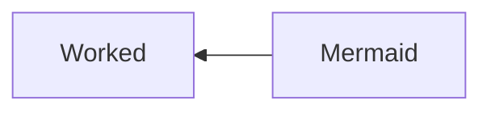
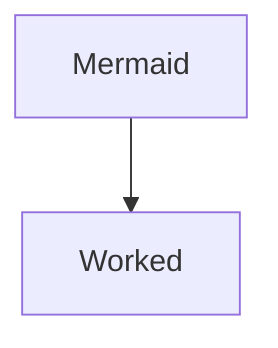

# Learning Documentation

- [Learning Documentation](#learning-documentation)
  - [SSH](#ssh)
    - [Create SSH](#create-ssh)
    - [Validate SSH](#validate-ssh)
    - [Check SSH public key](#check-ssh-public-key)
  - [ASDF](#asdf)
    - [ASDF Install](#asdf-install)
    - [ASDF Plugins](#asdf-plugins)
      - [Adding plugin dependencies](#adding-plugin-dependencies)
      - [Listing ASDF Plugins](#listing-asdf-plugins)
      - [Adding ASDF Plugins](#adding-asdf-plugins)
    - [Installing through ASDF Plugins](#installing-through-asdf-plugins)
    - [Updating through ASDF Plugins](#updating-through-asdf-plugins)
    - [Set version with ASDF Plugins](#set-version-with-asdf-plugins)
  - [Tableplus](#tableplus)
    - [Tableplus Linux installation](#tableplus-linux-installation)
  - [Git and Github](#git-and-github)
    - [Submodules](#submodules)
      - [Adding submodule](#adding-submodule)
      - [Adding subtree](#adding-subtree)
      - [Updating subtree](#updating-subtree)
        - [Pulling changes](#pulling-changes)
        - [Pushing changes](#pushing-changes)
    - [Tags](#tags)
      - [Listing tags](#listing-tags)
      - [Creating tags](#creating-tags)
      - [Search tags](#search-tags)
    - [Git commands table](#git-commands-table)
    - [Markdown Diagrams](#markdown-diagrams)
      - [Mermaid Diagrams](#mermaid-diagrams)
        - [Fluxogram Left to Right](#fluxogram-left-to-right)
        - [Fluxogram Right to Left](#fluxogram-right-to-left)
        - [Fluxogram Top Down](#fluxogram-top-down)
  - [Heroku](#heroku)
    - [Staging Deployment](#staging-deployment)
  - [Languages Learning](#languages-learning)
  - [Handling Images](#handling-images)
    - [Installing ImageMagick](#installing-imagemagick)
      - [SVG TO PNG](#svg-to-png)
      - [PSD TO PNG](#psd-to-png)
    - [Installing Potrace](#installing-potrace)
      - [BMP to SVG](#bmp-to-svg)
  - [CURL](#curl)
  - [YARN](#yarn)
    - [Add new dependency](#add-new-dependency)
      - [add only in dev](#add-only-in-dev)
    - [Reinstall all dependencies](#reinstall-all-dependencies)
    - [Adding multiple dependencies version](#adding-multiple-dependencies-version)
    - [Downloading files](#downloading-files)
  - [Concepts](#concepts)
    - [Serialization](#serialization)
  - [References](#references)
  - [Gists](#gists)

## SSH

### Create SSH

```shell
ssh-keygen -t rsa -b 4096 -C "joe@example.com"
```

### Validate SSH

```shell
eval "$(ssh-agent -s)"
```

### Check SSH public key

```shell
cat ~/.ssh/id_rsa.pub
```

## ASDF

### ASDF Install

```shell
git clone https://github.com/asdf-vm/asdf.git ~/.asdf --branch v0.4.0
echo -e '\n. $HOME/.asdf/asdf.sh' >> ~/.bashrc
echo -e '\n. $HOME/.asdf/completions/asdf.bash' >> ~/.bashrc
```

### ASDF Plugins

#### Adding plugin dependencies

Each plugin has dependencies so we need to check the plugin repo where they should be listed. For asdf-nodejs they are:

```shell
apt-get install dirmngr gpg curl gawk
```

#### Listing ASDF Plugins

```shell
asdf list-all ruby
```

#### Adding ASDF Plugins

```shell
asdf plugin add nodejs https://github.com/asdf-vm/asdf-nodejs.git
asdf plugin-add python https://github.com/tuvistavie/asdf-python.git
asdf plugin-add ruby https://github.com/asdf-vm/asdf-ruby.git
asdf plugin-add lua https://github.com/Stratus3D/asdf-lua.git
```

### Installing through ASDF Plugins

```shell
asdf  install ruby 3.1.0
```

### Updating through ASDF Plugins

```shell
asdf plugin-update --all
```

### Set version with ASDF Plugins

Global

```shell
asdf global nodejs 16.5.0
```

Local

```shell
asdf local nodejs 12.23.0
```

## Tableplus

### Tableplus Linux installation

```shell
wget -qO - http://deb.tableplus.com/apt.tableplus.com.gpg.key | sudo apt-key add -
sudo add-apt-repository "deb [arch=amd64] https://deb.tableplus.com/debian/20 tableplus main"
sudo apt update
sudo apt install tableplus
```

## Git and Github

### Submodules

Git also allow you to link dependencies as submodules does you can manage  your repos with a project structure

To add a submodule first you need to have a remote repo to be attached as submodule

#### Adding submodule

```shell
git submodule add https://github.com/LucasBarretto86/LearningLOVE.git
```

As added a submodule you can control it's versions withint the specific module directory

```shell
cd LearningLove

touch test.txt
git add test.txt
git commit -m"Commiting directly with a submodule"
git push
```

#### Adding subtree

Subtree is very similar to submodules, however subtree allow you to bring in external repos by merging it and squashing

```shell
git subtree add --prefix {local directory being pulled into} {remote repo URL} {remote branch} --squash
```

#### Updating subtree

To update subtress you have to use pull and push refering the prefix and the remote repos path

##### Pulling changes

```shell
git subtree pull --prefix {local directory being pulled into} {remote repo URL} {remote branch} --squash
```

##### Pushing changes

```shell
git subtree push --prefix {local directory being pulled into} {remote repo URL} {remote branch}
```

### Tags

#### Listing tags

```shell
git tag
```

#### Creating tags

```shell
git tag -a v2.3.4 -m "[2.3.4] - 2022-04-25"
```

#### Search tags

### Git commands table

| Command|Description |
| :--- |:---- |
|`git rm -r --cached .`| Clear git cache for all files |
|`git branch | grep -v "main" | xargs git branch -D`| Clean git branches |
|`git branch -M NEW_NAME`| Renaming branch and origin
|`git branch -m NEW_NAME`| Renaming branch locally |
|`git reset --soft HEAD~1`| Retrieve one commit `~1`  and return it to stage |
|`git reset --hard`| Undo every change not commited, also allow you to undo commits with flag `HEAD~1` |
|`git push --force`| Force push in case it diverge from origin - Careful, no rollback |
|`git push --set-upstream origin BRANCH_NAME`| Push and set upstream |
|`git fetch --prune`| Updates existing branches|
|`git branch -vv`| Branch status|
|`git config --global user.name USER_NAME`| Set global user name|
|`git config --global user.email USER_EMAIL`| Set global user email|
|`git config --global user.password PASSWORD`| Set global user password|
|`git revert -m 1 COMMIT_SHA`| Revert changes from a commit|
|`git rebase BRANCH`| Sync loca branch with another specific branch, conflicts may happen and `git push --force` might be need !Careful!|
|`git remote add origin https://github.com/USER_NAME/REPO_NAME.git`| Add repo as remote|
|`git submodule add origin https://github.com/USER_NAME/REPO_NAME.git`| Add repo as submodule|
|`git submodule update`| To make pull in every submodule |
|`git submodule update MODULE_PATH`| To make pull in specific submodule |
|`git subtree add --prefix PATH_NAME REMOTE_REPO_URL BRANCH_NAME --squash`| To add a subtree to the project |
|`git subtree pull --prefix PATH_NAME REMOTE_REPO_URL BRANCH_NAME --squash`| To pull changes from original repo |
|`git subtree push --prefix PATH_NAME REMOTE_REPO_URL BRANCH_NAME --squash`| To push changes to a specific repo |

### Markdown Diagrams

#### Mermaid Diagrams

##### Fluxogram Left to Right

~~~txt
  ```mermaid
  graph LR
  Mermaid --> Worked
  ```
~~~

Output:


##### Fluxogram Right to Left

~~~txt
  ```mermaid
  graph RL
  Mermaid --> Worked
  ```
~~~

Output:



##### Fluxogram Top Down

~~~txt
  ```mermaid
  graph
  Mermaid --> Worked
  ```
~~~

Output:



## Heroku

### Staging Deployment

## Languages Learning

- [Learning CSS](https://github.com/LucasBarretto86/LearningCSS)
- [Learning JS]([specifics/js.md](https://github.com/LucasBarretto86/LearningJS))
- [Learning Lua](https://github.com/LucasBarretto86/LearningLua)
- [Learning LOVE](https://github.com/LucasBarretto86/LearningLOVE)
- [Learning Markdown](https://github.com/LucasBarretto86/LearningMarkdown)
- [Learning Postgres](https://github.com/LucasBarretto86/LearningSQL/src/Postgres/README.md)
- [Learning Python](https://github.com/LucasBarretto86/LearningPython)
- [Learning ReactJS](https://github.com/LucasBarretto86/LearningReactJS)|
- [Learning Ruby on Rails](https://github.com/LucasBarretto86/LearningRubyOnRails)
- [Learning SQL](https://github.com/LucasBarretto86/LearningSQL)

## Handling Images

### Installing ImageMagick

```shell
sudo apt install Imagemagick
```

#### SVG TO PNG

```shell
convert -background -quality 100 *.svg -set filename:base "%[basename]" "%[filename:base].png"
```

#### PSD TO PNG

```shell
convert  *.psd -set filename:base "%[basename]" -quality 100 "%[filename:base].png"
convert cover.ai cover.png
```

### Installing Potrace

Potrace(TM) is a tool for tracing a bitmap, which means, transforming a bitmap into a smooth, scalable image. It only traces black and white input images

```shell
sudo apt install potrace
```

#### BMP to SVG

```shell
potrace example.bmp -s -o example.svg
```


## CURL

## YARN

### Add new dependency

```shell
yarn add dependency_name
```

#### add only in dev

```shell
yarn add dependency_name -D
```

### Reinstall all dependencies

```shell
yarn install --check-files
```

### Adding multiple dependencies version

new dependency syntax -> "`dependency-alias`": "npm:`dependency-name@version`"
older dependency syntax -> "`dependency-name`": "`version`"

```json
// package.json
{
  "dependencies": {
    "@analytics": "npm:analytics@^0.6.2",
    "@analytics/google-analytics": "^0.5.2",
    "@apollo/client/updated": "npm:apollo/client@^3.6.2",
    "@apollo/client": "3.5.8"
  }
}

```

### Downloading files

```shell
curl https://emoji.slack-edge.com/T58JKBZJS/merged/adb3ef9def323d9a.png --output  ~/Downloads/images/merged.png
```

## Concepts

### Serialization

Basically serialize is the process to convert data to a byte stream that will represent an object to another end

[What is serialization](https://www.freecodecamp.org/news/what-is-serialization/)

## References

| Reference |
| :---- |
|[S.O.L.I.D](https://www.digitalocean.com/community/conceptual_articles/s-o-l-i-d-the-first-five-principles-of-object-oriented-design) |
|[GraphQL vs REST](https://www.imaginarycloud.com/blog/graphql-vs-rest/) |
|[Serialization](https://www.freecodecamp.org/news/what-is-serialization/) |

## Gists

[Random Stuff](https://gist.github.com/LucasBarretto86/2cc6e13a894d29b811d66604389edf3c)
