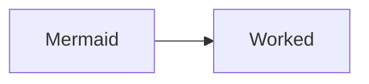
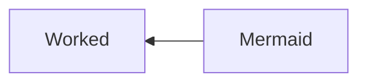
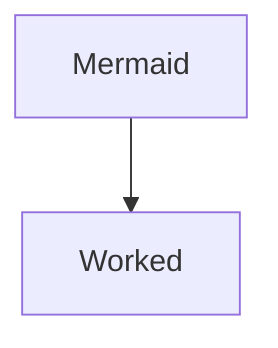

# Learning Documentation

- [Learning Documentation](#learning-documentation)
  - [SSH](#ssh)
    - [Create SSH](#create-ssh)
    - [Validate SSH](#validate-ssh)
    - [Check SSH public key](#check-ssh-public-key)
  - [ASDF](#asdf)
    - [ASDF Install](#asdf-install)
    - [ASDF Plugins](#asdf-plugins)
      - [Adding plugin dependencies](#adding-plugin-dependencies)
      - [Listing ASDF Plugins](#listing-asdf-plugins)
      - [Adding ASDF Plugins](#adding-asdf-plugins)
    - [Installing through ASDF Plugins](#installing-through-asdf-plugins)
    - [Updating through ASDF Plugins](#updating-through-asdf-plugins)
    - [Set version with ASDF Plugins](#set-version-with-asdf-plugins)
  - [Local Web Servers](#local-web-servers)
    - [Building Server with python3](#building-server-with-python3)
    - [Killing Server from a specific port](#killing-server-from-a-specific-port)
  - [Git and Github](#git-and-github)
    - [Git commands table](#git-commands-table)
    - [Markdown Diagrams](#markdown-diagrams)
      - [Mermaid Diagrams](#mermaid-diagrams)
        - [Fluxogram Left to Right](#fluxogram-left-to-right)
        - [Fluxogram Right to Left](#fluxogram-right-to-left)
        - [Fluxogram Top Down](#fluxogram-top-down)
    - [Heroku](#heroku)
      - [Staging Deployment](#staging-deployment)
  - [Languanges Learning](#languanges-learning)
  - [Handling Images](#handling-images)
    - [Installing ImageMagick](#installing-imagemagick)
      - [SVG TO PNG](#svg-to-png)
      - [PSD TO PNG](#psd-to-png)
    - [Installing Potrace](#installing-potrace)
      - [BMP to SVG](#bmp-to-svg)
  - [Concepts](#concepts)
    - [Serialization](#serialization)
  - [References](#references)
  - [Snippets](#snippets)
    - [Checking Computer Hostname](#checking-computer-hostname)

## SSH

### Create SSH

```shell
ssh-keygen -t rsa -b 4096 -C "joe@example.com"
```

### Validate SSH

```shell
eval "$(ssh-agent -s)"
```

### Check SSH public key

```shell
cat ~/.ssh/id_rsa.pub
```

## ASDF

### ASDF Install

```shell
git clone https://github.com/asdf-vm/asdf.git ~/.asdf --branch v0.4.0
echo -e '\n. $HOME/.asdf/asdf.sh' >> ~/.bashrc
echo -e '\n. $HOME/.asdf/completions/asdf.bash' >> ~/.bashrc
```

### ASDF Plugins

#### Adding plugin dependencies

Each plugin has dependencies so we need to check the plugin repo where they should be listed. For asdf-nodejs they are:

```shell
apt-get install dirmngr gpg curl gawk
```

#### Listing ASDF Plugins

```shell
asdf list-all ruby
```

#### Adding ASDF Plugins

```shell
asdf plugin add nodejs https://github.com/asdf-vm/asdf-nodejs.git
asdf plugin-add python https://github.com/tuvistavie/asdf-python.git
asdf plugin-add ruby https://github.com/asdf-vm/asdf-ruby.git
asdf plugin-add lua https://github.com/Stratus3D/asdf-lua.git
```

### Installing through ASDF Plugins

```shell
asdf  install ruby 3.1.0
```

### Updating through ASDF Plugins

```shell
asdf plugin-update --all
```

### Set version with ASDF Plugins

Global

```shell
asdf global nodejs 16.5.0
```

Local

```shell
asdf local nodejs 12.23.0
```

## Local Web Servers

### Building Server with python3

```shell
python3 -m http.server 5505
```

### Killing Server from a specific port

To list any process listening to the port 8080

```shell
lsof -i:8080
```

To kill any process listening to the port 8080

```shell
kill $(lsof -t -i:8080)
```

or more violently

```shell
kill -9 $(lsof -t -i:8080)
```

## Git and Github

### Git commands table

| Command|Description |
| :--- |:---- |
|`git rm -r --cached .`| Clear git cache for all files |
|`git branch | grep -v "main" | xargs git branch -D`| Clean git branches |
|`git branch -M NEW_NAME`| Renaming branch and origin
|`git branch -m NEW_NAME`| Renaming branch locally |
|`git reset --soft HEAD~1`| Retrieve one commit `~1`  and return it to stage |
|`git reset --hard`| Undo every change not commited, also allow you to undo commits with flag `HEAD~1` |
|`git push --force`| Force push in case it diverge from origin - Careful, no rollback |
|`git fetch --prune`| Updates existing branches|
|`git branch -vv`| Branch status|
|`git config --global user.name USER_NAME`| Set global user name|
|`git config --global user.email USER_EMAIL`| Set global user email|
|`git config --global user.password PASSWORD`| Set global user password|
|`git revert -m 1 COMMIT_SHA`| Revert changes from a commit|
|`git rebase BRANCH`| Sync loca branch with another specific branch, conflicts may happen and `git push --force` might be need !Careful!|

### Markdown Diagrams

#### Mermaid Diagrams

##### Fluxogram Left to Right

~~~txt
  ```mermaid
  graph LR
  Mermaid --> Worked
  ```
~~~

Output:



##### Fluxogram Right to Left

~~~txt
  ```mermaid
  graph RL
  Mermaid --> Worked
  ```
~~~

Output:



##### Fluxogram Top Down

~~~txt
  ```mermaid
  graph
  Mermaid --> Worked
  ```
~~~

Output:



### Heroku

#### Staging Deployment

## Languanges Learning

|Language| Markdown|
|:---|:---|
|CSS|[CSS Learning](specifics/css.md)|
|Javascript|[JS Learning](specifics/js.md)|
|Markdown|[Markdown Learning](https://github.com/LucasBarretto86/LearningMarkdown)|
|Postgress|[Postgres Learning](specifics/postgres.md)|
|Python|[Python Learning](specifics/py.md)|
|Random|[Random Learning](specifics/random.md)|
|Ruby|[Ruby Learning](specifics/rb.md)|
|SQL|[SQL Learning](specifics/sql.md)|

## Handling Images

### Installing ImageMagick

```shell
sudo apt install Imagemagick
```

#### SVG TO PNG

```shell
convert -background -quality 100 *.svg -set filename:base "%[basename]" "%[filename:base].png"
```

#### PSD TO PNG

```shell
convert  *.psd -set filename:base "%[basename]" -quality 100 "%[filename:base].png"
convert cover.ai cover.png
```

### Installing Potrace

Potrace(TM) is a tool for tracing a bitmap, which means, transforming a bitmap into a smooth, scalable image. It only traces black and white input images

```shell
sudo apt install potrace
```

#### BMP to SVG

```shell
potrace example.bmp -s -o example.svg
```


## Concepts

### Serialization

Basically serialize is the process to convert data to a byte stream that will represent an object to another end

[What is serialization](https://www.freecodecamp.org/news/what-is-serialization/)

## References

| Reference |
| :---- |
|[S.O.L.I.D](https://www.digitalocean.com/community/conceptual_articles/s-o-l-i-d-the-first-five-principles-of-object-oriented-design) |
|[GraphQL vs REST](https://www.imaginarycloud.com/blog/graphql-vs-rest/) |
|[Learning Markdown](https://github.com/LucasBarretto86/LearningMarkdown#readme) |
|[Serialization](https://www.freecodecamp.org/news/what-is-serialization/) |

## Snippets

### Checking Computer Hostname

```shell
hostname --fqdn
```
