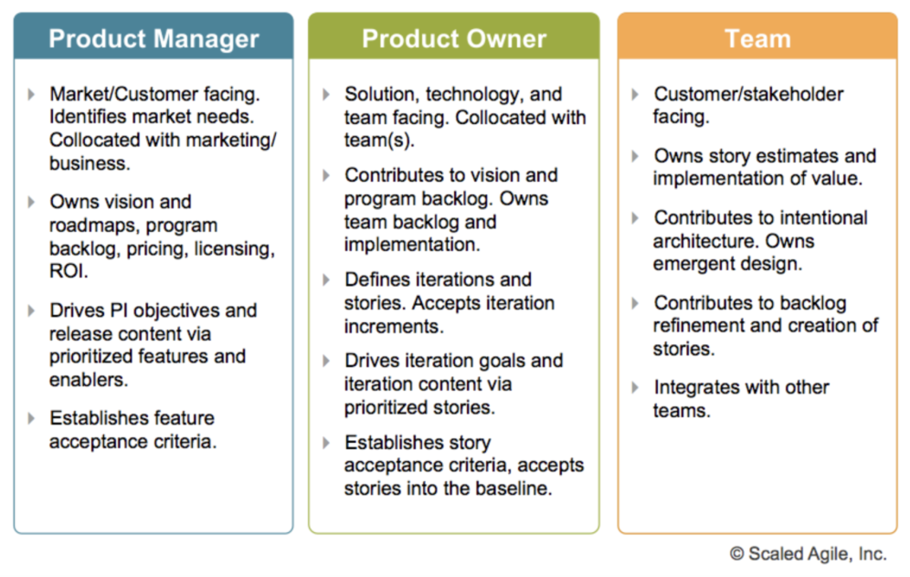
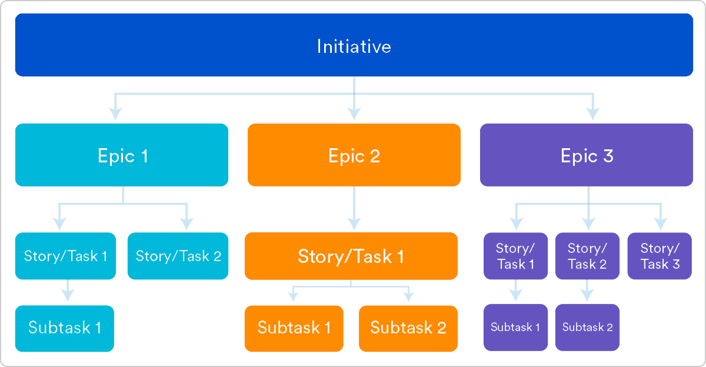
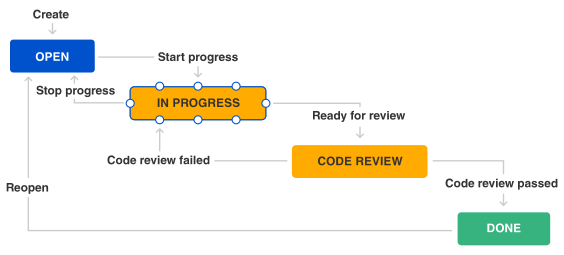
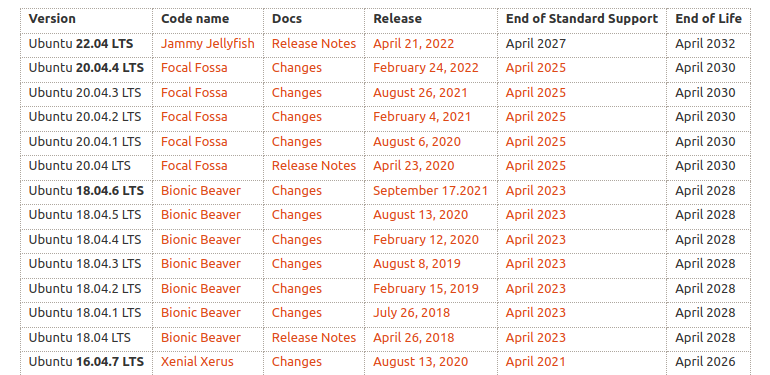

# Learning Documentation

This project hold all the information and knowledge I gathered through my experiences


---

- [Learning Documentation](#learning-documentation)
  - [Tree](#tree)
    - [Installing tree](#installing-tree)
    - [Tree usage](#tree-usage)
    - [Tree options](#tree-options)
  - [SSH](#ssh)
    - [Create SSH](#create-ssh)
      - [SSH-keygen Options](#ssh-keygen-options)
    - [Validate SSH](#validate-ssh)
    - [Check SSH public key](#check-ssh-public-key)
    - [Using existing SHH key](#using-existing-shh-key)
  - [ASDF](#asdf)
    - [ASDF Install](#asdf-install)
    - [ASDF Plugins](#asdf-plugins)
      - [Adding plugin dependencies](#adding-plugin-dependencies)
      - [Adding ASDF Plugins](#adding-asdf-plugins)
      - [Listing versions through ASDF Plugins](#listing-versions-through-asdf-plugins)
    - [Installing through ASDF Plugins](#installing-through-asdf-plugins)
    - [Updating through ASDF Plugins](#updating-through-asdf-plugins)
    - [Set version with ASDF Plugins](#set-version-with-asdf-plugins)
  - [Tableplus](#tableplus)
  - [Awesome Fonts](#awesome-fonts)
    - [Ruby on Rails install](#ruby-on-rails-install)
      - [Usage on Rails](#usage-on-rails)
  - [MongoDB](#mongodb)
    - [Create and setup MongoDB account](#create-and-setup-mongodb-account)
    - [Install MongoDB](#install-mongodb)
      - [Start MongoDB service](#start-mongodb-service)
      - [Check installation](#check-installation)
    - [Connect to Mongo using CLI](#connect-to-mongo-using-cli)
      - [Alias to connect](#alias-to-connect)
    - [Connect App to Mongo](#connect-app-to-mongo)
    - [MongoDB NonSQL basic operations](#mongodb-nonsql-basic-operations)
  - [Digital Ocean](#digital-ocean)
    - [Adding you SSH public key to Digital Ocean](#adding-you-ssh-public-key-to-digital-ocean)
    - [Adding SSH public key manually for existing Droplets](#adding-ssh-public-key-manually-for-existing-droplets)
    - [Paste SSH key to the `authorized_keys` file](#paste-ssh-key-to-the-authorized_keys-file)
    - [Access Droplet with SSH](#access-droplet-with-ssh)
    - [Copying files from a droplet](#copying-files-from-a-droplet)
    - [Running server from droplet](#running-server-from-droplet)
  - [Heroku](#heroku)
    - [Adding remote](#adding-remote)
    - [Pushing branches](#pushing-branches)
    - [Adding bash alias](#adding-bash-alias)
    - [Running on Dynos](#running-on-dynos)
  - [Render](#render)
    - [Render CLI](#render-cli)
  - [Cloud Storage](#cloud-storage)
    - [B2 Cloud Storage](#b2-cloud-storage)
      - [Setup B2 Cloud Storage](#setup-b2-cloud-storage)
        - [Create a B2 Bucket](#create-a-b2-bucket)
        - [Setting CORS](#setting-cors)
        - [Accessing and using B2](#accessing-and-using-b2)
  - [AWS](#aws)
    - [Setup AWS CLI](#setup-aws-cli)
      - [Install AWS CLI](#install-aws-cli)
      - [Checking AWS credentials on CLI](#checking-aws-credentials-on-cli)
      - [Removing unknown existing data](#removing-unknown-existing-data)
      - [Adding new profile credentials](#adding-new-profile-credentials)
      - [CLI basic usage](#cli-basic-usage)
      - [Making assets bucket public](#making-assets-bucket-public)
      - [Setup bucket CORS access](#setup-bucket-cors-access)
  - [Setup Credentials](#setup-credentials)
  - [MinIO](#minio)
  - [Zed](#zed)
    - [Note shutdown with lid down even in power](#note-shutdown-with-lid-down-even-in-power)
    - [Increasing-the-amount-of-inotify-watchers](#increasing-the-amount-of-inotify-watchers)
    - [Error](#error)
    - [Fix](#fix)
    - [Deprecated trusted.gpg](#deprecated-trustedgpg)
      - [List source list](#list-source-list)
      - [Backup source list](#backup-source-list)
      - [Remove all source lists](#remove-all-source-lists)
      - [Update and upgrade apts](#update-and-upgrade-apts)
  - [NeoVim](#neovim)
    - [Kickstart setup](#kickstart-setup)
    - [Custom setup](#custom-setup)
    - [Fix file-explore icons](#fix-file-explore-icons)
    - [Neovim quick reference](#neovim-quick-reference)
      - [Basic Plugin Commands](#basic-plugin-commands)
      - [Bonus: Useful Neovim Shortcuts](#bonus-useful-neovim-shortcuts)
  - [Handling Images](#handling-images)
    - [Installing ImageMagick](#installing-imagemagick)
    - [ImageMagick convert](#imagemagick-convert)
      - [SVG TO PNG](#svg-to-png)
      - [PSD TO PNG](#psd-to-png)
      - [Common ImageMagick issue](#common-imagemagick-issue)
    - [Installing Potrace](#installing-potrace)
      - [BMP to SVG](#bmp-to-svg)
  - [Bun](#bun)
    - [Bun Commands and Flags](#bun-commands-and-flags)
  - [Biome](#biome)
  - [Concepts](#concepts)
    - [Daemon processes](#daemon-processes)
    - [Product Manager vs Product Owner](#product-manager-vs-product-owner)
    - [User Story Framework](#user-story-framework)
      - [Workflow](#workflow)
        - [Theme](#theme)
        - [Initiative](#initiative)
        - [Epic](#epic)
        - [Story](#story)
        - [Task, Subtask, Chores](#task-subtask-chores)
        - [Bug](#bug)
    - [Serialization](#serialization)
    - [Versioning](#versioning)
      - [Build versioning](#build-versioning)
      - [Calendar versioning](#calendar-versioning)
      - [Semantic versioning](#semantic-versioning)
        - [Milestone version](#milestone-version)
    - [File permissions](#file-permissions)
    - [Magic numbers](#magic-numbers)
    - [Readme](#readme)
    - [Changelog](#changelog)
      - [Cron jobs](#cron-jobs)
      - [Keep a Changelog](#keep-a-changelog)
    - [What is a Slug?](#what-is-a-slug)
    - [Absolute and Relative paths](#absolute-and-relative-paths)
    - [Public Page No Index](#public-page-no-index)
  - [Gherkin](#gherkin)
    - [Document Structure](#document-structure)
    - [Step Keywords](#step-keywords)
      - [Given — precondition](#given--precondition)
      - [When — action](#when--action)
      - [Then — outcome](#then--outcome)
      - [And / But](#and--but)
    - [Scenario](#scenario)
    - [Rule](#rule)
    - [Background](#background)
    - [Scenario Outline](#scenario-outline)
    - [Step Arguments](#step-arguments)
      - [Data Table — outside an Outline](#data-table--outside-an-outline)
      - [Data Table — inside an Outline](#data-table--inside-an-outline)
    - [Structural reference](#structural-reference)
    - [Quick reference](#quick-reference)
  - [References](#references)
  - [Gists](#gists)

## Tree

### Installing tree

```shell
sudo apt-get install tree
```

### Tree usage

```shell
tree files/
```

**Output:**

```mono
files/
├── flows.md
├── notes.md
├── scratch.json
└── scratch.md
```

### Tree options

|    Option     | Description                                         |
| :-----------: | :-------------------------------------------------- |
|      -a       | list all files, hidden files included               |
|      -d       | list only subdirectories                            |
|      -f       | list file absolute path                             |
|      -p       | list file with permissions                          |
|  -P pattern   | List only those files that match the pattern given. |
|  -I pattern   | Do not list files that match the given pattern.     |
| --filelimit=N | list files within a limit                           |
|    −−help     | shows tree help                                     |
|   −−version   | shows tree version                                  |

## SSH

### Create SSH

**Basic:**

```shell
ssh-keygen
```

**With options:**

```shell
ssh-keygen -t rsa -b 4096 -C "joe@example.com"
```

#### SSH-keygen Options

### Validate SSH

```shell
eval "$(ssh-agent -s)"
```

### Check SSH public key

```shell
cat ~/.ssh/id_rsa.pub
```

### Using existing SHH key

First you need to copy and move the files into the new machine

```shell
ssh-add ~/.ssh/id_rsa
```

If you get this output:

```mono
@@@@@@@@@@@@@@@@@@@@@@@@@@@@@@@@@@@@@@@@@@@@@@@@@@@@@@@@@@@
@         WARNING: UNPROTECTED PRIVATE KEY FILE!          @
@@@@@@@@@@@@@@@@@@@@@@@@@@@@@@@@@@@@@@@@@@@@@@@@@@@@@@@@@@@
Permissions 0777 for '/home/user_name/.ssh/id_rsa' are too open.
It is required that your private key files are NOT accessible by others.
This private key will be ignored.
```

It means you will need to adjust the `chmod` and repeat the command to add the ssh agent

```shell
chmod 600 ~/.ssh/id_rsa
```

If it persists use:

```shell
chmod 700 ~/.ssh
```

## ASDF

### ASDF Install

> Remember to check current branch to download <https://asdf-vm.com/guide/getting-started.html#_1-install-dependencies>

```shell
git clone https://github.com/asdf-vm/asdf.git ~/.asdf --branch v0.10.2
echo -e '\n. $HOME/.asdf/asdf.sh' >> ~/.bashrc
echo -e '\n. $HOME/.asdf/completions/asdf.bash' >> ~/.bashrc
```

> Reboot OS after install

### ASDF Plugins

#### Adding plugin dependencies

Each plugin has dependencies so we need to check the plugin repo where they should be listed. For asdf-nodejs they are:

```shell
sudo apt-get install dirmngr gpg curl gawk build-essential libssl-dev
```

> some installations might require more of libs

```shell
sudo apt-get install -y make build-essential libssl-dev zlib1g-dev libbz2-dev libreadline-dev libsqlite3-dev wget curl llvm libncurses5-dev libncursesw5-dev xz-utils tk-dev libffi-dev liblzma-dev libreadline-dev
```

#### Adding ASDF Plugins

```shell
asdf plugin add nodejs https://github.com/asdf-vm/asdf-nodejs.git
asdf plugin-add python https://github.com/tuvistavie/asdf-python.git
asdf plugin-add ruby https://github.com/asdf-vm/asdf-ruby.git
asdf plugin-add lua https://github.com/Stratus3D/asdf-lua.git
asdf plugin-add yarn https://github.com/twuni/asdf-yarn.git
asdf plugin-add java https://github.com/halcyon/asdf-java.git
```

#### Listing versions through ASDF Plugins

```shell
asdf list-all ruby
```

### Installing through ASDF Plugins

```shell
asdf install ruby 3.1.0
```

### Updating through ASDF Plugins

```shell
asdf plugin-update --all
```

### Set version with ASDF Plugins

Global

```shell
asdf global nodejs X.X.X
```

Local

```shell
asdf local nodejs X.X.X
```

## Tableplus

**Installation:**

```shell
# Add TablePlus gpg key
wget -qO - https://deb.tableplus.com/apt.tableplus.com.gpg.key | gpg --dearmor | sudo tee /etc/apt/trusted.gpg.d/tableplus-archive.gpg > /dev/null

# Add TablePlus repo
sudo add-apt-repository "deb [arch=amd64] https://deb.tableplus.com/debian/24 tableplus main"

# Install
sudo apt update
sudo apt install tableplus
```

**Remove tableplus:**

```sh
sudo apt-get purge tableplus -y
sudo rm -rf /opt/tableplus
sudo apt autoremove
sudo apt autoclean
```

## Awesome Fonts

- Create profile to generate the snippet we gonna use to trigger the lib
  <https://www.w3schools.com/icons/fontawesome5_intro.asp#:~:text=To%20use%20the%20Free%20Font>,Awesome%20to%20your%20web%20page.

### Ruby on Rails install

First add on the gemfile

```gemfile
gem "font-awesome-sass", "~> 6.3.0"
```

```mono
bundle install
```

After we need to add the import line on the `application.scss`

```scss
// app/assets/stylesheets/application.scss

@import "font-awesome";
```

> If you are using importmaps don't forget to run: `rails assets:precompile`

Depending on where you want to use FontAwesome, you will need to add the script tag generated on your profile to link the lib, this can be found at

```html
<!-- app/views/layouts/application.html.erb -->

<!DOCTYPE html>
<html>
  <head>
    <title>Patients Intermediary App</title>
    <meta name="viewport" content="width=device-width,initial-scale=1" />
    <%= csrf_meta_tags %> <%= csp_meta_tag %> <%= stylesheet_link_tag "application", "data-turbo-track": "reload" %> <%= javascript_importmap_tags %>
    <script src="https://kit.fontawesome.com/323h4jk32h4l2j123.js" crossorigin="anonymous"></script>
  </head>

  <body>
    ...
  </body>
</html>
```

#### Usage on Rails

**Example:**

```rb
<%= icon("fa-solid", "note-sticky", class: "fa-1x") %>
```

but you still can use with html on .erb

```html
<i class="fa-solid fa-x1 fa-note-sticky"></i>
```

## MongoDB

### Create and setup MongoDB account

First we need to go to and create account and free cluster `M0` through their website [MongoDB](https://cloud.mongodb.com/)

Secondly we create a database and a collection also through their website

### Install MongoDB

[Mongo CLI reference](https://www.mongodb.com/docs/manual/tutorial/install-mongodb-on-ubuntu/#import-the-public-key-used-by-the-package-management-system)

```sh
# Import the public key used by the package management system
sudo apt-get install gnupg curl

# To import the MongoDB public GPG key from https://pgp.mongodb.com/server-7.0.asc, run the following command:

curl -fsSL https://pgp.mongodb.com/server-7.0.asc | \
   sudo gpg -o /usr/share/keyrings/mongodb-server-7.0.gpg \
   --dearmor

# Create a list file for MongoDB
echo "deb [ arch=amd64,arm64 signed-by=/usr/share/keyrings/mongodb-server-7.0.gpg ] https://repo.mongodb.org/apt/ubuntu jammy/mongodb-org/7.0 multiverse" | sudo tee /etc/apt/sources.list.d/mongodb-org-7.0.list

# Update the package list
sudo apt-get update

# Install MongoDB Shell
sudo apt-get install -y mongodb-org
```

#### Start MongoDB service

```sh
sudo systemctl start mongod
sudo systemctl enable mongod
```

#### Check installation

```sh
sudo systemctl status mongod
```

**Output:**

```mono
● mongod.service - MongoDB Database Server
     Loaded: loaded (/lib/systemd/system/mongod.service; enabled; preset: enabled)
     Active: active (running) since Mon 2024-01-22 13:37:29 -03; 5min ago
       Docs: https://docs.mongodb.org/manual
   Main PID: 26568 (mongod)
     Memory: 74.1M
        CPU: 6.219s
     CGroup: /system.slice/mongod.service
             └─26568 /usr/bin/mongod --config /etc/mongod.conf
```

### Connect to Mongo using CLI

On the mongoDB website, connect to the cluster created and create a databaseUser, then in your terminal use the following command to connect:

```sh
mongosh "mongodb+srv://<cluster_name>.<host_id>.mongodb.net/" --apiVersion 1 --username <username>
```

> **Notice:** `<cluster_name>` is the name you gave to your on cluster, `<host_id>` is the randomly generated host_id and `<username>` is the username you created
> Be sure to check on your account and cluster the correct values, or the correct url to be able to connect

**Output:**

```mono
Current Mongosh Log ID: 65ae9cd4d6ee091a23dbcded
Connecting to:  mongodb+srv://<credentials>@free0.6xstial.mongodb.net/?appName=mongosh+2.1.1
Using MongoDB:  6.0.12 (API Version 1)
Using Mongosh:  2.1.1

For mongosh info see: https://docs.mongodb.com/mongodb-shell/

Atlas atlas-2urtgo-shard-0 [primary] test>
```

#### Alias to connect

You could also add an alias in case you don't want keep repeating this line all the time:

```sh
alias connect-mongodb='mongosh "mongodb+srv://<cluster_name>.<host_id>.mongodb.net/" --apiVersion 1 --username <username>'
```

After that you can just call the `connect-mongodb` to connect.

### Connect App to Mongo

To be able to connect to mongo using a application we use the database url, you can find it on the mongoDB website, looks like this:

```mono
mongodb+srv://<username>:<password>@<cluster>.<host_id>.mongodb.net/
```

Since we gonna use application we should create a ENV to store our database_url, something like that:

```.env
DATABASE_URL="mongodb+srv://<username>:<password>@<cluster>.<host_id>.mongodb.net/"
```

### MongoDB NonSQL basic operations

Keep in mind that MongoDB shell primarily uses a JavaScript-like syntax, and the data is represented in a JSON-like format.

1. **Insert Document:**
   To insert a document into a collection, you use the `insertOne()` or `insertMany()` method. Here's an example of inserting a single document:

   ```mono
   db.collectionName.insertOne({ key: 'value' });
   ```

2. **Query Documents:**
   MongoDB supports flexible queries using a rich set of operators. Here's an example of finding documents in a collection:

   ```mono
   db.collectionName.find({ key: 'value' });
   ```

   You can also use various query operators for more complex conditions.

3. **Update Document:**
   To update a document, you can use the `updateOne()` or `updateMany()` method:

   ```mono
   db.collectionName.updateOne({ key: 'value' }, { $set: { newKey: 'updatedValue' } });
   ```

4. **Delete Document:**
   To delete a document, you can use the `deleteOne()` or `deleteMany()` method:

   ```mono
   db.collectionName.deleteOne({ key: 'value' });
   ```

5. **Indexing:**
   Indexing can improve the performance of queries. To create an index, you can use the `createIndex()` method:

   ```mono
   db.collectionName.createIndex({ key: 1 }); // 1 for ascending, -1 for descending
   ```

6. **Aggregation:**
   MongoDB provides an aggregation framework for performing data transformations. Here's an example of using the aggregation pipeline:

   ```mono
   db.collectionName.aggregate([
     { $match: { key: 'value' } },
     { $group: { _id: '$category', total: { $sum: '$quantity' } } }
   ]);
   ```

## Digital Ocean

### Adding you SSH public key to Digital Ocean

1. First generate or copy your id_rsa.pub
2. Navigate on DO dashboard and add your id_rsa.pub, you will find here: settings/security

> **Notice:** that adding SSH public only new droplets will be creating with you public key, if the droplet you are trying access was created prior to the SSH definition you will have to add your key manually as below:

### Adding SSH public key manually for existing Droplets

1. Access the droplet you want to add your SSH key through the browser console
2. Within the droplet you will have to paste your SSH public key to the `authorized_keys` file
3. From you local console access the droplet

### Paste SSH key to the `authorized_keys` file

```shell
mkdir -p ~/.ssh
nano ~/.ssh/authorized_keys
```

> After open the file on nano, paste your public key and save it and that's it

### Access Droplet with SSH

```shell
ssh -i root@vm-ip
```

### Copying files from a droplet

To copy files we basically will use `SCP` command

```shell
scp -r root@droplet_ip:/file/path/ /where/to/save/file
```

**Example:**

```shell
scp -r root@167.99.229.118:~/Downloads/production_latest_backup.dump ~/
```

### Running server from droplet

```shell
ssh -L 3005:localhost:3000 -C -N -l root 146.190.208.106
```

## Heroku

**Installation:**

```sh
curl https://cli-assets.heroku.com/install.sh | sh
```

### Adding remote

```sh
git remote add staging https://git.heroku.com/%project-name%.git
# OR

git remote add production https://git.heroku.com/%project-name%.git
```

> Replace `%project-name%` with effective project name on heroku

### Pushing branches

```sh
git push staging HEAD:main -f
```

### Adding bash alias

**Create bash alias `staging`:**

Add to the .bashrc:

```sh
# .bashrc
# HEROKU
staging() {
  heroku "${@:---help}" -r staging
}
```

then reload source

```sh
source ~/.bashrc
```

### Running on Dynos

```sh
 heroku run bash -r staging
```

> `-r, --remote=<value>` = git remote of app to use

after adding the alias:

```sh
staging run bash
```

---

## Render

### Render CLI

**Installation:**

```sh
curl -fsSL https://raw.githubusercontent.com/render-oss/cli/refs/heads/main/bin/install.sh | sh
```

**Render login:**

In many ways render works very much like other CLI's like Heroku for instance.

```sh
render login
```

**Workspaces:**

Listing workspaces:

```sh
render workspaces --output json
[
  {
    "email": "registered-email",
    "id": "project-id",
    "name": "workspace-name",
    "type": "team"
  }
```

To be able to scope render CLI usage to a workspace we need to set a workspace

```sh
render workspaces set %workspace-name%
```

This in fact will prompt workspaces selection, so you can navigate and choose one

**Listing services:**

After set a workspace you can also use CLI prompt to list services, which will also allow you navigate through services

---

## Cloud Storage

### B2 Cloud Storage

#### Setup B2 Cloud Storage

Since AWS is costly I decided to use a cheaper service, Cloudinary it's also expensive, so I'm decided to use B2 Cloud Storage

##### Create a B2 Bucket

Sign in to your Backblaze B2 account and create a new bucket.

> Choose "Public" if you want the content to be publicly accessible.

I will choose go public because first I want to keep my assets accessible

References: <https://www.backblaze.com/docs>

##### Setting CORS

After create my private Bucket, I updated the CORS configuration for `https://*.lucasbarretto.com`

##### Accessing and using B2

Since I set up CORS directly I'll have to use the URL provided by the B2, something like: `https://f000.backblazeb2.com/file/your-bucket/folder-name/filename.extension`

In case I want to use a custom URL I would have to setup Cloudflare, for now I will keep B2 url

Then on my css to use the fonts are on the cloud storage I will have to do something like:

```css
@font-face {
  font-family: "Manjari";
  src:
    url("https://f000.backblazeb2.com/file/your-bucket/folder-name/Manjari-Thin.woff2") format("woff2"),
    url("https://f000.backblazeb2.com/file/your-bucket/folder-name/Manjari-Thin.woff") format("woff"),
    url("https://f000.backblazeb2.com/file/your-bucket/folder-name/Manjari-Thin.ttf") format("truetype");

  font-weight: 300;
}
```

## AWS

### Setup AWS CLI

Keep in mind that to be able to use the CLI you will need to setup IAM Role that allows you to use CLI

1. Installing AWS-cli (Skip if you already have it installed)
2. Check pre AWS credentials on CLI
3. Removing unknown existing data (Skip if setup has never been done before)
4. Adding new AWS credential profile to avoid problems
5. Basic usage of CLI
6. Making assets bucket public
7. Setup bucket CORS access

#### Install AWS CLI

```sh
sudo snap install aws-cli
```

OR

```sh
curl "https://d1vvhvl2y92vvt.cloudfront.net/awscli-exe-linux-x86_64.zip" -o "awscliv2.zip"
unzip awscliv2.zip
sudo ./aws/install
```

#### Checking AWS credentials on CLI

```sh
aws configure list
```

**Output:**

```sh
      Name                    Value             Type    Location
      ----                    -----             ----    --------
   profile                <not set>             None    None
access_key                <not set>             None    None
secret_key                <not set>             None    None
    region                <not set>             None    None

```

> In case there is some credentials and you are unsure what is that all about you can completely remove all credentials

#### Removing unknown existing data

```sh
rm -rf ~/.aws

unset AWS_ACCESS_KEY_ID
unset AWS_SECRET_ACCESS_KEY
```

#### Adding new profile credentials

```sh
aws configure --profile lucasbarretto.com

AWS Access Key ID [None]: ****************XR3X
AWS Secret Access Key [None]: ****************0LDi
Default region name [None]: sa-east-1
Default output format [None]: JSON
```

Now to link the created profile:

```sh
export AWS_PROFILE=lucasbarretto.com
```

Then checking the configuration

```sh
aws configure list
```

**Output:**

```sh
      Name                    Value             Type    Location
      ----                    -----             ----    --------
   profile        lucasbarretto.com              env    ['AWS_DEFAULT_PROFILE', 'AWS_PROFILE']
access_key     ****************XR3X shared-credentials-file
secret_key     ****************0LDi shared-credentials-file
    region                sa-east-1      config-file    ~/.aws/config
```

#### CLI basic usage

Certainly! Here's the list of commands converted into a Markdown table:

| Command                                                                   | Description                    |
| :------------------------------------------------------------------------ | :----------------------------- |
| `aws configure`                                                           | Configuring AWS CLI            |
| `aws s3 ls`                                                               | Listing S3 Buckets             |
| `aws s3 cp my-local-file.txt s3://my-bucket/`                             | Copying a Local File to S3     |
| `aws s3 cp s3://my-bucket/my-s3-file.txt my-local-directory/`             | Copying from S3 to Local       |
| `aws s3 cp . s3://my-bucket/ --recursive --exclude "*" --include "*.jpg"` | Uploading Multiple Files to S3 |
| `aws s3 ls s3://my-bucket/`                                               | Listing S3 Objects in a Bucket |
| `aws s3 mb s3://my-new-bucket-name`                                       | Creating an S3 Bucket          |
| `aws s3 rb s3://my-bucket-to-delete`                                      | Deleting an S3 Bucket          |
| `aws s3 sync my-local-directory s3://my-bucket/`                          | Syncing Local Files with S3    |
| `aws ec2 describe-instances`                                              | Describing EC2 Instances       |

You can copy and paste this table into your Markdown file.

#### Making assets bucket public

To make or bucket public we need to add a bucket-policy and also add CORS policy

**Using CLI:**

```sh
aws s3api put-bucket-policy --bucket assets.lucasbarretto.com --policy '{
  "Version": "2012-10-17",
  "Statement": [
    {
      "Sid": "PublicReadGetObject",
      "Effect": "Allow",
      "Principal": "*",
      "Action": "s3:GetObject",
      "Resource": "arn:aws:s3:::assets.lucasbarretto.com/*"
    }
  ]
}'
```

**Direct on S3 dashboard:**

In that case we just need to add the JSON on the bucket-policy field under permissions

```json
{
  "Version": "2012-10-17",
  "Statement": [
    {
      "Sid": "PublicReadGetObject",
      "Effect": "Allow",
      "Principal": "*",
      "Action": "s3:GetObject",
      "Resource": "arn:aws:s3:::assets.lucasbarretto.com/*"
    }
  ]
}
```

#### Setup bucket CORS access

On my bucket `assets.lucasbarretto.com` I added CORS policy to allow GET requests for my assets

> Keep in mind that since I will only do gets I don't need IAM role and credentials configs, only CORS config
> on the bucket must be sufficient

```json
[
    {
        "AllowedHeaders": [
            "*"
        ],
        "AllowedMethods": [
            "GET",
            "HEAD"
        ],
        "AllowedOrigins": [
            "https://*.lucasbarretto.com",
            "http://localhost:5500"
            "http://127.0.1.0:5500"
        ],
        "ExposeHeaders": [],
        "MaxAgeSeconds": 3000
    }
]
```

## Setup Credentials

First we need to add our env file

```sh
touch .env
```

> very important to add this to `.gitignore` to avoid push credentials to the repository

As we add credentials we will use it like this:

```js
// Setup S3 credential example

const AWS = require("aws-sdk");

const s3 = new AWS.S3({
  accessKeyId: process.env.AWS_ACCESS_KEY_ID,
  secretAccessKey: process.env.AWS_SECRET_ACCESS_KEY,
  region: process.env.AWS_REGION,
});
```

## MinIO

MinIO uses the same protocols from AWS S3, therefore this is a excellent alternative to handle cloud storage on local environments avoid the boring AWS configs

**Container installation:**

```yml
services:
  minio:
    image: bitnami/minio
    container_name: minio
    environment:
      - MINIO_ROOT_USER=admin123
      - MINIO_ROOT_PASSWORD=admin123
    ports:
      - "9000:9000"
      - "9001:9001"
    volumes:
      - minio:/bitnami/minio/data

volumes:
  minio:
```

If you are using the docker-compose template, and you have services up and running, you already have minIO
environment working at `http://localhost:9001/`

1. Login
   - Use `admin123` or any `username/password` defined on the compose file as `MINIO_ROOT_USER`,
     `MINIO_ROOT_PASSWORD`

2. Create bucket
   - Soon as you get in you can create a bucket, normally called `development`

3. Create Access key
   - After bucket is created go to `Access Key` option and add a new key and save your access key and it's secret
   - Setup AWS `.envrc` credentials
     - With bucket name, access_key and secret add AWS ENV update your ENVS like so:

       ```mono
       # Replace values `<>` with the correct MinIO values
       export AWS_S3_ACCESS_KEY_ID=<MINIO_ACCESS_KEY>
       export AWS_S3_SECRET=<MINIO_ACCESS_KEY_SECRET>
       export AWS_S3_REGION=us-east-1
       export AWS_S3_BUCKET=<MINIO_BUCKET_NAME>
       export AWS_S3_ENDPOINT=<MINIO_LOCALHOST_URL>

       ```

## Zed

I start using Zed due to speed, so here how to install it on Linux:

```sh
curl -f https://zed.dev/install.sh | sh
```

**Keymaps bindings to replicate RubyMine:**

Save it on the: 'Open key Bindings', the `keymaps.json`

````json
[
  {
    "context": "Workspace",
    "bindings": {
      "ctrl-shift-n": "file_finder::Toggle",                  // Search file
      "ctrl-shift-a": "command_palette::Toggle"               // Open command palette
    }
  },
  {
    "context": "Editor",
    "bindings": {
      "escape": "editor::Cancel",                             // Cancel action
      "shift-backspace": "editor::Backspace",                 // Backspace
      "backspace": "editor::Backspace",                       // Backspace
      "delete": "editor::Delete",                             // Delete
      "tab": "editor::Tab",                                   // Tab
      "shift-tab": "editor::TabPrev",                         // Previous Tab
      "ctrl-k": "editor::CutToEndOfLine",                     // Cut to the end of line
      "ctrl-k ctrl-q": "editor::Rewrap",                      // Rewrap
      "ctrl-k q": "editor::Rewrap",                           // Rewrap
      "ctrl-backspace": "editor::DeleteToPreviousWordStart",  // Delete previous word
      "ctrl-delete": "editor::DeleteToNextWordEnd",           // Delete next word
      "cut": "editor::Cut",                                   // Cut
      "shift-delete": "editor::Cut",                          // Cut
      "ctrl-x": "editor::Cut",                                // Cut
      "copy": "editor::Copy",                                 // Copy
      "ctrl-insert": "editor::Copy",                          // Copy
      "ctrl-c": "editor::Copy",                               // Copy
      "paste": "editor::Paste",                               // Paste
      "shift-insert": "editor::Paste",                        // Paste
      "ctrl-v": "editor::Paste",                              // Paste
      "undo": "editor::Undo",                                 // Undo
      "ctrl-z": "editor::Undo",                               // Undo
      "redo": "editor::Redo",                                 // Redo
      "ctrl-y": "editor::Redo",                               // Redo
      "ctrl-shift-z": "editor::Redo",                         // Redo
      "up": "editor::MoveUp",                                 // Move up
      "ctrl-up": "editor::LineUp",                            // Move up by line
      "ctrl-down": "editor::LineDown",                        // Move down by line
      "pageup": "editor::MovePageUp",                         // Move page up
      "alt-pageup": "editor::PageUp",                         // Page up
      "shift-pageup": "editor::SelectPageUp",                 // Select page up
      "home": "editor::MoveToBeginningOfLine",                // Move to the beginning of line
      "down": "editor::MoveDown",                             // Move down
      "pagedown": "editor::MovePageDown",                     // Move page down
      "alt-pagedown": "editor::PageDown",                     // Page down
      "shift-pagedown": "editor::SelectPageDown",             // Select page down
      "end": "editor::MoveToEndOfLine",                       // Move to the end of line
      "left": "editor::MoveLeft",                             // Move left
      "right": "editor::MoveRight",                           // Move right
      "ctrl-left": "editor::MoveToPreviousWordStart",         // Move to previous word start
      "ctrl-right": "editor::MoveToNextWordEnd",              // Move to next word end
      "ctrl-home": "editor::MoveToBeginning",                 // Move to beginning
      "ctrl-end": "editor::MoveToEnd",                        // Move to end
      "shift-up": "editor::SelectUp",                         // Select up
      "shift-down": "editor::SelectDown",                     // Select down
      "shift-left": "editor::SelectLeft",                     // Select left
      "shift-right": "editor::SelectRight",                   // Select right
      "ctrl-shift-left": "editor::SelectToPreviousWordStart", // Select to previous word
      "ctrl-shift-right": "editor::SelectToNextWordEnd",      // Select to next word
      "ctrl-shift-home": "editor::SelectToBeginning",         // Select to beginning
      "ctrl-shift-end": "editor::SelectToEnd",                // Select to end
      "ctrl-a": "editor::SelectAll",                          // Select all
      "ctrl-l": "editor::SelectLine",                         // Select line
      "ctrl-shift-i": "editor::Format",                       // Format
      "shift-home": [
        "editor::SelectToBeginningOfLine",                    // Select to beginning of line
        { "stop_at_soft_wraps": true }
      ],
      "shift-end": [
        "editor::SelectToEndOfLine",                          // Select to end of line
        { "stop_at_soft_wraps": true }
      ],
      "ctrl-alt-space": "editor::ShowCharacterPalette",       // Show character palette
      "ctrl-;": "editor::ToggleLineNumbers",                  // Toggle line numbers
      "ctrl-k ctrl-r": "editor::RevertSelectedHunks",         // Revert selected hunks
      "ctrl-'": "editor::ToggleHunkDiff",                     // Toggle hunk diff
      "ctrl-\"": "editor::ExpandAllHunkDiffs",                // Expand all hunk diffs
      "ctrl-i": "editor::ShowSignatureHelp",                  // Show signature help
      "alt-g b": "editor::ToggleGitBlame",                    // Toggle Git blame
      "menu": "editor::OpenContextMenu",                      // Open context menu
      "shift-f10": "editor::OpenContextMenu",                 // Open context menu
      "ctrl-b": "editor::GoToDefinition",                     // Go to definition
      "ctrl-alt-b": "editor::GoToImplementation"              // Go to implementation
    }
  }
]
``


## Issues

### Ubuntu sharing entire screen

```shell
sudo nano /etc/gdm3/custom.conf
````

basically just uncomment line bellow

```mono
# /etc/gdm3/custom.conf
...

[daemon]
# Uncomment the line below to force the login screen to use Xorg
WaylandEnable=false
```

after that save and reboot

### Note shutdown with lid down even in power

```shell
sudo nano /etc/systemd/logind.conf
```

Change the line `HandleLidSwitch=suspend` for one of the following

| Value     | Description           |
| :-------- | :-------------------- |
| lock      | lock when lid closed. |
| ignore    | do nothing.           |
| poweroff  | shutdown.             |
| hibernate | hibernate Ubuntu.     |

save config and restart services

```shell
systemctl restart systemd-logind.service
```

### Increasing-the-amount-of-inotify-watchers

### Error

```shell
FATAL: Listen error: unable to monitor directories for changes.
Visit https://github.com/guard/listen/wiki/Increasing-the-amount-of-inotify-watchers for info on how to fix this.
```

### Fix

```shell
echo fs.inotify.max_user_watches=524288 | sudo tee -a /etc/sysctl.conf && sudo sysctl -p
```

### Deprecated trusted.gpg

> W: <https://deb.tableplus.com/debian/22/dists/tableplus/InRelease>: Key is stored in legacy trusted.gpg keyring (/etc/apt/trusted.gpg), see the DEPRECATION section in apt-key(8) for details.

1. [List source lists](#list-source-list)
2. [Backup source list](#backup-source-list)
3. [Remove all source lists](#remove-all-source-lists)
4. [Update and upgrade apts](#update-and-upgrade-apts)

#### List source list

```shell
ls -l /etc/apt/sources.list.d
```

**Output:**

```mono
total 24
-rw-r--r-- 1 root root   0 dez 30 13:19 archive_uri-https_deb_tableplus_com_debian_20-kinetic.list
-rw-r--r-- 1 root root   0 dez 30 13:19 archive_uri-https_deb_tableplus_com_debian_20-kinetic.list.save
-rw-r--r-- 1 root root 142 jan  5 16:23 archive_uri-https_deb_tableplus_com_debian_22-kinetic.list
-rw-r--r-- 1 root root  68 jan  5 16:15 archive_uri-https_deb_tableplus_com_debian_22-kinetic.list.save
-rw-r--r-- 1 root root 190 jan  5 16:23 google-chrome.list
-rw-r--r-- 1 root root 190 jan  5 16:15 google-chrome.list.save
-rw-r--r-- 1 root root   0 jan  5 16:15 google.list
-rw-r--r-- 1 root root   0 jan  5 16:15 google.list.save
-rw-r--r-- 1 root root  74 jan  5 16:35 pgdg.list
-rw-r--r-- 1 root root  62 jan  5 16:15 pgdg.list.save
```

#### Backup source list

```shell
sudo cp /etc/apt/sources.list.d /etc/apt/sources.list.d.backup -r
```

#### Remove all source lists

```shell
sudo rm /etc/apt/sources.list.d/*
```

#### Update and upgrade apts

```shell
sudo apt update
sudo apt upgrade
sudo apt dist-upgrade
sudo apt autoremove
sudo apt install update-manager-core
sudo do-release-upgrade
```

## NeoVim

**Installation:**

```sh
sudo snap install nvim --classic
```

In some cases you have to install:

```sh
echo 'export PATH="$HOME/snap/bin:$PATH"' >> ~/.bashrc
source ~/.bashrc
```

### Kickstart setup

Kickstart is a project that bootstrap your vim adding most important plugins and configs out of the box: <https://github.com/nvim-lua/kickstart.nvim/blob/master/README.md>

**Installation:**

```sh
sudo apt install make gcc ripgrep unzip git xclip
git clone https://github.com/nvim-lua/kickstart.nvim.git "${XDG_CONFIG_HOME:-$HOME/.config}"/nvim
```

To add file-explore and allow other custom plugins go to `"${XDG_CONFIG_HOME:-$HOME/.config}"/nvim/init.lua` and uncomment the line `{ import = 'custom.plugins' },`:

```lua
-- NOTE: The import below can automatically add your own plugins, configuration, etc from `lua/custom/plugins/*.lua`
--    This is the easiest way to modularize your config.
--
--  Uncomment the following line and add your plugins to `lua/custom/plugins/*.lua` to get going.
{ import = 'custom.plugins' },
```

This will allow you to add custom plugins on `${XDG_CONFIG_HOME:-$HOME/.config}"/nvim/lua/custom/plugins/init.lua`

Update your file for this to add `nvim-tree` file-explorer:

```lua
- You can add your own plugins here or in other files in this directory!
--  I promise not to create any merge conflicts in this directory :)
--
-- See the kickstart.nvim README for more information

-- disable netrw at the very start of your init.lua
return {
  -- File explorer (project sidebar)
  {
    'nvim-tree/nvim-tree.lua',
    dependencies = { 'nvim-tree/nvim-web-devicons' },
    config = function()
      require("nvim-tree").setup()
    end
  }
}
```

### Custom setup

**Setup custom configuration:**

```sh
mkdir -p ~/.config/nvim/lua
touch ~/.config/nvim/init.lua
```

**Install plugin manager (lazy.nvim):**

```sh
git clone --depth 1 https://github.com/folke/lazy.nvim.git ~/.config/nvim/lazy
```

Add manager to the init.lua

```sh
sudo nano ~/.config/nvim/init.lua
```

```lua
-- ~/.config/nvim/init.lua

-- Load lazy.nvim
vim.opt.rtp:prepend("~/.config/nvim/lazy")
require("lazy").setup("plugins")
```

**Create plugin.lua file:**

```sh
touch ~/.config/nvim/lua/plugins.lua
```

**Basic plugins:**

```lua
-- ~/.config/nvim/lua/plugins.lua

return {
  -- File explorer sidebar
  { 'nvim-tree/nvim-tree.lua', config = function()
    require("nvim-tree").setup()
  end},

  -- Fuzzy finder
  { 'nvim-telescope/telescope.nvim', dependencies = { 'nvim-lua/plenary.nvim' } },

  -- Status line
  { 'nvim-lualine/lualine.nvim', config = function()
    require("lualine").setup()
  end},

  -- Git integration
  { 'tpope/vim-fugitive' },

  -- Syntax highlighting
  { 'nvim-treesitter/nvim-treesitter', build = ":TSUpdate" },
}
```

After you will need to run `nvim` to install plugins

### Fix file-explore icons

To fix the icons you will have to run the following command in your machine

```sh
mkdir -p ~/.local/share/fonts
cd ~/.local/share/fonts
wget https://github.com/ryanoasis/nerd-fonts/releases/latest/download/FiraCode.zip
unzip FiraCode.zip
rm FiraCode.zip
fc-cache -fv
```

After downloaded and loaded you will go to your terminal and will change the font to any of these Nerd fonts, keep in mind that if you are using ubuntu server you will have to add the font to the ssh client terminal

Run this to test if icons are correct:

```sh
echo "       "
```

### Neovim quick reference

| Action                       | Command                          | Explanation                                             |
| :--------------------------- | :------------------------------- | :------------------------------------------------------ |
| Normal Mode (default mode)   | `Esc`                            | Exit Insert/Visual/Command mode, go to Normal mode.     |
| Insert Mode                  | `i`                              | Enter Insert mode (start typing text).                  |
| Visual Mode                  | `v`                              | Enter Visual mode to select text.                       |
| Command Mode                 | `:`                              | Enter Command mode to type commands (e.g., `:w`, `:q`). |
| Search                       | `/search_term`                   | Search for `search_term` forward in the text.           |
| Find Next                    | `n`                              | Move to the next search result.                         |
| Find Previous                | `N`                              | Move to the previous search result.                     |
| Go to Line                   | `G`                              | Jump to the last line of the file.                      |
| Go to Specific Line          | `:line_number`                   | Jump to the line number (e.g., `:10` to go to line 10). |
| Jump to Beginning of File    | `gg`                             | Go to the start of the file.                            |
| Jump to End of File          | `G`                              | Go to the end of the file.                              |
| Move by Word                 | `w`                              | Move the cursor to the next word.                       |
| Move by Word Backward        | `b`                              | Move the cursor to the previous word.                   |
| Move by Line Start           | `0`                              | Move the cursor to the start of the current line.       |
| Move by Line End             | `$`                              | Move the cursor to the end of the current line.         |
| Scroll Down                  | `Ctrl + f`                       | Scroll down one page (forward).                         |
| Scroll Up                    | `Ctrl + b`                       | Scroll up one page (backward).                          |
| Split Screen Horizontally    | `:split` or `Ctrl + w` then `s`  | Split window horizontally.                              |
| Split Screen Vertically      | `:vsplit` or `Ctrl + w` then `v` | Split window vertically.                                |
| Switch Between Splits        | `Ctrl + w` then `w`              | Switch between open splits.                             |
| Close Current Split          | `Ctrl + w` then `q`              | Close the current split window.                         |
| Close All Splits             | `:qa`                            | Quit all splits and close Neovim.                       |
| Save File                    | `:w`                             | Save the file.                                          |
| Quit Neovim                  | `:q`                             | Quit Neovim.                                            |
| Save and Quit                | `:wq` or `ZZ`                    | Save and quit Neovim.                                   |
| Undo                         | `u`                              | Undo the last change.                                   |
| Redo                         | `Ctrl + r`                       | Redo the last undone change.                            |
| Delete Character             | `x`                              | Delete the character under the cursor.                  |
| Delete Word                  | `dw`                             | Delete the word under the cursor.                       |
| Delete Line                  | `dd`                             | Delete the current line.                                |
| Copy (Yank) Line             | `yy`                             | Yank (copy) the current line.                           |
| Paste                        | `p`                              | Paste after the cursor position.                        |
| Move to Matching Parenthesis | `%`                              | Jump to the matching parenthesis, brace, or bracket.    |

#### Basic Plugin Commands

- Telescope (File Finder)
  - `:Telescope find_files` — Find files in the current directory.
  - `:Telescope live_grep` — Search for text across files.
  - `:Telescope buffers` — List open buffers.

- Lualine (Status Line)
  - Automatically loads on startup to show the status line.

- Nvim Tree (File Explorer)
  - `:NvimTreeToggle` — Toggle the file explorer window.
  - `:NvimTreeFindFile` — Focus on the currently opened file in the tree.

#### Bonus: Useful Neovim Shortcuts

- Save File and Quit: `:wq` or `ZZ`
- Undo Changes: `u`
- Redo Changes: `Ctrl + r`
- Exit Insert Mode: `Esc`
- Repeat Last Command: `.` (dot)

You can always access more commands and functions by typing `:help` followed by the topic, like `:help navigation` or `:help command-mode`.

Let me know if you need further clarification or any additional commands!

---

## Handling Images

### Installing ImageMagick

```shell
sudo apt install imagemagick
```

### ImageMagick convert

#### SVG TO PNG

```shell
convert -background -quality 100 *.svg -set filename:base "%[basename]" "%[filename:base].png"
```

#### PSD TO PNG

```shell
convert  *.psd -set filename:base "%[basename]" -quality 100 "%[filename:base].png"
convert cover.ai cover.png
```

#### Common ImageMagick issue

ImageMagick is very demanding so you gonna find some problems if you attempt to convert many files

```mono
convert-im6.q16: cache resources exhausted `301612577831.png' @ error/cache.c/OpenPixelCache/4095.
```

In that ca you might need to adjust policy.xml

Find the policy.xml, commonly you find here `/etc/ImageMagick-6/policy.xml`

```shell
find / -name "policy.xml"
```

> In case you need to search for the correct path

Withing the xml file find and change this two lines below:

```xml
<!-- /etc/ImageMagick-6/policy.xml -->

<!-- FROM -->
<policy domain="resource" name="disk" value="1GiB"/>

<!-- TO -->
<policy domain="resource" name="disk" value="8GiB"/>
```

You can edit on nano or any other text editor

```shell
# Nano
nano /etc/ImageMagick-6/policy.xml

# Sublime
subl /etc/ImageMagick-6/policy.xml
```

### Installing Potrace

Potrace(TM) is a tool for tracing a bitmap, which means, transforming a bitmap into a smooth, scalable image. It only traces black and white input images

```shell
sudo apt install potrace
```

#### BMP to SVG

```shell
potrace example.bmp -s -o example.svg
```


## Bun

Bun ships as a single executable with no dependencies that can be installed a few different ways.

**Installing Bun:**

```sh
curl -fsSL https://bun.sh/install | bash
# OR
curl -fsSL https://bun.sh/install | bash -s "bun-v1.2.2"

# Resourcing bash
source /home/barretto86/.bashrc
```

**Checking version:**

```sh
bun --version
```

**Setup Bun on `package.json`:**

```json
// package.json
{
  // ... other fields
  "scripts": {
    "clean": "rm -rf dist && echo 'Done.'",
    "dev": "bun server.ts"
  }
}
```

**With Vite:**

```json
// package.json
{
  // ... other fields
  "scripts": {
    "dev": "bunx --bun vite",
    "build": "vite build"
  }
}
```

### Bun Commands and Flags

**Commands:**

```mono
Usage: bun <command> [...flags] [...args]

Commands:
  run       ./my-script.ts       Execute a file with Bun
            lint                 Run a package.json script
  test                           Run unit tests with Bun
  x         prettier             Execute a package binary (CLI), installing if needed (bunx)
  repl                           Start a REPL session with Bun
  exec                           Run a shell script directly with Bun

  install                        Install dependencies for a package.json (bun i)
  add       hono                 Add a dependency to package.json (bun a)
  remove    left-pad             Remove a dependency from package.json (bun rm)
  update    react                Update outdated dependencies
  outdated                       Display latest versions of outdated dependencies
  link      [<package>]          Register or link a local npm package
  unlink                         Unregister a local npm package
  publish                        Publish a package to the npm registry
  patch <pkg>                    Prepare a package for patching
  pm <subcommand>                Additional package management utilities

  build     ./a.ts ./b.jsx       Bundle TypeScript & JavaScript into a single file

  init                           Start an empty Bun project from a blank template
  create    vite                 Create a new project from a template (bun c)
  upgrade                        Upgrade to latest version of Bun.
  <command> --help               Print help text for command.

Flags:
      --watch                    Automatically restart the process on file change
      --hot                      Enable auto reload in the Bun runtime, test runner, or bundler
      --no-clear-screen          Disable clearing the terminal screen on reload when --hot or --watch is enabled
      --smol                     Use less memory, but run garbage collection more often
  -r, --preload                  Import a module before other modules are loaded
      --inspect                  Activate Bun's debugger
      --inspect-wait             Activate Bun's debugger, wait for a connection before executing
      --inspect-brk              Activate Bun's debugger, set breakpoint on first line of code and wait
      --if-present               Exit without an error if the entrypoint does not exist
      --no-install               Disable auto install in the Bun runtime
      --install                  Configure auto-install behavior. One of "auto" (default, auto-installs when no node_modules), "fallback" (missing packages only), "force" (always).
  -i                             Auto-install dependencies during execution. Equivalent to --install=fallback.
  -e, --eval                     Evaluate argument as a script
  -p, --print                    Evaluate argument as a script and print the result
      --prefer-offline           Skip staleness checks for packages in the Bun runtime and resolve from disk
      --prefer-latest            Use the latest matching versions of packages in the Bun runtime, always checking npm
      --port                     Set the default port for Bun.serve
      --conditions               Pass custom conditions to resolve
      --fetch-preconnect         Preconnect to a URL while code is loading
      --max-http-header-size     Set the maximum size of HTTP headers in bytes. Default is 16KiB
      --dns-result-order         Set the default order of DNS lookup results. Valid orders: verbatim (default), ipv4first, ipv6first
      --expose-gc                Expose gc() on the global object. Has no effect on Bun.gc().
      --no-deprecation           Suppress all reporting of the custom deprecation.
      --throw-deprecation        Determine whether or not deprecation warnings result in errors.
      --title                    Set the process title
      --zero-fill-buffers        Boolean to force Buffer.allocUnsafe(size) to be zero-filled.
      --silent                   Don't print the script command
      --elide-lines              Number of lines of script output shown when using --filter (default: 10). Set to 0 to show all lines.
  -v, --version                  Print version and exit
      --revision                 Print version with revision and exit
  -F, --filter                   Run a script in all workspace packages matching the pattern
  -b, --bun                      Force a script or package to use Bun's runtime instead of Node.js (via symlinking node)
      --shell                    Control the shell used for package.json scripts. Supports either 'bun' or 'system'
      --env-file                 Load environment variables from the specified file(s)
      --cwd                      Absolute path to resolve files & entry points from. This just changes the process' cwd.
  -c, --config                   Specify path to Bun config file. Default $cwd/bunfig.toml
  -h, --help                     Display this menu and exit
```

---

## Biome

Biome is a fast formatter for JavaScript, TypeScript, JSX, TSX, JSON, HTML, CSS and GraphQL that scores 97% compatibility with Prettier, saving CI and developer time.

**Install:**

```sh
npm i -D -E @biomejs/biome

# OR

bun add -D -E @biomejs/biome

# OR

yarn add -D -E @biomejs/biome
```

**Config:**

```sh
npx @biomejs/biome init

# OR

bunx --bun biome init

# OR

yarn exec biome init
```

**Formatting with npm:**

| Command                                   | Description                                          |
| ----------------------------------------- | ---------------------------------------------------- |
| npx @biomejs/biome format --write         | Format all files                                     |
| npx @biomejs/biome format --write <files> | Format specific files                                |
| npx @biomejs/biome lint --write           | Lint files and apply safe fixes to all files         |
| npx @biomejs/biome lint --write <files>   | Lint files and apply safe fixes to specific files    |
| npx @biomejs/biome check --write          | Format, lint, and organize imports of all files      |
| npx @biomejs/biome check --write <files>  | Format, lint, and organize imports of specific files |

**Formatting with Bun:**

| Command                           | Description                                          |
| --------------------------------- | ---------------------------------------------------- |
| bunx biome format --write         | Format all files                                     |
| bunx biome format --write <files> | Format specific files                                |
| bunx biome lint --write           | Lint and apply safe fixes to all files               |
| bunx biome lint --write <files>   | Lint files and apply safe fixes to specific files    |
| bunx biome check --write          | Format, lint, and organize imports of all files      |
| bunx biome check --write <files>  | Format, lint, and organize imports of specific files |

**Formatting with yarn:**

| Command                                | Description                                          |
| -------------------------------------- | ---------------------------------------------------- |
| yarn exec biome format --write         | Format all files                                     |
| yarn exec biome format --write <files> | Format specific files                                |
| yarn exec biome lint --write           | Lint files and apply safe fixes to all files         |
| yarn exec biome lint --write <files>   | Lint files and apply safe fixes to specific files    |
| yarn exec biome check --write          | Format, lint, and organize imports of all files      |
| yarn exec biome check --write <files>  | Format, lint, and organize imports of specific files |

**Zed LSP:**

```json
// settings.json

{
  // ...
  "lsp": {
    "biome": {
      "command": "bunx", // Using bun
      "args": ["biome", "lsp-proxy"],
      "language_ids": ["javascript", "typescript", "jsx", "tsx", "json", "jsonc", "css", "graphql"],
      "settings": {
        "require_config_file": true
      }
    }
  },
  "language_servers": ["biome"],
  "formatter": {
    "language_server": {
      "name": "biome"
    }
  },
  "languages": {
    "JavaScript": { "formatter": { "language_server": { "name": "biome" } } },
    "TypeScript": { "formatter": { "language_server": { "name": "biome" } } },
    "TSX": { "formatter": { "language_server": { "name": "biome" } } },
    "JSON": { "formatter": { "language_server": { "name": "biome" } } },
    "JSONC": { "formatter": { "language_server": { "name": "biome" } } },
    "CSS": { "formatter": { "language_server": { "name": "biome" } } },
    "GraphQL": { "formatter": { "language_server": { "name": "biome" } } }
  }
}
```

---

## Concepts

### Daemon processes

Daemon process in a nutshell is a process that runs on the background, daemon processes can be trigger by the OS silently, an example of daemon process is the Network Time Protocol (NTP) daemon is used to measure time differences between the clock on the computer it runs on and those of all other computers on the network.

**Read more:**

<https://www.techtarget.com/whatis/definition/daemon>

### Product Manager vs Product Owner



### User Story Framework



In agile management the breakdown

#### Workflow



- [Theme](#theme)
- [Initiative](#initiative)
- [Epic](#epic)
- [Story](#story)
- [Task, Subtask, Chores](#task-subtask-chores)
- [Bug](#bug)

##### Theme

##### Initiative

##### Epic

##### Story

##### Task, Subtask, Chores

##### Bug

### Serialization

Basically serialize is the process to convert data to a byte stream that will represent an object to another end

[What is serialization](https://www.freecodecamp.org/news/what-is-serialization/)

### Versioning

Basically it defines how to set unique sequential identification for a software, there is few schemes to do version:

- Build versioning
- Calendar versioning
- Semantic versioning
- Milestone versioning

#### Build versioning

Simple V1, V2, V3

#### Calendar versioning

It's basically set version based on current year, month, day. Used mostly to softwares that have consistent yearly or monthly releases, ubuntu is a good example:



Typically the format used is `YY.MM.DD` or `YYYY.MM`

It's also common to add a unique after the date schema to specify a hotfix: `YY.MM.HOTFIX` or `YY.MM.DD.HOTFIX`

```mono
21.04.1
21.04.2
```

#### Semantic versioning

Semantic versioning is perhaps the most used way to make clear versions, the semantic versioning are `MAJOR.MINOR.PATCH`

- PATCH - Means that this version is implementing a hotfix and it's backward compatible
- MINOR - Means we are introducing a new feature, a new functionality that is also backward compatible and if there's any dependency installation or upgrade it won't require any change on the current code base.
- MAJOR - Increment the major version means that the new features or the code changes that are being implemented isn't backward compatible, which means the whole application will be effected

But there's some rules, whenever a MINOR version is implemented the PATCH version becomes `0`, Whenever a MAJOR version is implemented both MINOR and PATCH version becomes `0`

```md
**Patch change**

- 1.0.1
- 1.0.2
- ...
- 1.0.20

**Minor change**

- 1.1.0
- 1.2.0
- ...
- 1.15.0

**Major change**

- 2.0.0
- 3.0.0
- ...
- 10.0.0
```

Semantic version can also use suffixes to describe if a release is in `pre-alpha`, `alpha`, `beta`, `close-beta` phases, it normally means that this releases are mostly available for testing purposes

```md
1.0.1b
1.0.2-beta
1.0.2-alpha
1.0.2-alpha-1
1.0.2-alpha.2
1.0.2a
```


##### Milestone version

Basically is a version number or a name given at random or decided arbitrarily, mostly for marketing reasons

### File permissions

<https://www.magenteiro.com/blog/para-magenteiros/permissoes-um-jeito-simples-de-entender/>

### Magic numbers

In computer programming, a magic number is any of the following:

- A unique value with unexplained meaning or multiple occurrences which could (preferably) be replaced with a named constant
- A constant numerical or text value used to identify a file format or protocol (for files, see List of file signatures)
- A distinctive unique value that is unlikely to be mistaken for other meanings (e.g., Universally Unique Identifiers)

<https://en.wikipedia.org/wiki/Magic_number_(programming)>

### Readme

A README file it's the first file you should create for a project, this file should contain the most important information to assist consumers and developers about your application, a good README also provide a better understanding from the current state, goals and progress from your project

These are some important subjects that a good README should describe:

- Titles and internal titles
- Introduction - the project's aim
- Technologies
- Launch

Consider also using additional elements such as:

- Table of contents
- Illustrations
- Scope of functionalities
- Examples of use
- Project status
- Sources
- Other information

<https://bulldogjob.com/readme/how-to-write-a-good-readme-for-your-github-project>

<https://github.com/matiassingers/awesome-readme>

<https://www.yegor256.com/2019/04/23/elegant-readme.html>

<https://github.com/jehna/readme-best-practices#readme>

<https://gist.github.com/luvuong-le/ec9eaa582c34b1403d1b811fbc5c51d7>

Badges

<https://shields.io/>

### Changelog

#### Cron jobs

#### Keep a Changelog

It's a set of rules to organize changelog from a project to understand how it works see: <http://keepachangelog.com/en/1.0.0/>

[CHANGELOG EXAMPLE](/files/CHANGELOG.md)

### What is a Slug?

What is a Slug? A slug is the last part of the url containing a unique string which identifies the resource being served by the web service. In that sense, a slug is a unique identifier for the resource.

### Absolute and Relative paths

An absolute, or full, path begins with a drive letter followed by a colon, such as D:.

A relative path refers to a location that is relative to a current directory. Relative paths make use of two special symbols, a dot (.) and a double-dot (..), which translate into the current directory and the parent directory. Double dots are used for moving up in the hierarchy. A single dot represents the current directory itself.

In the example directory structure below, assume you used Windows Explorer to navigate to `D:\Data\Shapefiles\Soils`. After navigating to this directory, a relative path will use `D:\Data\Shapefiles\Soils` as the current directory (until you navigate to a new directory, at which point the new directory becomes the current directory). The current directory is sometimes referred to as the root directory.

### Public Page No Index

<https://www.siteguru.co/seo-academy/when-to-use-meta-robots-noindex-tags>

---

## Gherkin

Gherkin is a plain-text, line-oriented language used to write executable specifications for software behavior — most commonly associated with the Cucumber testing framework (though other tools like Behave, SpecFlow, and Behat also use it).

Core idea: it lets you describe how a system should behave using structured natural language, written in a Given/When/Then format, so that:

Business people (product owners, stakeholders) can read and verify it
Developers can implement it without ambiguity
The same document doubles as an automated test — each step is matched to code (a "step definition") that actually exercises the system

A minimal example:

```gherkin
Feature: Guess the word

  Scenario: Maker starts a game
    Given the Maker has started a game with the word "silky"
    When the Breaker joins the Maker's game
    Then the Breaker must guess a word with 5 characters
```

Key building blocks:

- **Feature** — groups related scenarios, describing a capability
- **Scenario (or Example)** — one concrete illustration of behavior
- **Given / When / Then / And / But** — steps describing precondition, action, and outcome
- **Rule, Background, Scenario Outline** — optional structures for grouping business rules, shared setup, or data-driven variations

Because Gherkin is just structured text, it acts as living documentation: it stays in sync with the system's actual behavior, since the same file that describes the behavior is also what runs as the test suite (via the step definitions behind it).


### Document Structure

```gherkin
Feature
  Rule (optional)
    Background (optional)
    Scenario / Example
      Given / When / Then / And / But
  Scenario Outline
    Examples
```

- **Feature** — one per file. High-level description grouping related scenarios. First keyword in the file.
- **Rule** — optional, groups scenarios that illustrate one business rule. Use when a feature contains more than one distinct policy.
- **Background** — steps that run before every scenario in a Feature (or Rule). Use only for context every scenario shares.
- **Scenario** (a.k.a. **Example**) — one concrete example of a behavior, 3–7 steps.
- **Scenario Outline** (a.k.a. **Scenario Template**) — a scenario template run once per row in an **Examples** table, when only input data varies.

---

### Step Keywords

#### Given — precondition

Establishes the state of the system *before* the scenario begins. Written as a fact, not a sequence of actions.

```gherkin
Correct: Given the cart contains "Wireless Mouse" with quantity 1
Avoid: Given the user navigates to the products page
   And clicks "Wireless Mouse"
   And clicks "Add to Cart"
```

Rules:
- State, not setup steps.
- No implementation detail (no method names, no database calls).
- Independent of other scenarios — no scenario should rely on another scenario having run first.

#### When — action

The single event or action being specified. One business action per scenario.

```gherkin
Correct: When the staff submits the registration
Avoid: When the user clicks the "Submit" button
Avoid: When the staff types their email, types their password, and presses Enter
```

Rules:
- Describe intent, not UI mechanics ("submits the form", not "clicks the button").
- One action per scenario. If two actions are both under test, split into two scenarios.

#### Then — outcome

The expected, observable result. The step definition should assert on what the user or another system can actually see — not on internal state.

```gherkin
Correct: The user sees the confirmation page
Correct: The user sees the error "Name cannot be blank"
Avoid: The password is encrypted
Avoid: The database stores the record
```

Rules:
- **Observable only.** If it can't be seen or received by the actor, it doesn't belong in a Then (avoid asserting on database rows, internal object state, etc.).
- **Specific, not vague.** "the results look correct" is not a valid assertion; state the exact expected result.
- **Active voice, actor present.** Prefer "the user sees X" over "X is shown." Passive constructions hide who is observing what.
- One outcome per Then; use And/But for additional outcomes.

#### And / But

Continue the preceding keyword's meaning without repeating it. Use `But` for a negative assertion — it reads more naturally than `And ... not`.

```gherkin
Then the order total is $29.99
  And the shipping is free
  But the gift wrap option is not available
```

An asterisk (`*`) may be used in place of any step keyword, useful for list-like steps where "And" reads awkwardly.

### Scenario

```gherkin
Scenario: [behavior, described as a business outcome]
  Given [precondition]
    And [additional precondition]
  When [one action]
  Then [observable outcome]
    And [additional outcome]
    But [notably absent outcome]
```

**Length:** 3–7 steps. Beyond ~10, the scenario is likely covering more than one behavior.

**Duplicate-step check:** Cucumber matches steps by text only, ignoring the keyword. `Given there is money in my account` and `Then there is money in my account` are duplicates and will collide. Use unambiguous domain language instead (`Given my account has a balance of £430` / `Then my account should have a balance of £430`).


### Rule

Use `Rule` to state a business policy — something the system *must* or *must not* do — and group the scenarios that illustrate it.

**Test:** can you prefix it with "The system shall..."?

```gherkin
Correct: Rule: Prescriber status changes must be recorded in the audit log
Avoid: Rule: Toggling status logs status change event   ← description, not a rule
```

Split a Feature into multiple Rules when it governs more than one distinct policy (e.g., "data validity" vs. "auditability"). Don't create a Rule for a single scenario — a Rule should group at least 2–3 scenarios, or it's unnecessary structure.


### Background

Use `Background` only for `Given` steps repeated identically across *every* scenario in the Feature (or Rule).

Guidelines:
- Keep it short — under ~4 lines. If it grows, move detail into a higher-level step (e.g., `Given I am logged in as a site owner` instead of listing user/site setup line by line).
- Don't use it to hide complicated state the reader doesn't need to know about.
- If different scenarios need different backgrounds, split into separate Rules or Features rather than forcing one Background to cover all cases.

### Scenario Outline

Use an Outline only when the behavior is identical across cases and only the data changes.

**Test:** cover the steps of two candidate scenarios with your hand — can the difference between them be described in one word or one data value?

**Correct usage** — only the status value changes, behavior is otherwise identical:

```gherkin
Scenario Outline: Toggle prescriber status
  Given the prescriber is "<initial_status>"
  When staff marks the prescriber as "<new_status>"
  Then the prescriber status is "<new_status>"
  And the change is logged

  Examples:
    | initial_status  | new_status |
    | active          | inactive   |
    | inactive        | active     |
```

A second example, parameterizing more than one value per row:

```gherkin
Scenario Outline: Reject an invalid registration field
  Given staff is registering a new prescriber
  When staff submits "<field>" as "<value>"
  Then the user sees the error "<error_message>"

  Examples:
    | field        | value | error_message                 |
    | name         |       | Name cannot be blank          |
    | registration | 12    | Registration must be 6 digits |
    | email        | abc   | Email must be a valid address |
```

**Avoid** — the cases below differ in more than data (different Given, different Then), so they must stay as two separate scenarios rather than being collapsed into one Outline:

```gherkin
Scenario: Staff tags a file successfully
  Given a file exists
  When staff tags the file
  Then the tag label appears on the file

Scenario: Staff tags a file that is already tagged
  Given the file already has a tag
  When staff tags the file again
  Then the user sees the error "File is already tagged"
```

Do **not** use an Outline when scenarios differ in more than input data — different Then assertions, different preconditions, or different outcomes each mean the cases are distinct scenarios, not variations of one.

### Step Arguments

- **Doc Strings** (`"""`): pass a block of text to a step as its last argument. Useful for larger bodies of text (e.g. a blog post body).
- **Data Tables** (`|`): pass a table of values to a step as its last argument. Useful for structured multi-row/column input (e.g., a list of users).

Note the distinction: a **Data Table** attached to a single step passes a list of rows to *that step's* definition. An **Examples** table attached to a Scenario Outline runs the *entire scenario* once per row. They are separate mechanisms and can be combined in the same scenario.

#### Data Table — outside an Outline

Used on its own step, independent of any Outline, to pass a fixed list of values:

```gherkin
Scenario: Staff imports a batch of prescribers
  Given the following prescribers exist:
    | name         | registration | type      |
    | Dr. A. Silva | 123456       | physician |
    | Dr. B. Souza | 654321       | dentist   |
  When staff runs the import
  Then the user sees "2 prescribers imported"
```

The table here is fixed data for one scenario — it does not vary across runs.

#### Data Table — inside an Outline

A Data Table can appear on a step within a Scenario Outline. Outline parameters (`<...>`) can be used inside the table cells, and the table is re-evaluated for every row in `Examples`:

```gherkin
Scenario Outline: Staff searches for a prescriber by field
  Given the following prescriber exists:
    | name          | registration    |
    | Dr. <name>    | <registration>  |
  When staff searches for "<search_term>"
  Then the user sees <result_count> result(s)

  Examples:
    | name    | registration | search_term | result_count |
    | Alvarez | 111111       | Alvarez     | 1            |
    | Alvarez | 111111       | 999999      | 0            |
```

Use this combination only when the table itself needs to vary per example row. If the table is constant across all rows, keep it as fixed Data Table content and only parameterize the differing step(s) — don't parameterize a table that never actually changes.

### Structural reference

**Question to ask:** 

- what verb would the actor use to describe what they just did? Different verb → likely a different Feature.
- Is this one action a user would describe with a single verb?
  - Yes → likely one Feature
  - No  → does it have its own precondition → outcome cycle?
    - Yes → separate Feature
    - No  → a step within the larger Feature
- One feature or two? Split if any are true:
  1. Can a user perform one without the other being available?
  2. Do they require different preconditions?
  3. Would a product owner name them as separate capabilities in conversation?

**Directory structure:** 

Should mirror the domain grouping (chapters = directories, features = files):

```
features/
├── prescribers/
│   ├── add_prescriber.feature
│   ├── edit_prescriber.feature
│   ├── search_prescribers.feature
│   ├── view_prescribers_list.feature
│   └── tag_prescriber_files.feature
```

**Scenario checklist:**

| Count | Assessment                                             |
| ----- | ------------------------------------------------------ |
| 1     | Likely under-specified, or the feature is trivial      |
| 2–3   | Thin — check for missing edge cases                    |
| 4–8   | Well-specified                                         |
| 9–15  | Consider whether a `Rule` split clarifies the grouping |
| 16+   | Likely multiple capabilities in one Feature — split it |


**Review Checklist:**

Before finalizing a scenario, confirm:

1. Can a product owner read it and confirm "yes, that's the expected behavior"?
2. Can a developer implement it without needing clarification (i.e., are the Then steps specific)?
3. Does it run independently of every other scenario (no shared/leaked state via Given)?
4. Is every Then observable and in active voice?
5. Is there exactly one When (one business action)?

### Quick reference

| Keyword          | Common pitfall                           | Fix                                     |
| ---------------- | ---------------------------------------- | --------------------------------------- |
| Given            | Multi-step setup sequence                | Compress into one stated fact           |
| When             | UI mechanics instead of business action  | State the actor's intent                |
| Then             | Passive voice ("is shown", "is updated") | Name the actor: "sees", "receives"      |
| Then             | Vague assertion ("looks correct")        | State the exact expected value          |
| And/But          | Grouping unrelated outcomes              | Split into separate scenarios           |
| Rule             | Describes an event instead of a policy   | Rephrase as "the system shall..."       |
| Scenario Outline | Cases differ by more than data           | Use separate scenarios                  |
| All              | Mixed tense or person                    | Present tense, third person, throughout |

---

## References

- [S.O.L.I.D](https://www.digitalocean.com/community/conceptual_articles/s-o-l-i-d-the-first-five-principles-of-object-oriented-design)
- [GraphQL vs REST](https://www.imaginarycloud.com/blog/graphql-vs-rest/)
- [Serialization](https://www.freecodecamp.org/news/what-is-serialization/)
- [Web Developer Playbook: Slug](https://medium.com/dailyjs/web-developer-playbook-slug-a6dcbe06c284)
- [Paths explained: Absolute, relative, UNC, and URL](https://desktop.arcgis.com/en/arcmap/10.3/tools/supplement/pathnames-explained-absolute-relative-unc-and-url.htm#GUID-5118AC85-57E4-4027-AC24-FB6E99FADEFF)
- [User Story Framework](https://en.wikipedia.org/wiki/User_story)
- [Why the PM and the PO should be the same person](https://www.delibr.com/post/product-manager-vs-product-owner)
- [Keep a changelog](http://keepachangelog.com/en/1.0.0/)
- [Bun](https://bun.sh/docs/installation)
- [Biome](https://biomejs.dev/pt-br/)

## Gists

[Random Stuff](https://gist.github.com/LucasBarretto86/2cc6e13a894d29b811d66604389edf3c)
