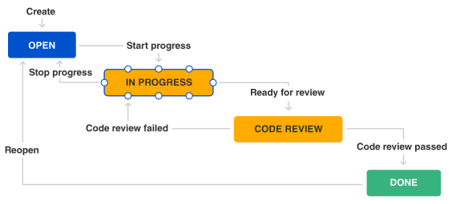

# Learning Documentation

This project hold all the information and knowledge I gathered through my experiences


---

- [Learning Documentation](#learning-documentation)
  - [Tree](#tree)
    - [Installing tree](#installing-tree)
    - [Tree usage](#tree-usage)
    - [Tree options](#tree-options)
  - [SSH](#ssh)
    - [Create SSH](#create-ssh)
      - [SSH-keygen Options](#ssh-keygen-options)
    - [Validate SSH](#validate-ssh)
    - [Check SSH public key](#check-ssh-public-key)
    - [Using existing SHH key](#using-existing-shh-key)
  - [ASDF](#asdf)
    - [ASDF Install](#asdf-install)
    - [ASDF Plugins](#asdf-plugins)
      - [Adding plugin dependencies](#adding-plugin-dependencies)
      - [Adding ASDF Plugins](#adding-asdf-plugins)
      - [Listing versions through ASDF Plugins](#listing-versions-through-asdf-plugins)
    - [Installing through ASDF Plugins](#installing-through-asdf-plugins)
    - [Updating through ASDF Plugins](#updating-through-asdf-plugins)
    - [Set version with ASDF Plugins](#set-version-with-asdf-plugins)
  - [Tableplus](#tableplus)
  - [Git and Github](#git-and-github)
    - [Configurations](#configurations)
      - [.gitignore globally](#gitignore-globally)
    - [cherry-pick](#cherry-pick)
      - [cherry-pick single commit](#cherry-pick-single-commit)
      - [cherry-pick multiple commits](#cherry-pick-multiple-commits)
    - [Squashing / Rebasing](#squashing--rebasing)
    - [Commit message](#commit-message)
    - [Submodules](#submodules)
      - [Adding submodule](#adding-submodule)
      - [Pull for all submodules for the first time](#pull-for-all-submodules-for-the-first-time)
      - [Pull each submodule](#pull-each-submodule)
      - [Submodule issues](#submodule-issues)
    - [Subtrees](#subtrees)
      - [Adding subtree](#adding-subtree)
      - [Updating subtree](#updating-subtree)
        - [Pulling changes](#pulling-changes)
        - [Pushing changes](#pushing-changes)
    - [Tags](#tags)
      - [Listing tags](#listing-tags)
      - [Creating tags](#creating-tags)
      - [Search tags](#search-tags)
    - [Git lfs / Large files on Github](#git-lfs--large-files-on-github)
      - [Extension installation](#extension-installation)
        - [First download the git-lfs file](#first-download-the-git-lfs-file)
        - [Download additional script](#download-additional-script)
        - [First install](#first-install)
      - [Git lfs usage](#git-lfs-usage)
        - [Tracking files](#tracking-files)
    - [Github actions](#github-actions)
      - [Events](#events)
      - [Workflows](#workflows)
    - [Git commands table](#git-commands-table)
    - [Advanced `diff`](#advanced-diff)
  - [Awesome Fonts](#awesome-fonts)
    - [Ruby on Rails install](#ruby-on-rails-install)
      - [Usage on Rails](#usage-on-rails)
  - [MongoDB](#mongodb)
    - [Create and setup MongoDB account](#create-and-setup-mongodb-account)
    - [Install MongoDB](#install-mongodb)
      - [Start MongoDB service](#start-mongodb-service)
      - [Check installation](#check-installation)
    - [Connect to Mongo using CLI](#connect-to-mongo-using-cli)
      - [Alias to connect](#alias-to-connect)
    - [Connect App to Mongo](#connect-app-to-mongo)
    - [MongoDB NonSQL basic operations](#mongodb-nonsql-basic-operations)
  - [Digital Ocean](#digital-ocean)
    - [Adding you SSH public key to Digital Ocean](#adding-you-ssh-public-key-to-digital-ocean)
    - [Adding SSH public key manually for existing Droplets](#adding-ssh-public-key-manually-for-existing-droplets)
    - [Paste SSH key to the `authorized_keys` file](#paste-ssh-key-to-the-authorized_keys-file)
    - [Access Droplet with SSH](#access-droplet-with-ssh)
    - [Copying files from a droplet](#copying-files-from-a-droplet)
    - [Running server from droplet](#running-server-from-droplet)
  - [Cloud Storage](#cloud-storage)
    - [B2 Cloud Storage](#b2-cloud-storage)
      - [Setup B2 Cloud Storage](#setup-b2-cloud-storage)
        - [Create a B2 Bucket](#create-a-b2-bucket)
        - [Setting CORS](#setting-cors)
        - [Accessing and using B2](#accessing-and-using-b2)
  - [AWS](#aws)
    - [Setup AWS CLI](#setup-aws-cli)
      - [Install AWS CLI](#install-aws-cli)
      - [Checking AWS credentials on CLI](#checking-aws-credentials-on-cli)
      - [Removing unknown existing data](#removing-unknown-existing-data)
      - [Adding new profile credentials](#adding-new-profile-credentials)
      - [CLI basic usage](#cli-basic-usage)
      - [Making assets bucket public](#making-assets-bucket-public)
      - [Setup bucket CORS access](#setup-bucket-cors-access)
  - [Setup Credentials](#setup-credentials)
  - [MinIO](#minio)
  - [Zed](#zed)
    - [Note shutdown with lid down even in power](#note-shutdown-with-lid-down-even-in-power)
    - [Increasing-the-amount-of-inotify-watchers](#increasing-the-amount-of-inotify-watchers)
    - [Error](#error)
    - [Fix](#fix)
    - [Deprecated trusted.gpg](#deprecated-trustedgpg)
      - [List source list](#list-source-list)
      - [Backup source list](#backup-source-list)
      - [Remove all source lists](#remove-all-source-lists)
      - [Update and upgrade apts](#update-and-upgrade-apts)
  - [Handling Images](#handling-images)
    - [Installing ImageMagick](#installing-imagemagick)
    - [ImageMagick convert](#imagemagick-convert)
      - [SVG TO PNG](#svg-to-png)
      - [PSD TO PNG](#psd-to-png)
      - [Common ImageMagick issue](#common-imagemagick-issue)
    - [Installing Potrace](#installing-potrace)
      - [BMP to SVG](#bmp-to-svg)
  - [Concepts](#concepts)
    - [Daemon processes](#daemon-processes)
    - [Product Manager vs Product Owner](#product-manager-vs-product-owner)
    - [User Story Framework](#user-story-framework)
      - [Workflow](#workflow)
        - [Theme](#theme)
        - [Initiative](#initiative)
        - [Epic](#epic)
        - [Story](#story)
        - [Task, Subtask, Chores](#task-subtask-chores)
        - [Bug](#bug)
    - [Serialization](#serialization)
    - [Versioning](#versioning)
      - [Build versioning](#build-versioning)
      - [Calendar versioning](#calendar-versioning)
      - [Semantic versioning](#semantic-versioning)
        - [Milestone version](#milestone-version)
    - [File permissions](#file-permissions)
    - [Readme](#readme)
    - [Changelog](#changelog)
      - [Cron jobs](#cron-jobs)
      - [Keep a Changelog](#keep-a-changelog)
    - [What is a Slug?](#what-is-a-slug)
    - [Absolute and Relative paths](#absolute-and-relative-paths)
    - [Public Page No Index](#public-page-no-index)
  - [References](#references)
  - [Gists](#gists)

## Tree

### Installing tree

```shell
sudo apt-get install tree
```

### Tree usage

```shell
tree files/
```

**Output:**

```mono
files/
├── flows.md
├── notes.md
├── scratch.json
└── scratch.md
```

### Tree options

|    Option     | Description                                         |
| :-----------: | :-------------------------------------------------- |
|      -a       | list all files, hidden files included               |
|      -d       | list only subdirectories                            |
|      -f       | list file absolute path                             |
|      -p       | list file with permissions                          |
|  -P pattern   | List only those files that match the pattern given. |
|  -I pattern   | Do not list files that match the given pattern.     |
| --filelimit=N | list files within a limit                           |
|    −−help     | shows tree help                                     |
|   −−version   | shows tree version                                  |

## SSH

### Create SSH

**Basic:**

```shell
ssh-keygen
```

**With options:**

```shell
ssh-keygen -t rsa -b 4096 -C "joe@example.com"
```

#### SSH-keygen Options

### Validate SSH

```shell
eval "$(ssh-agent -s)"
```

### Check SSH public key

```shell
cat ~/.ssh/id_rsa.pub
```

### Using existing SHH key

First you need to copy and move the files into the new machine

```shell
ssh-add ~/.ssh/id_rsa
```

If you get this output:

```mono
@@@@@@@@@@@@@@@@@@@@@@@@@@@@@@@@@@@@@@@@@@@@@@@@@@@@@@@@@@@
@         WARNING: UNPROTECTED PRIVATE KEY FILE!          @
@@@@@@@@@@@@@@@@@@@@@@@@@@@@@@@@@@@@@@@@@@@@@@@@@@@@@@@@@@@
Permissions 0777 for '/home/user_name/.ssh/id_rsa' are too open.
It is required that your private key files are NOT accessible by others.
This private key will be ignored.
```

It means you will need to adjust the `chmod` and repeat the command to add the ssh agent

```shell
chmod 600 ~/.ssh/id_rsa
```

If it persists use:

```shell
chmod 700 ~/.ssh
```

## ASDF

### ASDF Install

> Remember to check current branch to download <https://asdf-vm.com/guide/getting-started.html#_1-install-dependencies>

```shell
git clone https://github.com/asdf-vm/asdf.git ~/.asdf --branch v0.10.2
echo -e '\n. $HOME/.asdf/asdf.sh' >> ~/.bashrc
echo -e '\n. $HOME/.asdf/completions/asdf.bash' >> ~/.bashrc
```

> Reboot OS after install

### ASDF Plugins

#### Adding plugin dependencies

Each plugin has dependencies so we need to check the plugin repo where they should be listed. For asdf-nodejs they are:

```shell
sudo apt-get install dirmngr gpg curl gawk build-essential libssl-dev
```

> some installations might require more of libs

```shell
sudo apt-get install -y make build-essential libssl-dev zlib1g-dev libbz2-dev libreadline-dev libsqlite3-dev wget curl llvm libncurses5-dev libncursesw5-dev xz-utils tk-dev libffi-dev liblzma-dev libreadline-dev
```

#### Adding ASDF Plugins

```shell
asdf plugin add nodejs https://github.com/asdf-vm/asdf-nodejs.git
asdf plugin-add python https://github.com/tuvistavie/asdf-python.git
asdf plugin-add ruby https://github.com/asdf-vm/asdf-ruby.git
asdf plugin-add lua https://github.com/Stratus3D/asdf-lua.git
asdf plugin-add yarn https://github.com/twuni/asdf-yarn.git
asdf plugin-add java https://github.com/halcyon/asdf-java.git
```

#### Listing versions through ASDF Plugins

```shell
asdf list-all ruby
```

### Installing through ASDF Plugins

```shell
asdf install ruby 3.1.0
```

### Updating through ASDF Plugins

```shell
asdf plugin-update --all
```

### Set version with ASDF Plugins

Global

```shell
asdf global nodejs X.X.X
```

Local

```shell
asdf local nodejs X.X.X
```

## Tableplus

**Installation:**

```shell
# Add TablePlus gpg key
wget -qO - https://deb.tableplus.com/apt.tableplus.com.gpg.key | gpg --dearmor | sudo tee /etc/apt/trusted.gpg.d/tableplus-archive.gpg > /dev/null

# Add TablePlus repo
sudo add-apt-repository "deb [arch=amd64] https://deb.tableplus.com/debian/24 tableplus main"

# Install
sudo apt update
sudo apt install tableplus
```

**Remove tableplus:**

```sh
sudo apt-get purge tableplus -y
sudo rm -rf /opt/tableplus
sudo apt autoremove
sudo apt autoclean
```

## Git and Github

### Configurations

#### .gitignore globally

**Setup .gitignore_global:**

In some instances we want have files that needs to be excluded globally avoid committing it by accident there's when `.gitignore_global` como into play

**Create global ignore:**

```sh
touch ~/.gitignore_global
```

**Set global ignore config:**

```sh
git config --global core.excludesfile ~/.gitignore_global
```

**Add ignores:**

```sh
nano ~/.gitignore_global
```

**Basic ignore template:**

```mono
# macOS files
.DS_Store

# Editor files
*.swp
*~ 
.vscode/
.idea/

# Logs
log/
*.log

# Node.js
node_modules/

# Ruby & Rails
*.gem
.bundle/
log/
tmp/

# Hidden files
*.hid
*.hide
*.hidden
 ```

**Check configuration:**

```sh
git config --global core.excludesfile
```

---

### cherry-pick

Cherry pick commits allow you to copy commit from one branch to another

#### cherry-pick single commit

```shell
git cherry-pick COMMIT_HASH
```

#### cherry-pick multiple commits

To get multiple commit we use the two commits hash representing "from", "to" and add operator `^..` between them

```shell
git cherry-pick COMMIT_A^..COMMIT_B
```

- A must be older than B
- If you want get all commits but ignore A, you only `A..B`
- in `ZSH` needs to use `'A^..B` or `'A..B`

### Squashing / Rebasing

**Specific commit:**

```sh
git rebase -i <commit hash>
```

**Output:**

```mono
pick 01d5859 feat: Implement Rspec and other test gems (#2)
pick c200190 feat: Setup docker for development (#1)

# Rebase 8ad5442..c200190 onto 8ad5442 (2 commands)
#
# Commands:
# p, pick <commit> = use commit
# r, reword <commit> = use commit, but edit the commit message
# e, edit <commit> = use commit, but stop for amending
# s, squash <commit> = use commit, but meld into previous commit
# f, fixup [-C | -c] <commit> = like "squash" but keep only the previous
#                    commit's log message, unless -C is used, in which case
#                    keep only this commit's message; -c is same as -C but
#                    opens the editor
# x, exec <command> = run command (the rest of the line) using shell
# b, break = stop here (continue rebase later with 'git rebase --continue')
# d, drop <commit> = remove commit
# l, label <label> = label current HEAD with a name
# t, reset <label> = reset HEAD to a label
# m, merge [-C <commit> | -c <commit>] <label> [# <oneline>]
# .       create a merge commit using the original merge commit's
# .       message (or the oneline, if no original merge commit was
# .       specified); use -c <commit> to reword the commit message
#
# These lines can be re-ordered; they are executed from top to bottom.
#
# If you remove a line here THAT COMMIT WILL BE LOST.
#
# However, if you remove everything, the rebase will be aborted.
#

```

> to change the commit we just modify the place where it states `pick` for one of the listed options like, "squash", "reword"

**Since first commit:**

Squashing all commits since the first

```sh
git rebase -i --root
```

**Prior to merge:**

If you haven't merged yet and want to squash everything into a single commit, use:

```sh
git merge --squash <branch-name>
```

**Rebase merge commits:**

```sh
git rebase -i --rebase-merges <commit hash>
```

### Commit message

**Amending:**

If you want to change the commit message from the latest commit:

```sh
git commit --amend
```

> To change message from older commits you will need to do a rebase with options `reword`

### Submodules

Git also allow you to link dependencies as submodules does you can manage your repos with a project structure

To add a submodule first you need to have a remote repo to be attached as submodule

#### Adding submodule

**Through https - OLD:**

```shell
git submodule add https://github.com/LucasBarretto86/MyApp.git
```

**Through SSH:**

```shell
git submodule add git@github.com:LucasBarretto86/MyApp.git
```

**Submodule renaming root folder:**

```shell
git submodule add git@github.com:LucasBarretto86/MyApp.git frontend
```

> In that example above we will create the submodule with the repo content directly inside a frontend folder

```tree
/frontend
  ├── package.json
  ├── src/
  ├── public/
  └── (other files from MyApp)
```

#### Pull for all submodules for the first time

```shell
git submodule update --init --recursive
git pull --recurse-submodule
```

#### Pull each submodule

```shell
git submodule foreach git pull origin main
```

#### Submodule issues

Sometimes a repo that has submodules does not fully updates so here there's few lines you may use

- Remove `.git` caches Re-adding modules and Re-downloading

Within the modules root folder

```shell
# Cleaning submodules and repo indexes
rm -Rf .git/modules/*
rm .git/index

# Adding modules again, before doing this you can check submodules path within the file .gitmodules
cd *SUBMODULES_FOLDER*
git submodule add git@github.com:*USER_NAME*/*REPO_NAME*.git

# Pull from each submodule
cd ..
git submodule foreach git pull origin main
```

### Subtrees

Subtree is very similar to submodules, however subtree allow you to bring in external repos by merging it and squashing

#### Adding subtree

```shell
git subtree add --prefix {local directory being pulled into} {remote repo URL} {remote branch} --squash
```

#### Updating subtree

To update subtrees you have to use pull and push referring the prefix and the remote repos path

##### Pulling changes

```shell
git subtree pull --prefix {local directory being pulled into} {remote repo URL} {remote branch} --squash
```

##### Pushing changes

```shell
git subtree push --prefix {local directory being pulled into} {remote repo URL} {remote branch}
```

### Tags

#### Listing tags

```shell
git tag
```

#### Creating tags

```shell
git tag -a v2.3.4 -m "[2.3.4] - 2022-04-25"
```

#### Search tags

### Git lfs / Large files on Github

Git has an extension to control larger files

#### Extension installation

First is required to download files

##### First download the git-lfs file

<https://github.com/git-lfs/git-lfs/releases>

##### Download additional script

```shell
curl -s https://packagecloud.io/install/repositories/github/git-lfs/script.deb.sh?os=Ubuntu&dist=kinnect&source=script | sudo bash
```

##### First install

Within the `git-lfs-3.2.0` folder

```shell
sudo ./install.sh
```

#### Git lfs usage

```shell
git lfs install
```

##### Tracking files

Within the repo with large files start tracking files

```shell
git lfs track "*.capx"
```

### Github actions

Actions allows us to set automatization that run over a repository triggered by events, mostly the actions are used to run linters, CI, deploy, builds, and etc...


All configuration is setup using YAML

**Example:**

```yml
on:
  issues:
    types:
      - opened

jobs:
  label_issue:
    runs-on: ubuntu-latest
    steps:
      - env:
          GITHUB_TOKEN: ${{ secrets.MY_TOKEN }}
          ISSUE_URL: ${{ github.event.issue.html_url }}
        run: |
          gh issue edit $ISSUE_URL --add-label "triage"
```

#### Events

Events establishes when a workflow should be triggered

Some of the most common triggers are:

- push
- pull_request
- public
- fork
- label
- workflow_dispatch
- schedule

To automatically trigger a workflow, use on to define which events can cause the workflow to run.

**`schedule` trigger examples:**

```yml
on:
  schedule:
    - cron: 0 12 * * 1
```

**`label` trigger example:**

```yml
on:
  label:
    types:
      - created
```

It's also possible to define multiple triggers

```yml
on:
  [push, fork]
  # - do something
```

OR

```yml
on:
  label:
    types:
      - created
  push:
    branches:
      - main
```

It's also possible to have multiple types

```yml
on:
  label:
    types: [created, edited]
```

To see more available workflow triggers go to <https://docs.github.com/en/actions/using-workflows/events-that-trigger-workflows>

#### Workflows

A workflow is a configurable automated process that will run one or more jobs, it is also defined by YAML file, which has to saved under `workflows` directory

```tree
.github
└── workflows
    └── markdown-linter.yml
```

Workflow basically runs sequenced pre-existing actions or shell scripts

**Workflow YAML file example using pre existing:**

```yml
name: Code Linting

on: push

jobs:
  MarkdownLinter:
    runs-on: ubuntu-latest
    steps:
      - uses: actions/checkout@v1

      - name: Markdown Lint
        uses: avto-dev/markdown-lint@v1
        with:
          config: "./.markdownlintrc"
          args: "./README.md ./specifics/*.md"
          ignore: "./CHANGELOG.md ./unorganized_documents/* ./files/*"
```

> In some cases we might to add specific args it depend on the action itself, so we might check the action repo

### Git commands table

| Command                                                                    | Description                                                                                             |
| :------------------------------------------------------------------------- | :------------------------------------------------------------------------------------------------------ |
| `git rm -r --cached .`                                                     | Clear git cache for all files                                                                           |
| `git branch \| grep -v "main" \| xargs git branch-D`                       | Clean git branches                                                                                      |
| `git branch -M NEW_NAME`                                                   | Rename branch and set new name for origin                                                               |
| `git branch -m NEW_NAME`                                                   | Rename branch locally                                                                                   |
| `git reset --soft HEAD~1`                                                  | Retrieve one commit (`~1`) and return it to the staging area                                            |
| `git reset --hard`                                                         | Undo every uncommitted change; can also undo commits using `HEAD~1` flag                                |
| `git push --force`                                                         | Force push in case of divergence from origin (careful, no rollback)                                     |
| `git push --set-upstream origin BRANCH_NAME`                               | Push and set upstream branch                                                                            |
| `git fetch --prune`                                                        | Remove stale remote-tracking branches                                                                   |
| `git branch -vv`                                                           | Show branch status with upstream tracking                                                               |
| `git config --global user.name USER_NAME`                                  | Set global user name                                                                                    |
| `git config --global user.email USER_EMAIL`                                | Set global user email                                                                                   |
| `git config --global user.password PASSWORD`                               | Set global user password                                                                                |
| `git config --global init.defaultBranch BRANCH_NAME`                       | Redefine the default initial branch name globally                                                       |
| `git revert -m 1 COMMIT_SHA`                                               | Revert changes from a specific commit                                                                   |
| `git rebase BRANCH`                                                        | Sync local branch with another branch (conflicts may occur; use `git push --force` carefully if needed) |
| `git remote add origin git@github.com:USER_NAME/REPO_NAME.git`             | Add remote repository                                                                                   |
| `git submodule add origin git@github.com:USER_NAME/REPO_NAME.git`          | Add a repository as a submodule                                                                         |
| `git submodule update`                                                     | Pull updates for all submodules                                                                         |
| `git submodule update MODULE_PATH`                                         | Pull updates for a specific submodule                                                                   |
| `git subtree add --prefix PATH_NAME REMOTE_REPO_URL BRANCH_NAME --squash`  | Add a subtree to the project                                                                            |
| `git subtree pull --prefix PATH_NAME REMOTE_REPO_URL BRANCH_NAME --squash` | Pull changes from the original repository for a subtree                                                 |
| `git subtree push --prefix PATH_NAME REMOTE_REPO_URL BRANCH_NAME --squash` | Push changes from the subtree to the original repository                                                |

### Advanced `diff`

**Diff to external file:**

```sh
git diff --staged > diff.txt
```

> `>` to create a file `>>` to add to an existing file

**Diff between branches:**

```sh
git diff branch_name..another_branch
```

**Diff truncate:**

```sh
git diff -U5 -w branch_name..another_branch
```

> In this example, `-U5` specifies that only 5 lines of unified context should be included for each change, and `-w` ignores whitespace changes.

## Awesome Fonts

- Create profile to generate the snippet we gonna use to trigger the lib
  <https://www.w3schools.com/icons/fontawesome5_intro.asp#:~:text=To%20use%20the%20Free%20Font>,Awesome%20to%20your%20web%20page.

### Ruby on Rails install

First add on the gemfile

```gemfile
gem "font-awesome-sass", "~> 6.3.0"
```

```mono
bundle install
```

After we need to add the import line on the `application.scss`

```scss
// app/assets/stylesheets/application.scss

@import "font-awesome";
```

> If you are using importmaps don't forget to run: `rails assets:precompile`

Depending on where you want to use FontAwesome, you will need to add the script tag generated on your profile to link the lib, this can be found at

```html
<!-- app/views/layouts/application.html.erb -->

<!DOCTYPE html>
<html>
  <head>
    <title>Patients Intermediary App</title>
    <meta name="viewport" content="width=device-width,initial-scale=1" />
    <%= csrf_meta_tags %> <%= csp_meta_tag %> <%= stylesheet_link_tag
    "application", "data-turbo-track": "reload" %> <%= javascript_importmap_tags
    %>
    <script
      src="https://kit.fontawesome.com/323h4jk32h4l2j123.js"
      crossorigin="anonymous"
    ></script>
  </head>

  <body>
    ...
  </body>
</html>
```

#### Usage on Rails

**Example:**

```rb
<%= icon("fa-solid", "note-sticky", class: "fa-1x") %>
```

but you still can use with html on .erb

```html
<i class="fa-solid fa-x1 fa-note-sticky"></i>
```

## MongoDB

### Create and setup MongoDB account

First we need to go to and create account and free cluster `M0` through their website [MongoDB](https://cloud.mongodb.com/)

Secondly we create a database and a collection also through their website

### Install MongoDB

[Mongo CLI reference](https://www.mongodb.com/docs/manual/tutorial/install-mongodb-on-ubuntu/#import-the-public-key-used-by-the-package-management-system)

```sh
# Import the public key used by the package management system
sudo apt-get install gnupg curl

# To import the MongoDB public GPG key from https://pgp.mongodb.com/server-7.0.asc, run the following command:

curl -fsSL https://pgp.mongodb.com/server-7.0.asc | \
   sudo gpg -o /usr/share/keyrings/mongodb-server-7.0.gpg \
   --dearmor

# Create a list file for MongoDB
echo "deb [ arch=amd64,arm64 signed-by=/usr/share/keyrings/mongodb-server-7.0.gpg ] https://repo.mongodb.org/apt/ubuntu jammy/mongodb-org/7.0 multiverse" | sudo tee /etc/apt/sources.list.d/mongodb-org-7.0.list

# Update the package list
sudo apt-get update

# Install MongoDB Shell
sudo apt-get install -y mongodb-org
```

#### Start MongoDB service

```sh
sudo systemctl start mongod
sudo systemctl enable mongod
```

#### Check installation

```sh
sudo systemctl status mongod
```

**Output:**

```mono
● mongod.service - MongoDB Database Server
     Loaded: loaded (/lib/systemd/system/mongod.service; enabled; preset: enabled)
     Active: active (running) since Mon 2024-01-22 13:37:29 -03; 5min ago
       Docs: https://docs.mongodb.org/manual
   Main PID: 26568 (mongod)
     Memory: 74.1M
        CPU: 6.219s
     CGroup: /system.slice/mongod.service
             └─26568 /usr/bin/mongod --config /etc/mongod.conf
```

### Connect to Mongo using CLI

On the mongoDB website, connect to the cluster created and create a databaseUser, then in your terminal use the following command to connect:

```sh
mongosh "mongodb+srv://<cluster_name>.<host_id>.mongodb.net/" --apiVersion 1 --username <username>
```

> **Notice:** `<cluster_name>` is the name you gave to your on cluster, `<host_id>` is the randomly generated host_id and `<username>` is the username you created
> Be sure to check on your account and cluster the correct values, or the correct url to be able to connect

**Output:**

```mono
Current Mongosh Log ID: 65ae9cd4d6ee091a23dbcded
Connecting to:  mongodb+srv://<credentials>@free0.6xstial.mongodb.net/?appName=mongosh+2.1.1
Using MongoDB:  6.0.12 (API Version 1)
Using Mongosh:  2.1.1

For mongosh info see: https://docs.mongodb.com/mongodb-shell/

Atlas atlas-2urtgo-shard-0 [primary] test>
```

#### Alias to connect

You could also add an alias in case you don't want keep repeating this line all the time:

```sh
alias connect-mongodb='mongosh "mongodb+srv://<cluster_name>.<host_id>.mongodb.net/" --apiVersion 1 --username <username>'
```

After that you can just call the `connect-mongodb` to connect.

### Connect App to Mongo

To be able to connect to mongo using a application we use the database url, you can find it on the mongoDB website, looks like this:

```mono
mongodb+srv://<username>:<password>@<cluster>.<host_id>.mongodb.net/
```

Since we gonna use application we should create a ENV to store our database_url, something like that:

```.env
DATABASE_URL="mongodb+srv://<username>:<password>@<cluster>.<host_id>.mongodb.net/"
```

### MongoDB NonSQL basic operations

Keep in mind that MongoDB shell primarily uses a JavaScript-like syntax, and the data is represented in a JSON-like format.

1. **Insert Document:**
   To insert a document into a collection, you use the `insertOne()` or `insertMany()` method. Here's an example of inserting a single document:

   ```mono
   db.collectionName.insertOne({ key: 'value' });
   ```

2. **Query Documents:**
   MongoDB supports flexible queries using a rich set of operators. Here's an example of finding documents in a collection:

   ```mono
   db.collectionName.find({ key: 'value' });
   ```

   You can also use various query operators for more complex conditions.

3. **Update Document:**
   To update a document, you can use the `updateOne()` or `updateMany()` method:

   ```mono
   db.collectionName.updateOne({ key: 'value' }, { $set: { newKey: 'updatedValue' } });
   ```

4. **Delete Document:**
   To delete a document, you can use the `deleteOne()` or `deleteMany()` method:

   ```mono
   db.collectionName.deleteOne({ key: 'value' });
   ```

5. **Indexing:**
   Indexing can improve the performance of queries. To create an index, you can use the `createIndex()` method:

   ```mono
   db.collectionName.createIndex({ key: 1 }); // 1 for ascending, -1 for descending
   ```

6. **Aggregation:**
   MongoDB provides an aggregation framework for performing data transformations. Here's an example of using the aggregation pipeline:

   ```mono
   db.collectionName.aggregate([
     { $match: { key: 'value' } },
     { $group: { _id: '$category', total: { $sum: '$quantity' } } }
   ]);
   ```

## Digital Ocean

### Adding you SSH public key to Digital Ocean

1. First generate or copy your id_rsa.pub
2. Navigate on DO dashboard and add your id_rsa.pub, you will find here: settings/security

> **Notice:** that adding SSH public only new droplets will be creating with you public key, if the droplet you are trying access was created prior to the SSH definition you will have to add your key manually as below:

### Adding SSH public key manually for existing Droplets

1. Access the droplet you want to add your SSH key through the browser console
2. Within the droplet you will have to paste your SSH public key to the `authorized_keys` file
3. From you local console access the droplet

### Paste SSH key to the `authorized_keys` file

```shell
mkdir -p ~/.ssh
nano ~/.ssh/authorized_keys
```

> After open the file on nano, paste your public key and save it and that's it

### Access Droplet with SSH

```shell
ssh -i root@vm-ip
```

### Copying files from a droplet

To copy files we basically will use `SCP` command

```shell
scp -r root@droplet_ip:/file/path/ /where/to/save/file
```

**Example:**

```shell
scp -r root@167.99.229.118:~/Downloads/production_latest_backup.dump ~/
```

### Running server from droplet

```shell
ssh -L 3005:localhost:3000 -C -N -l root 146.190.208.106
```

## Cloud Storage

### B2 Cloud Storage

#### Setup B2 Cloud Storage

Since AWS is costly I decided to use a cheaper service, Cloudinary it's also expensive, so I'm decided to use B2 Cloud Storage

##### Create a B2 Bucket

Sign in to your Backblaze B2 account and create a new bucket.

> Choose "Public" if you want the content to be publicly accessible.

I will choose go public because first I want to keep my assets accessible

References: <https://www.backblaze.com/docs>

##### Setting CORS

After create my private Bucket, I updated the CORS configuration for `https://*.lucasbarretto.com`

##### Accessing and using B2

Since I set up CORS directly I'll have to use the URL provided by the B2, something like: `https://f000.backblazeb2.com/file/your-bucket/folder-name/filename.extension`

In case I want to use a custom URL I would have to setup Cloudflare, for now I will keep B2 url

Then on my css to use the fonts are on the cloud storage I will have to do something like:

```css
@font-face {
  font-family: "Manjari";
  src: url("https://f000.backblazeb2.com/file/your-bucket/folder-name/Manjari-Thin.woff2") format("woff2"),
    url("https://f000.backblazeb2.com/file/your-bucket/folder-name/Manjari-Thin.woff") format("woff"),
    url("https://f000.backblazeb2.com/file/your-bucket/folder-name/Manjari-Thin.ttf") format("truetype");
    
  font-weight: 300;
}
```

## AWS

### Setup AWS CLI

Keep in mind that to be able to use the CLI you will need to setup IAM Role that allows you to use CLI

1. Installing AWS-cli (Skip if you already have it installed)
2. Check pre AWS credentials on CLI
3. Removing unknown existing data (Skip if setup has never been done before)
4. Adding new AWS credential profile to avoid problems
5. Basic usage of CLI
6. Making assets bucket public
7. Setup bucket CORS access

#### Install AWS CLI

```sh
sudo snap install aws-cli
```

OR

```sh
curl "https://d1vvhvl2y92vvt.cloudfront.net/awscli-exe-linux-x86_64.zip" -o "awscliv2.zip"
unzip awscliv2.zip
sudo ./aws/install
```

#### Checking AWS credentials on CLI

```sh
aws configure list
```

**Output:**

```sh
      Name                    Value             Type    Location
      ----                    -----             ----    --------
   profile                <not set>             None    None
access_key                <not set>             None    None
secret_key                <not set>             None    None
    region                <not set>             None    None

```

> In case there is some credentials and you are unsure what is that all about you can completely remove all credentials

#### Removing unknown existing data

```sh
rm -rf ~/.aws

unset AWS_ACCESS_KEY_ID
unset AWS_SECRET_ACCESS_KEY
```

#### Adding new profile credentials

```sh
aws configure --profile lucasbarretto.com

AWS Access Key ID [None]: ****************XR3X
AWS Secret Access Key [None]: ****************0LDi
Default region name [None]: sa-east-1
Default output format [None]: JSON
```

Now to link the created profile:

```sh
export AWS_PROFILE=lucasbarretto.com
```

Then checking the configuration

```sh
aws configure list
```

**Output:**

```sh
      Name                    Value             Type    Location
      ----                    -----             ----    --------
   profile        lucasbarretto.com              env    ['AWS_DEFAULT_PROFILE', 'AWS_PROFILE']
access_key     ****************XR3X shared-credentials-file
secret_key     ****************0LDi shared-credentials-file
    region                sa-east-1      config-file    ~/.aws/config
```

#### CLI basic usage

Certainly! Here's the list of commands converted into a Markdown table:

 | Command                                                                   | Description                    |
 | :------------------------------------------------------------------------ | :----------------------------- |
 | `aws configure`                                                           | Configuring AWS CLI            |
 | `aws s3 ls`                                                               | Listing S3 Buckets             |
 | `aws s3 cp my-local-file.txt s3://my-bucket/`                             | Copying a Local File to S3     |
 | `aws s3 cp s3://my-bucket/my-s3-file.txt my-local-directory/`             | Copying from S3 to Local       |
 | `aws s3 cp . s3://my-bucket/ --recursive --exclude "*" --include "*.jpg"` | Uploading Multiple Files to S3 |
 | `aws s3 ls s3://my-bucket/`                                               | Listing S3 Objects in a Bucket |
 | `aws s3 mb s3://my-new-bucket-name`                                       | Creating an S3 Bucket          |
 | `aws s3 rb s3://my-bucket-to-delete`                                      | Deleting an S3 Bucket          |
 | `aws s3 sync my-local-directory s3://my-bucket/`                          | Syncing Local Files with S3    |
 | `aws ec2 describe-instances`                                              | Describing EC2 Instances       |

You can copy and paste this table into your Markdown file.

#### Making assets bucket public

To make or bucket public we need to add a bucket-policy and also add CORS policy

**Using CLI:**

```sh
aws s3api put-bucket-policy --bucket assets.lucasbarretto.com --policy '{
  "Version": "2012-10-17",
  "Statement": [
    {
      "Sid": "PublicReadGetObject",
      "Effect": "Allow",
      "Principal": "*",
      "Action": "s3:GetObject",
      "Resource": "arn:aws:s3:::assets.lucasbarretto.com/*"
    }
  ]
}'
```

**Direct on S3 dashboard:**

In that case we just need to add the JSON on the bucket-policy field under permissions

```json
{
  "Version": "2012-10-17",
  "Statement": [
    {
      "Sid": "PublicReadGetObject",
      "Effect": "Allow",
      "Principal": "*",
      "Action": "s3:GetObject",
      "Resource": "arn:aws:s3:::assets.lucasbarretto.com/*"
    }
  ]
}
```

#### Setup bucket CORS access

On my bucket `assets.lucasbarretto.com` I added CORS policy to allow GET requests for my assets

> Keep in mind that since I will only do gets I don't need IAM role and credentials configs, only CORS config
> on the bucket must be sufficient

```json
[
    {
        "AllowedHeaders": [
            "*"
        ],
        "AllowedMethods": [
            "GET",
            "HEAD"
        ],
        "AllowedOrigins": [
            "https://*.lucasbarretto.com",
            "http://localhost:5500"
            "http://127.0.1.0:5500"
        ],
        "ExposeHeaders": [],
        "MaxAgeSeconds": 3000
    }
]
```

## Setup Credentials

First we need to add our env file

```sh
touch .env
```

> very important to add this to `.gitignore` to avoid push credentials to the repository

As we add credentials we will use it like this:

```js
// Setup S3 credential example

const AWS = require('aws-sdk');

const s3 = new AWS.S3({
  accessKeyId: process.env.AWS_ACCESS_KEY_ID,
  secretAccessKey: process.env.AWS_SECRET_ACCESS_KEY,
  region: process.env.AWS_REGION
});

```

## MinIO

MinIO uses the same protocols from AWS S3, therefore this is a excellent alternative to handle cloud storage on local environments avoid the boring AWS configs

**Container installation:**

```yml
services:
  minio:
    image: bitnami/minio
    container_name: minio
    environment:
      - MINIO_ROOT_USER=admin123
      - MINIO_ROOT_PASSWORD=admin123
    ports:
      - "9000:9000"
      - "9001:9001"
    volumes:
      - minio:/bitnami/minio/data

volumes:
  minio:
```

If you are using the docker-compose template, and you have services up and running, you already have minIO
environment working at `http://localhost:9001/`

1. Login
   - Use `admin123` or any `username/password` defined on the compose file as `MINIO_ROOT_USER`,
       `MINIO_ROOT_PASSWORD`

2. Create bucket
   - Soon as you get in you can create a bucket, normally called `development`

3. Create Access key
   - After bucket is created go to `Access Key` option and add a new key and save your access key and it's secret
   - Setup AWS `.envrc` credentials
     - With bucket name, access_key and secret add AWS ENV update your ENVS like so:

       ```mono
       # Replace values `<>` with the correct MinIO values
       export AWS_S3_ACCESS_KEY_ID=<MINIO_ACCESS_KEY>
       export AWS_S3_SECRET=<MINIO_ACCESS_KEY_SECRET>
       export AWS_S3_REGION=us-east-1
       export AWS_S3_BUCKET=<MINIO_BUCKET_NAME>
       export AWS_S3_ENDPOINT=<MINIO_LOCALHOST_URL>
       
        ```

## Zed

I start using Zed due to speed, so here how to install it on Linux:

```sh
curl -f https://zed.dev/install.sh | sh
```

**Keymaps bindings to replicate RubyMine:**

Save it on the: 'Open key Bindings', the `keymaps.json`

```json
[
  {
    "context": "Workspace",
    "bindings": {
      "ctrl-shift-n": "file_finder::Toggle",                  // Search file
      "ctrl-shift-a": "command_palette::Toggle"               // Open command palette
    }
  },
  {
    "context": "Editor",
    "bindings": {
      "escape": "editor::Cancel",                             // Cancel action
      "shift-backspace": "editor::Backspace",                 // Backspace
      "backspace": "editor::Backspace",                       // Backspace
      "delete": "editor::Delete",                             // Delete
      "tab": "editor::Tab",                                   // Tab
      "shift-tab": "editor::TabPrev",                         // Previous Tab
      "ctrl-k": "editor::CutToEndOfLine",                     // Cut to the end of line
      "ctrl-k ctrl-q": "editor::Rewrap",                      // Rewrap
      "ctrl-k q": "editor::Rewrap",                           // Rewrap
      "ctrl-backspace": "editor::DeleteToPreviousWordStart",  // Delete previous word
      "ctrl-delete": "editor::DeleteToNextWordEnd",           // Delete next word
      "cut": "editor::Cut",                                   // Cut
      "shift-delete": "editor::Cut",                          // Cut
      "ctrl-x": "editor::Cut",                                // Cut
      "copy": "editor::Copy",                                 // Copy
      "ctrl-insert": "editor::Copy",                          // Copy
      "ctrl-c": "editor::Copy",                               // Copy
      "paste": "editor::Paste",                               // Paste
      "shift-insert": "editor::Paste",                        // Paste
      "ctrl-v": "editor::Paste",                              // Paste
      "undo": "editor::Undo",                                 // Undo
      "ctrl-z": "editor::Undo",                               // Undo
      "redo": "editor::Redo",                                 // Redo
      "ctrl-y": "editor::Redo",                               // Redo
      "ctrl-shift-z": "editor::Redo",                         // Redo
      "up": "editor::MoveUp",                                 // Move up
      "ctrl-up": "editor::LineUp",                            // Move up by line
      "ctrl-down": "editor::LineDown",                        // Move down by line
      "pageup": "editor::MovePageUp",                         // Move page up
      "alt-pageup": "editor::PageUp",                         // Page up
      "shift-pageup": "editor::SelectPageUp",                 // Select page up
      "home": "editor::MoveToBeginningOfLine",                // Move to the beginning of line
      "down": "editor::MoveDown",                             // Move down
      "pagedown": "editor::MovePageDown",                     // Move page down
      "alt-pagedown": "editor::PageDown",                     // Page down
      "shift-pagedown": "editor::SelectPageDown",             // Select page down
      "end": "editor::MoveToEndOfLine",                       // Move to the end of line
      "left": "editor::MoveLeft",                             // Move left
      "right": "editor::MoveRight",                           // Move right
      "ctrl-left": "editor::MoveToPreviousWordStart",         // Move to previous word start
      "ctrl-right": "editor::MoveToNextWordEnd",              // Move to next word end
      "ctrl-home": "editor::MoveToBeginning",                 // Move to beginning
      "ctrl-end": "editor::MoveToEnd",                        // Move to end
      "shift-up": "editor::SelectUp",                         // Select up
      "shift-down": "editor::SelectDown",                     // Select down
      "shift-left": "editor::SelectLeft",                     // Select left
      "shift-right": "editor::SelectRight",                   // Select right
      "ctrl-shift-left": "editor::SelectToPreviousWordStart", // Select to previous word
      "ctrl-shift-right": "editor::SelectToNextWordEnd",      // Select to next word
      "ctrl-shift-home": "editor::SelectToBeginning",         // Select to beginning
      "ctrl-shift-end": "editor::SelectToEnd",                // Select to end
      "ctrl-a": "editor::SelectAll",                          // Select all
      "ctrl-l": "editor::SelectLine",                         // Select line
      "ctrl-shift-i": "editor::Format",                       // Format
      "shift-home": [
        "editor::SelectToBeginningOfLine",                    // Select to beginning of line
        { "stop_at_soft_wraps": true }
      ],
      "shift-end": [
        "editor::SelectToEndOfLine",                          // Select to end of line
        { "stop_at_soft_wraps": true }
      ],
      "ctrl-alt-space": "editor::ShowCharacterPalette",       // Show character palette
      "ctrl-;": "editor::ToggleLineNumbers",                  // Toggle line numbers
      "ctrl-k ctrl-r": "editor::RevertSelectedHunks",         // Revert selected hunks
      "ctrl-'": "editor::ToggleHunkDiff",                     // Toggle hunk diff
      "ctrl-\"": "editor::ExpandAllHunkDiffs",                // Expand all hunk diffs
      "ctrl-i": "editor::ShowSignatureHelp",                  // Show signature help
      "alt-g b": "editor::ToggleGitBlame",                    // Toggle Git blame
      "menu": "editor::OpenContextMenu",                      // Open context menu
      "shift-f10": "editor::OpenContextMenu",                 // Open context menu
      "ctrl-b": "editor::GoToDefinition",                     // Go to definition
      "ctrl-alt-b": "editor::GoToImplementation"              // Go to implementation
    }
  }
]
``


## Issues

### Ubuntu sharing entire screen

```shell
sudo nano /etc/gdm3/custom.conf
```

basically just uncomment line bellow

```mono
# /etc/gdm3/custom.conf
...

[daemon]
# Uncomment the line below to force the login screen to use Xorg
WaylandEnable=false
```

after that save and reboot

### Note shutdown with lid down even in power

```shell
sudo nano /etc/systemd/logind.conf
```

Change the line `HandleLidSwitch=suspend` for one of the following

| Value     | Description           |
| :-------- | :-------------------- |
| lock      | lock when lid closed. |
| ignore    | do nothing.           |
| poweroff  | shutdown.             |
| hibernate | hibernate Ubuntu.     |

save config and restart services

```shell
systemctl restart systemd-logind.service
```

### Increasing-the-amount-of-inotify-watchers

### Error

```shell
FATAL: Listen error: unable to monitor directories for changes.
Visit https://github.com/guard/listen/wiki/Increasing-the-amount-of-inotify-watchers for info on how to fix this.
```

### Fix

```shell
echo fs.inotify.max_user_watches=524288 | sudo tee -a /etc/sysctl.conf && sudo sysctl -p
```

### Deprecated trusted.gpg

> W: <https://deb.tableplus.com/debian/22/dists/tableplus/InRelease>: Key is stored in legacy trusted.gpg keyring (/etc/apt/trusted.gpg), see the DEPRECATION section in apt-key(8) for details.

1. [List source lists](#list-source-list)
2. [Backup source list](#backup-source-list)
3. [Remove all source lists](#remove-all-source-lists)
4. [Update and upgrade apts](#update-and-upgrade-apts)

#### List source list

```shell
ls -l /etc/apt/sources.list.d
```

**Output:**

```mono
total 24
-rw-r--r-- 1 root root   0 dez 30 13:19 archive_uri-https_deb_tableplus_com_debian_20-kinetic.list
-rw-r--r-- 1 root root   0 dez 30 13:19 archive_uri-https_deb_tableplus_com_debian_20-kinetic.list.save
-rw-r--r-- 1 root root 142 jan  5 16:23 archive_uri-https_deb_tableplus_com_debian_22-kinetic.list
-rw-r--r-- 1 root root  68 jan  5 16:15 archive_uri-https_deb_tableplus_com_debian_22-kinetic.list.save
-rw-r--r-- 1 root root 190 jan  5 16:23 google-chrome.list
-rw-r--r-- 1 root root 190 jan  5 16:15 google-chrome.list.save
-rw-r--r-- 1 root root   0 jan  5 16:15 google.list
-rw-r--r-- 1 root root   0 jan  5 16:15 google.list.save
-rw-r--r-- 1 root root  74 jan  5 16:35 pgdg.list
-rw-r--r-- 1 root root  62 jan  5 16:15 pgdg.list.save
```

#### Backup source list

```shell
sudo cp /etc/apt/sources.list.d /etc/apt/sources.list.d.backup -r
```

#### Remove all source lists

```shell
sudo rm /etc/apt/sources.list.d/*
```

#### Update and upgrade apts

```shell
sudo apt update
sudo apt upgrade
sudo apt dist-upgrade
sudo apt autoremove
sudo apt install update-manager-core
sudo do-release-upgrade
```

## Handling Images

### Installing ImageMagick

```shell
sudo apt install imagemagick
```

### ImageMagick convert

#### SVG TO PNG

```shell
convert -background -quality 100 *.svg -set filename:base "%[basename]" "%[filename:base].png"
```

#### PSD TO PNG

```shell
convert  *.psd -set filename:base "%[basename]" -quality 100 "%[filename:base].png"
convert cover.ai cover.png
```

#### Common ImageMagick issue

ImageMagick is very demanding so you gonna find some problems if you attempt to convert many files

```mono
convert-im6.q16: cache resources exhausted `301612577831.png' @ error/cache.c/OpenPixelCache/4095.
```

In that ca you might need to adjust policy.xml

Find the policy.xml, commonly you find here `/etc/ImageMagick-6/policy.xml`

```shell
find / -name "policy.xml"
```

> In case you need to search for the correct path

Withing the xml file find and change this two lines below:

```xml
<!-- /etc/ImageMagick-6/policy.xml -->

<!-- FROM -->
<policy domain="resource" name="disk" value="1GiB"/>

<!-- TO -->
<policy domain="resource" name="disk" value="8GiB"/>
```

You can edit on nano or any other text editor

```shell
# Nano
nano /etc/ImageMagick-6/policy.xml

# Sublime
subl /etc/ImageMagick-6/policy.xml
```

### Installing Potrace

Potrace(TM) is a tool for tracing a bitmap, which means, transforming a bitmap into a smooth, scalable image. It only traces black and white input images

```shell
sudo apt install potrace
```

#### BMP to SVG

```shell
potrace example.bmp -s -o example.svg
```


## Concepts

### Daemon processes

Daemon process in a nutshell is a process that runs on the background, daemon processes can be trigger by the OS silently, an example of daemon process is the Network Time Protocol (NTP) daemon is used to measure time differences between the clock on the computer it runs on and those of all other computers on the network.

**Read more:**

<https://www.techtarget.com/whatis/definition/daemon>

### Product Manager vs Product Owner


### User Story Framework


In agile management the breakdown

#### Workflow



- [Theme](#theme)
- [Initiative](#initiative)
- [Epic](#epic)
- [Story](#story)
- [Task, Subtask, Chores](#task-subtask-chores)
- [Bug](#bug)

##### Theme

##### Initiative

##### Epic

##### Story

##### Task, Subtask, Chores

##### Bug

### Serialization

Basically serialize is the process to convert data to a byte stream that will represent an object to another end

[What is serialization](https://www.freecodecamp.org/news/what-is-serialization/)

### Versioning

Basically it defines how to set unique sequential identification for a software, there is few schemes to do version:

- Build versioning
- Calendar versioning
- Semantic versioning
- Milestone versioning

#### Build versioning

Simple V1, V2, V3

#### Calendar versioning

It's basically set version based on current year, month, day. Used mostly to softwares that have consistent yearly or monthly releases, ubuntu is a good example:


Typically the format used is `YY.MM.DD` or `YYYY.MM`

It's also common to add a unique after the date schema to specify a hotfix: `YY.MM.HOTFIX` or `YY.MM.DD.HOTFIX`

```mono
21.04.1
21.04.2
```

#### Semantic versioning

Semantic versioning is perhaps the most used way to make clear versions, the semantic versioning are `MAJOR.MINOR.PATCH`

- PATCH - Means that this version is implementing a hotfix and it's backward compatible
- MINOR - Means we are introducing a new feature, a new functionality that is also backward compatible and if there's any dependency installation or upgrade it won't require any change on the current code base.
- MAJOR - Increment the major version means that the new features or the code changes that are being implemented isn't backward compatible, which means the whole application will be effected

But there's some rules, whenever a MINOR version is implemented the PATCH version becomes `0`, Whenever a MAJOR version is implemented both MINOR and PATCH version becomes `0`

```md
**Patch change**

- 1.0.1
- 1.0.2
- ...
- 1.0.20

**Minor change**

- 1.1.0
- 1.2.0
- ...
- 1.15.0

**Major change**

- 2.0.0
- 3.0.0
- ...
- 10.0.0
```

Semantic version can also use suffixes to describe if a release is in `pre-alpha`, `alpha`, `beta`, `close-beta` phases, it normally means that this releases are mostly available for testing purposes

```md
1.0.1b
1.0.2-beta
1.0.2-alpha
1.0.2-alpha-1
1.0.2-alpha.2
1.0.2a
```


##### Milestone version

Basically is a version number or a name given at random or decided arbitrarily, mostly for marketing reasons

### File permissions

<https://www.magenteiro.com/blog/para-magenteiros/permissoes-um-jeito-simples-de-entender/>

### Readme

A README file it's the first file you should create for a project, this file should contain the most important information to assist consumers and developers about your application, a good README also provide a better understanding from the current state, goals and progress from your project

These are some important subjects that a good README should describe:

- Titles and internal titles
- Introduction - the project's aim
- Technologies
- Launch

Consider also using additional elements such as:

- Table of contents
- Illustrations
- Scope of functionalities
- Examples of use
- Project status
- Sources
- Other information

<https://bulldogjob.com/readme/how-to-write-a-good-readme-for-your-github-project>

<https://github.com/matiassingers/awesome-readme>

<https://www.yegor256.com/2019/04/23/elegant-readme.html>

<https://github.com/jehna/readme-best-practices#readme>

<https://gist.github.com/luvuong-le/ec9eaa582c34b1403d1b811fbc5c51d7>

Badges

<https://shields.io/>

### Changelog

#### Cron jobs

#### Keep a Changelog

It's a set of rules to organize changelog from a project to understand how it works see: <http://keepachangelog.com/en/1.0.0/>

[CHANGELOG EXAMPLE](/files/CHANGELOG.md)

### What is a Slug?

What is a Slug? A slug is the last part of the url containing a unique string which identifies the resource being served by the web service. In that sense, a slug is a unique identifier for the resource.

### Absolute and Relative paths

An absolute, or full, path begins with a drive letter followed by a colon, such as D:.

A relative path refers to a location that is relative to a current directory. Relative paths make use of two special symbols, a dot (.) and a double-dot (..), which translate into the current directory and the parent directory. Double dots are used for moving up in the hierarchy. A single dot represents the current directory itself.

In the example directory structure below, assume you used Windows Explorer to navigate to `D:\Data\Shapefiles\Soils`. After navigating to this directory, a relative path will use `D:\Data\Shapefiles\Soils` as the current directory (until you navigate to a new directory, at which point the new directory becomes the current directory). The current directory is sometimes referred to as the root directory.

### Public Page No Index

<https://www.siteguru.co/seo-academy/when-to-use-meta-robots-noindex-tags>

## References

- [S.O.L.I.D](https://www.digitalocean.com/community/conceptual_articles/s-o-l-i-d-the-first-five-principles-of-object-oriented-design)
- [GraphQL vs REST](https://www.imaginarycloud.com/blog/graphql-vs-rest/)
- [Serialization](https://www.freecodecamp.org/news/what-is-serialization/)
- [Web Developer Playbook: Slug](https://medium.com/dailyjs/web-developer-playbook-slug-a6dcbe06c284)
- [Paths explained: Absolute, relative, UNC, and URL](https://desktop.arcgis.com/en/arcmap/10.3/tools/supplement/pathnames-explained-absolute-relative-unc-and-url.htm#GUID-5118AC85-57E4-4027-AC24-FB6E99FADEFF)
- [User Story Framework](https://en.wikipedia.org/wiki/User_story)
- [Why the PM and the PO should be the same person](https://www.delibr.com/post/product-manager-vs-product-owner)
- [Keep a changelog](http://keepachangelog.com/en/1.0.0/)

## Gists

[Random Stuff](https://gist.github.com/LucasBarretto86/2cc6e13a894d29b811d66604389edf3c)
