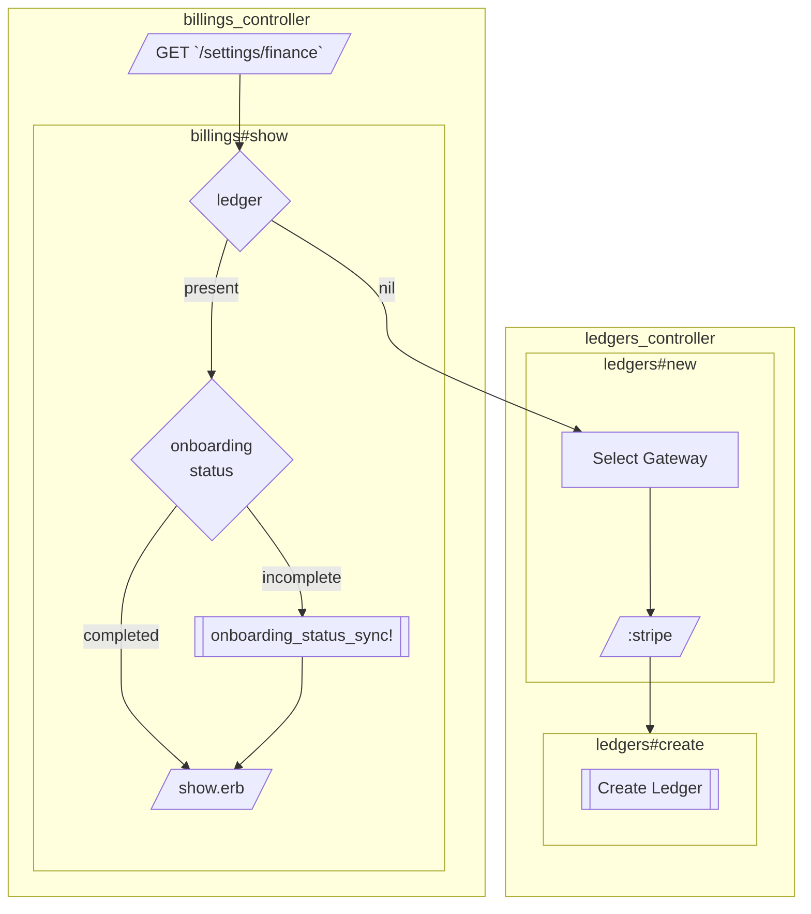

# Scratches

```mermaid
flowchart
  subgraph billings[billings_controller]
    settings_finance[/GET `/settings/finance`/]   --> B{ledger}

    subgraph show[billings#show]
      B --> |present| C{onboarding\nstatus}
      C --> |completed| view
      C --> |incomplete| sync[[onboarding_status_sync!]]
      sync --> view
    end

    view[/show.erb/]
  end
  
  B --> |nil| gateway
  
  subgraph ledgers[ledgers_controller]
    subgraph new[ledgers#new]
      gateway[Select Gateway] --> stripe[/:stripe/]
    end

    subgraph create[ledgers#create]
      A4[[Create Ledger]]
    end

    stripe --> create
  end
```
