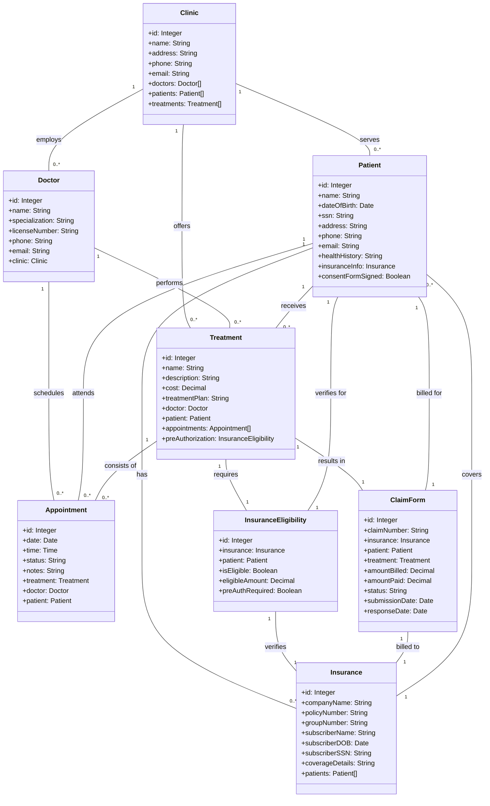
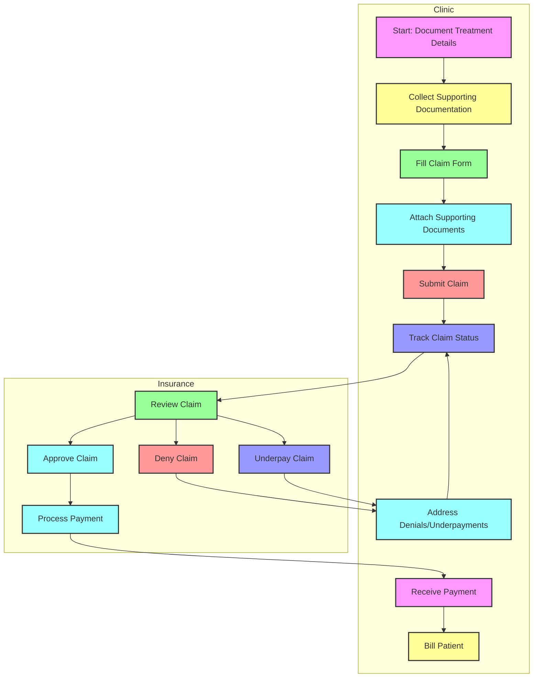
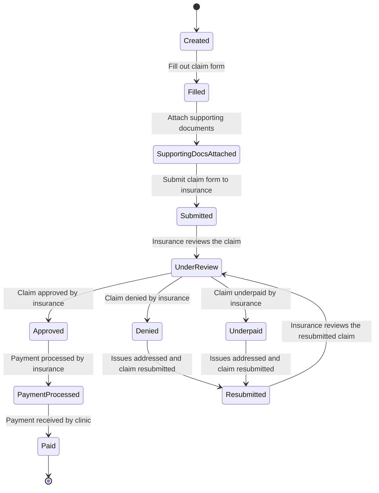

## Class Diagram

## Flow chart

```mermaid
flowchart TD
    subgraph Patient
        PatientInfo["Patient: Provide Personal Information"]
        HealthHistory["Patient: Provide Health History"]
        InsuranceInfo["Patient: Provide Insurance Information"]
        ConsentForm["Patient: Sign Consent Form"]
        PatientInfo --> HealthHistory
        HealthHistory --> InsuranceInfo
        InsuranceInfo --> ConsentForm
    end

    subgraph Clinic
        InitialConsult["Clinic/Doctor: Initial Consultation"]
        TreatmentPlan["Doctor: Create Treatment Plan"]
        PreAuth["Clinic: Submit Pre-Authorization Request"]
        ScheduleAppointments["Clinic: Schedule Appointments"]
        PerformAppointment["Clinic/Doctor: Perform Appointment"]
        DocAppointment["Clinic: Document Appointment Details"]
        CollectDocs["Clinic: Collect Supporting Documentation"]
        FillClaimForm["Clinic: Fill Claim Form"]
        AttachDocs["Clinic: Attach Supporting Documents"]
        SubmitClaim["Clinic: Submit Claim"]
        TrackStatus["Clinic: Track Claim Status"]
        AddressIssues["Clinic: Address Denials/Underpayments"]
        ReceivePayment["Clinic: Receive Payment"]
        BillPatient["Clinic: Bill Patient"]
    end

    subgraph Insurance
        InsuranceEligibility["Insurance: Verify Eligibility"]
        ReviewPreAuth["Insurance: Review Pre-Authorization"]
        ProcessClaim["Insurance: Process Claim"]
        DenialReview["Insurance: Review Denials/Underpayments"]
    end

    Patient --> Clinic
    Clinic --> Insurance

    %% Patient Flow
    PatientInfo --> HealthHistory
    HealthHistory --> InsuranceInfo
    InsuranceInfo --> ConsentForm
    ConsentForm --> InitialConsult

    %% Clinic Flow
    InitialConsult --> TreatmentPlan
    TreatmentPlan --> PreAuth
    PreAuth -->|Submit| InsuranceEligibility
    InsuranceEligibility -->|Verified| ReviewPreAuth
    ReviewPreAuth -->|Approved| ScheduleAppointments
    ScheduleAppointments --> PerformAppointment
    PerformAppointment --> DocAppointment
    DocAppointment --> CollectDocs
    CollectDocs --> FillClaimForm
    FillClaimForm --> AttachDocs
    AttachDocs --> SubmitClaim
    SubmitClaim --> TrackStatus
    TrackStatus --> AddressIssues
    AddressIssues -->|Resolved| ReceivePayment
    ReceivePayment --> BillPatient

    %% Insurance Flow
    ReviewPreAuth -->|Denied| AddressIssues
    ProcessClaim -->|Denied| AddressIssues
    AddressIssues -->|Resolved| ProcessClaim
    DenialReview -->|Resolved| ProcessClaim

    style PatientInfo fill:#f9f,stroke:#333,stroke-width:2px
    style HealthHistory fill:#ff9,stroke:#333,stroke-width:2px
    style InsuranceInfo fill:#9f9,stroke:#333,stroke-width:2px
    style ConsentForm fill:#9ff,stroke:#333,stroke-width:2px
    style InitialConsult fill:#f99,stroke:#333,stroke-width:2px
    style TreatmentPlan fill:#99f,stroke:#333,stroke-width:2px
    style PreAuth fill:#9ff,stroke:#333,stroke-width:2px
    style ScheduleAppointments fill:#f9f,stroke:#333,stroke-width:2px
    style PerformAppointment fill:#ff9,stroke:#333,stroke-width:2px
    style DocAppointment fill:#9f9,stroke:#333,stroke-width:2px
    style CollectDocs fill:#9ff,stroke:#333,stroke-width:2px
    style FillClaimForm fill:#f99,stroke:#333,stroke-width:2px
    style AttachDocs fill:#99f,stroke:#333,stroke-width:2px
    style SubmitClaim fill:#9ff,stroke:#333,stroke-width:2px
    style TrackStatus fill:#f9f,stroke:#333,stroke-width:2px
    style AddressIssues fill:#ff9,stroke:#333,stroke-width:2px
    style ReceivePayment fill:#9f9,stroke:#333,stroke-width:2px
    style BillPatient fill:#9ff,stroke:#333,stroke-width:2px
    style InsuranceEligibility fill:#f99,stroke:#333,stroke-width:2px
    style ReviewPreAuth fill:#99f,stroke:#333,stroke-width:2px
    style ProcessClaim fill:#9ff,stroke:#333,stroke-width:2px
    style DenialReview fill:#f9f,stroke:#333,stroke-width:2px
```

### Claim Form Diagram

### State diagram for Claim

- Payer can be the InsuranceCompany, it covers most cases
- Provider can be the Doctor, it covers most cases
- Can AppointmentTypes be considered as ProcedureIDs?
