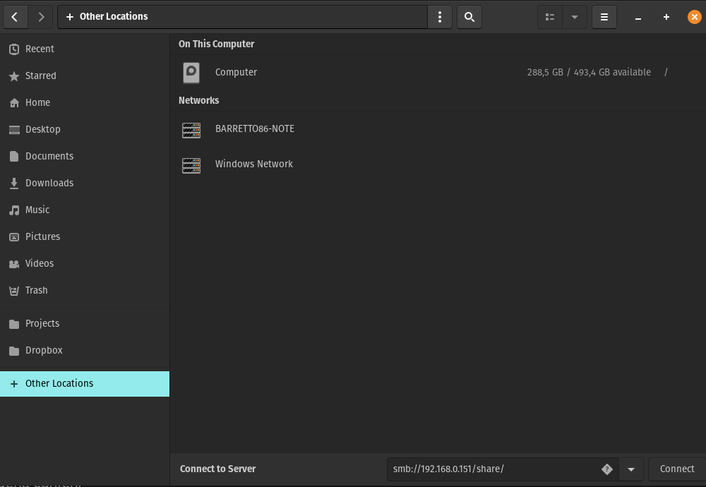
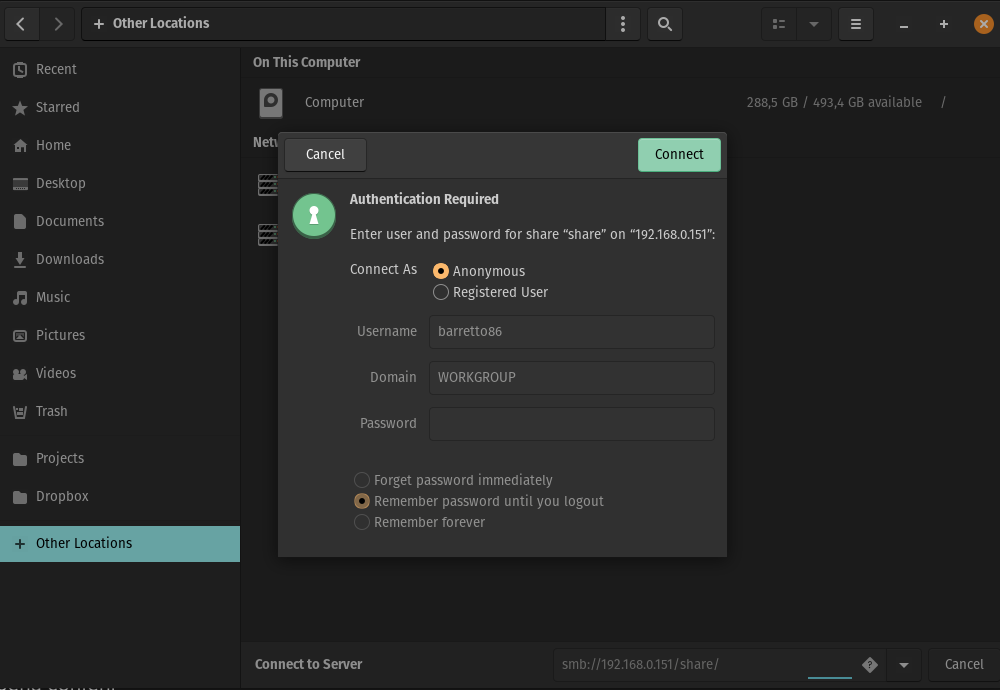
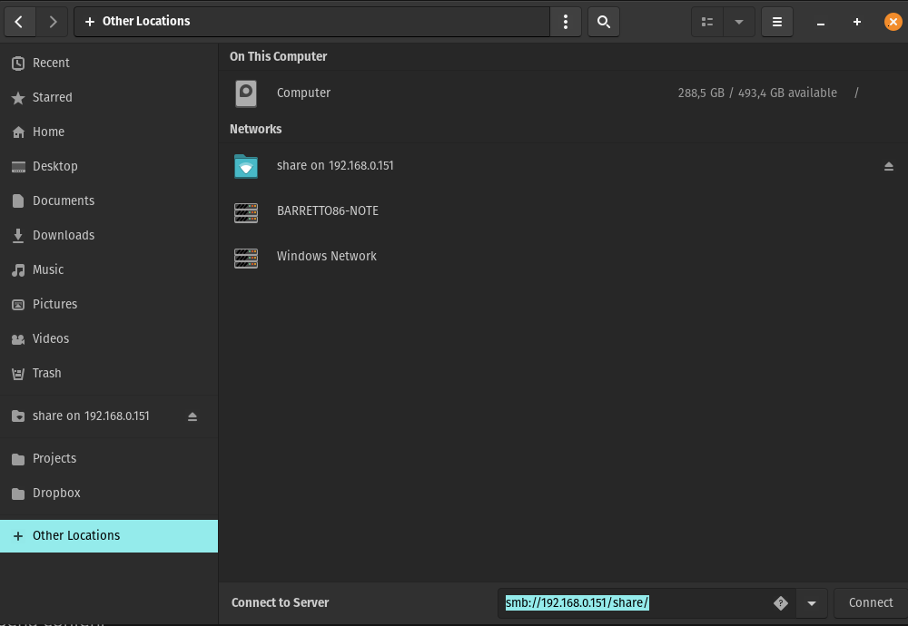

# Creating my personal NAS

- [Creating my personal NAS](#creating-my-personal-nas)
  - [What I want?](#what-i-want)
  - [Setup NAS Machine](#setup-nas-machine)
    - [Hardware](#hardware)
    - [Install](#install)
  - [Samba setup](#samba-setup)
    - [Connect to NAS Network (share folder) in Ubuntu](#connect-to-nas-network-share-folder-in-ubuntu)
    - [Keep NAS Network (share folder) always mounted](#keep-nas-network-share-folder-always-mounted)
  - [Setup SSH](#setup-ssh)
    - [SSH to allow access to the NAS](#ssh-to-allow-access-to-the-nas)
    - [SSH to authenticate on Github](#ssh-to-authenticate-on-github)
  - [Setup Docker and Docker compose](#setup-docker-and-docker-compose)
  - [Setup Monitoring with Glances](#setup-monitoring-with-glances)
  
## What I want?

1. I want have place where I can save my file so that I can access from any device
2. I want have a place where I can play around with Docker and Kubernetes on the feature
3. I want to now more about NAS and metrics

## Setup NAS Machine

### Hardware

- Beelink Intel Celeron J4125 8GB DDR4, M2 128GB

### Install

- First step will be to define which OS to use
  - Ubuntu Server
  - Debian
  - Open Media Vault

I have decided to use Ubuntu Server because I'm familiar with Ubuntu

**Ubuntu server installation:**

1. Download [Ubuntu Server 24.04](https://ubuntu.com/download/server)
2. Download [Etcher](https://etcher.balena.io/)
3. Create bootable
4. Setup NAS hardware bios to UEFI
5. Run the Ubuntu Installer
    - On the installation set the SSD as LVM to allow storage to be extended
    - From the canonical snaps I only added `Docker` the other I want be able to install as study
    - Added WIFI and allow Installer and Ubuntu to be updated to 24.08 version

6. After first initialization run:

   1. ```shell
      sudo apt updated
      sudo apt upgrade -Y
      sudo apt autoclean
      sudo apt autoremove
      ```

   2. Some dependencies might require installation as it cannot be upgrade using `apt upgrade`, so I personally needed to run additionally:

    ```sh
    sudo apt install python3-distupgrade ubuntu-release-upgrade-core
    ```

## Samba setup

To be able to share content between the NAS and other devices we'll need to setup Samba:

1. Install Samba
2. Create share folder
3. Configure Samba to allow sharing

**Install Samba:**

```sh
sudo apt install samba
```

To test installation

```sh
samba --version
```

**Create `share` folder:**

After installing samba we need to create the directories we will use as shared space between all devices

```sh
cd ~
mkdir -p /<nas-username>/share/
sudo chmod 777 /<nas-username>/share
```

> Replace the nas-username for the name of the user you created with the installation
> chmod 777 grant access for share folder to everyone

**Configure Samba to allow sharing:**

After having the directories created we need to add the share folder to the samba configuration

```sh
sudo nano /etc/samba/smd.conf
```

Here’s the correct setup for your Samba configuration:

```ini
[share]
  path = /<nas-username>/share
  browseable = yes
  read only = no
  guest ok = yes

```

> (`[share]`) defines how the folder will be accessed over the network, so if you name it `[share]`, then you’ll access it via `smb://192.168.0.151/share`.
> (`path`) specifies the actual location of the directory on your NAS’s filesystem., so if NAS root is `/`, you have to set `path = /<nas-username>/share`.

After adding the share configs section, we need to restart samba service

```sh
sudo systemctl restart smbd nmbd
```

To check if smbd params are correct:

```sh
sudo testparm
```

**Output:**

```mono
sudo testparm
Load smb config files from /etc/samba/smb.conf
Loaded services file OK.
Weak crypto is allowed by GnuTLS (e.g. NTLM as a compatibility fallback)

Server role: ROLE_STANDALONE

Press enter to see a dump of your service definitions

# Global parameters
[global]
 log file = /var/log/samba/log.%m
 logging = file
 map to guest = Bad User
 max log size = 1000
 obey pam restrictions = Yes
 pam password change = Yes
 panic action = /usr/share/samba/panic-action %d
 passwd chat = *Enter\snew\s*\spassword:* %n\n *Retype\snew\s*\spassword:* %n\n *password\supdated\ssuccessfully* .
 passwd program = /usr/bin/passwd %u
 server role = standalone server
 server string = %h server (Samba, Ubuntu)
 unix password sync = Yes
 usershare allow guests = Yes
 workgroup = BARRETTO86-GROUP
 idmap config * : backend = tdb


[printers]
 browseable = No
 comment = All Printers
 create mask = 0700
 path = /var/tmp
 printable = Yes


[print$]
 comment = Printer Drivers
 path = /var/lib/samba/printers


[share]
 guest ok = Yes
 path = /barretto86/share
 read only = No
``

Now we are up and running, next step will be to use the shared folder

**Adding NAS `share` folder to client device:**

Here I want to configure the share folder between my NAS and my notebook that also runs Linux, I will the POP_OS!

## Add SSH access to the NAS

**Setup SSH:**

Be sure we have `openss-server` installed correctly

```sh
sudo apt update
sudo apt install openssh-server
```

**Testing share folder:**

On the client Ubuntu:

```sh
sudo apt install smbclient
```

Lets test it:

```sh
smbclient //<nas-server-ip>/share -N
```

> In our example: `smbclient //192.168.0.151/share -N`

**Output:**

```mono
Try "help" to get a list of possible commands.
smb: \>
```

> In some cases ufw permission might be required `sudo ufw allow samba`

### Connect to NAS Network (share folder) in Ubuntu

To have a single access to the share folder, we need to add a new network using GNOME GUI

1. On GNOME Files add the network: `smb://192.168.0.151/share`
   - 
2. Request Anonymous login
   - 
3. Ensure successful connection
   - 

### Keep NAS Network (share folder) always mounted

To keep your Samba share always mounted use `fstab` to set up an automatic mount:

1. **Create a Mount Directory:**

   ```sh
   sudo mkdir -p /mnt/nas/share

   <!-- I created `nas` as directory to allow multiple mounts within nas, like `/mnt/nas/projects` -->
   ```

2. **Edit the fstab File:**

   ```sh
   sudo nano /etc/fstab
   ```

   Add the NAS Network mount entry:
   Add this line to the end of the file to mount the share at boot:

   ```mono
   //192.168.0.151/share /mnt/nas/share cifs guest,uid=1000,iocharset=utf8 0 0
   ```

   - `//192.168.0.151/share` is the network path.
   - `/mnt/nas/share` is the mount point.
   - `cifs` specifies the type.
   - `guest` allows connection without a password. Adjust `uid=1000` to match your user ID if needed.

3. **Mount all entries:**:

   ```sh
   sudo mount -a
   ```

   > flag `-a` means all to mount all entries from fstab

  To check and add the mounted shared folder to the bookmarks from Files you just visit the path created `/mnt/nas/`

## Setup SSH

### SSH to allow access to the NAS

**Setup SSH:**

Be sure we have `openss-server` installed correctly

```sh
sudo apt update
sudo apt install openssh-server
```

Lets start the service

```sh
sudo systemctl start ssh
sudo systemctl enable ssh
sudo systemctl status ssh
```

To add custom configuration such as port and so on we can edit the config file from SSH

```sh
sudo nano /etc/ssh/sshd_config
```

- To change the SSH port from the default 22 to something else (for security reasons):

  - ```mono
      # /etc/ssh/sshd_config
      Port 2222
    ```

- To disable root login (recommended for security):

  - ```mono
      # /etc/ssh/sshd_config
      PermitRootLogin no
    ```

> Remember to restart service if configs are changed `sudo systemctl restart ssh`

**Using SSH:**

First we need to know what the IP from the NAS is, so within the NAS run:

```sh
ip a
```

**Output:**

```mono
1: lo: <LOOPBACK,UP,LOWER_UP> mtu 65536 qdisc noqueue state UNKNOWN group default qlen 1000
    link/loopback 00:00:00:00:00:00 brd 00:00:00:00:00:00
    inet 127.0.0.1/8 scope host lo
       valid_lft forever preferred_lft forever
    inet6 ::1/128 scope host noprefixroute 
       valid_lft forever preferred_lft forever
2: enp1s0: <BROADCAST,MULTICAST> mtu 1500 qdisc noop state DOWN group default qlen 1000
    link/ether 7c:83:34:b2:fb:c4 brd ff:ff:ff:ff:ff:ff
3: wlo1: <BROADCAST,MULTICAST,UP,LOWER_UP> mtu 1500 qdisc noqueue state UP group default qlen 1000
    link/ether ec:63:d7:81:fc:95 brd ff:ff:ff:ff:ff:ff
    altname wlp2s0
    inet 192.168.0.151/24 metric 600 brd 192.168.0.255 scope global dynamic wlo1
       valid_lft 1851sec preferred_lft 1851sec
    inet6 2804:14c:3b95:14c5::172f/128 scope global dynamic noprefixroute 
       valid_lft 2120sec preferred_lft 2120sec
    inet6 2804:14c:3b95:14c5:ee63:d7ff:fe81:fc95/64 scope global dynamic mngtmpaddr noprefixroute 
       valid_lft 86395sec preferred_lft 71995sec
    inet6 fe80::ee63:d7ff:fe81:fc95/64 scope link 
       valid_lft forever preferred_lft forever
4: docker0: <NO-CARRIER,BROADCAST,MULTICAST,UP> mtu 1500 qdisc noqueue state DOWN group default 
    link/ether 02:42:73:56:04:c1 brd ff:ff:ff:ff:ff:ff
    inet 172.17.0.1/16 brd 172.17.255.255 scope global docker0
       valid_lft forever preferred_lft forever
```

> In this case the ip is found on `inet 192.168.0.151/24` meaning IP is `192.168.0.151`

So to access the NAS from the 'client' machine we run:

```sh
ssh username@192.168.0.151
```

> change `username` for your own machine username, for instance 'mary-jane' so `ssh mary-jane@192.168.0.151`
> On the first access it will request you to record a SSH fingerprint in that case you say 'yes'

After all set you will something like that:

```mono
Welcome to Ubuntu 24.04.1 LTS (GNU/Linux 6.8.0-48-generic x86_64)

 * Documentation:  https://help.ubuntu.com
 * Management:     https://landscape.canonical.com
 * Support:        https://ubuntu.com/pro

 System information as of Thu Nov 14 06:56:30 PM UTC 2024

  System load:           0.0
  Usage of /:            11.9% of 56.88GB
  Memory usage:          4%
  Swap usage:            0%
  Temperature:           39.0 C
  Processes:             148
  Users logged in:       1
  IPv4 address for wlo1: 192.168.0.151
  IPv6 address for wlo1: 2804:14c:3b95:14c5::172f
  IPv6 address for wlo1: 2804:14c:3b95:14c5:ee63:d7ff:fe81:fc95

 * Strictly confined Kubernetes makes edge and IoT secure. Learn how MicroK8s
   just raised the bar for easy, resilient and secure K8s cluster deployment.

   https://ubuntu.com/engage/secure-kubernetes-at-the-edge

Expanded Security Maintenance for Applications is not enabled.

0 updates can be applied immediately.

Enable ESM Apps to receive additional future security updates.
See https://ubuntu.com/esm or run: sudo pro status


Last login: Thu Nov 14 18:48:56 2024 from 192.168.0.128
```

### SSH to authenticate on Github

To be able to work with Github directly on has we will have to setup SSH keys

**Creating SSH key:**

```sh
ssh-keygen -t ed25519 -C "your_email@example.com"
```

**Testing Key:**

```sh
eval "$(ssh-agent -s)"
```

**Add your SSH key:**

```sh
ssh-add ~/.ssh/id_ed25519
```

> The command ssh-add is used to add your private key to the SSH agent (ssh-agent), which is a background process that manages your SSH keys.

**Setup on Github:**

Now that you have an SSH key, you need to add it to your GitHub account, through settings, to be able to copy and past the key use the following command:

```sh
cat ~/.ssh/id_ed25519.pub
```

**Test SSH:**

```sh
ssh -T git@github.com
```

## Setup Docker and Docker compose

**Install Docker:**

```sh
cd ~

# Install dependencies
sudo apt-get install -y apt-transport-https ca-certificates curl software-properties-common

# Adding official repo
curl -fsSL https://download.docker.com/linux/ubuntu/gpg | sudo gpg --dearmor -o /usr/share/keyrings/docker-archive-keyring.gpg

# Setup docker source.list
echo "deb [arch=amd64 signed-by=/usr/share/keyrings/docker-archive-keyring.gpg] https://download.docker.com/linux/ubuntu $(lsb_release -cs) stable" | sudo tee /etc/apt/sources.list.d/docker.list > /dev/null

# Installing Docker
sudo apt-get update
sudo apt-get install -y docker-ce docker-ce-cli containerd.io

# To test
sudo docker --version

# Starting services
sudo systemctl start docker
sudo systemctl enable docker

# To test
sudo systemctl status docker

# Allow Docker to Run Without Sudo
sudo usermod -aG docker $USER
newgrp docker

# To test
docker run hello-world
```

**Install docker-compose:**

```sh
# Adding official repo
sudo curl -L "https://github.com/docker/compose/releases/download/$(curl -s https://api.github.com/repos/docker/compose/releases/latest | jq -r .tag_name)/docker-compose-$(uname -s)-$(uname -m)" -o /usr/local/bin/docker-compose

# Grant permission
sudo chmod +x /usr/local/bin/docker-compose

# To test
docker-compose --version
```

## Setup Monitoring with Glances

To be able to monitor the NAS I decided to setup Glance due to simplicity

**Create monitor project:**

```sh
sudo mkdir cd ~/monitor
cd ~/monitor
```

**Setup docker-compose.yml for Glance:**

```sh
sudo nano docker-compose.yml
```

```yml
version: '3.8'

services:
  glances:
    image: nicolargo/glances:latest
    container_name: glances
    ports:
      - "61208:61208" # Web interface
    restart: unless-stopped
    environment:
      - GLANCES_OPT=-w # Enable web server mode
```

**Glances usage:**

To access glances:

```http
http://192.168.0.151:61208/
```
