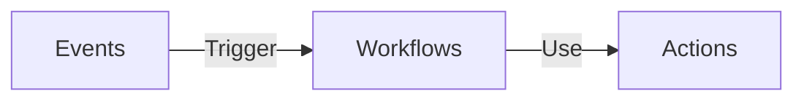

# Git and Github

## Branches

**List all remote branches:**

```sh
git branch -r
```

**List only existing in remote branches:**

```sh
git ls-remote --heads origin | awk '{print $2}' | sed 's|refs/heads/||'
```

## Configurations

## .gitignore globally

**Setup .gitignore_global:**

In some instances we want have files that needs to be excluded globally avoid committing it by accident there's when `.gitignore_global` como into play

**Create global ignore:**

```sh
touch ~/.gitignore_global
```

**Set global ignore config:**

```sh
git config --global core.excludesfile ~/.gitignore_global
```

**Add ignores:**

```sh
nano ~/.gitignore_global
```

**Basic ignore template:**

```mono
# macOS files
.DS_Store

# Editor files
*.swp
*~
.vscode/
.idea/

# Logs
log/
*.log

# Node.js
node_modules/

# Ruby & Rails
*.gem
.bundle/
log/
tmp/

# Hidden files
*.hid
*.hide
*.hidden
```

**Check configuration:**

```sh
git config --global core.excludesfile
```

**Unset local config:**

```sh
git config --unset --local user.name
git config --unset --local user.email
```

> always make sure to use ~/.config/git/

---

## cherry-pick

Cherry pick commits allow you to copy commit from one branch to another

## cherry-pick single commit

```shell
git cherry-pick COMMIT_HASH
```

## cherry-pick multiple commits

To get multiple commit we use the two commits hash representing "from", "to" and add operator `^..` between them

```shell
git cherry-pick COMMIT_A^..COMMIT_B
```

- A must be older than B
- If you want get all commits but ignore A, you only `A..B`
- in `ZSH` needs to use `'A^..B` or `'A..B`

## Squashing / Rebasing

**Specific commit:**

```sh
git rebase -i <commit hash>
```

> `HEAD~` works just as git reset

**Output:**

```mono
pick 01d5859 feat: Implement Rspec and other test gems (#2)
pick c200190 feat: Setup docker for development (#1)

# Rebase 8ad5442..c200190 onto 8ad5442 (2 commands)
#
# Commands:
# p, pick <commit> = use commit
# r, reword <commit> = use commit, but edit the commit message
# e, edit <commit> = use commit, but stop for amending
# s, squash <commit> = use commit, but meld into previous commit
# f, fixup [-C | -c] <commit> = like "squash" but keep only the previous
#                    commit's log message, unless -C is used, in which case
#                    keep only this commit's message; -c is same as -C but
#                    opens the editor
# x, exec <command> = run command (the rest of the line) using shell
# b, break = stop here (continue rebase later with 'git rebase --continue')
# d, drop <commit> = remove commit
# l, label <label> = label current HEAD with a name
# t, reset <label> = reset HEAD to a label
# m, merge [-C <commit> | -c <commit>] <label> [# <oneline>]
# .       create a merge commit using the original merge commit's
# .       message (or the oneline, if no original merge commit was
# .       specified); use -c <commit> to reword the commit message
#
# These lines can be re-ordered; they are executed from top to bottom.
#
# If you remove a line here THAT COMMIT WILL BE LOST.
#
# However, if you remove everything, the rebase will be aborted.
#

```

> to change the commit we just modify the place where it states `pick` for one of the listed options like, "squash", "reword"

**Since first commit:**

Squashing all commits since the first

```sh
git rebase -i --root
```

**Prior to merge:**

If you haven't merged yet and want to squash everything into a single commit, use:

```sh
git merge --squash <branch-name>
```

**Rebase merge commits:**

```sh
git rebase -i --rebase-merges <commit hash>
```

## Commit message

**Amending:**

If you want to change the commit message from the latest commit:

```sh
git commit --amend
```

> To change message from older commits you will need to do a rebase with options `reword`

## Worktrees

When we are working in a feature and we have changes uncommitted and needs to go to another branch, for instance the main to make a hotfix, normally we use stash and depends on stash stack to resume the work after get back to the early work branch, worktree could help in those cases because a worktree is a place where you can keep uncommitted changes without having to stash, working with working trees you have a linked copy to the repository therefore working as a virtualization to the main repository, every worktree is linked to a checked out branch, so when you access the worktree dir you will automatically be working in the branch linked instead of the main branch, that makes a clear separation.

**Worktrees placement conventions:**

Regarding working trees developers diverge what is the best way to handle the worktree placement, while some prefer make a worktree sibling to the main project folder `../%branch-name%` others prefer using a nested folder like `.worktrees/%branch-name%`, but both can be messy depending on your environment, for instance if you use IDE it can mess the local changes you see since normally we open the project in the root folder of the project it, for these cases there's a third alternative which is a global placement for worktrees, so you would use `~/.worktrees/%branch-name%` or you can configure your own IDE to handle

I chose to use the nested for the sake of clarity so the examples will reflect that, and it will require adding the `.worktrees` in the `.gitignore` file or else `git status` will show unstaged changes also from the worktree files

**Adding new worktree:**

```sh
git worktree add -b %branch-name% .worktrees/%branch-name%
```

**Listing worktree:**

```sh
git worktree list
```

**Removing worktree:**

```sh
git worktree remove .worktrees/%branch-name%
```

## Worktree ideal flow

Having a clean project using worktree requires a very different way to work with git, ideally is recommended to setup project like

```tree
my-app-worktrees/
├── my-app-main/           # Directory = main branch
├── my-app-feature-xyz/    # Directory = feature-xyz branch
└── my-app-hotfix/         # Directory = hotfix branch

```

> my-app-main will always be checkout to main, blocking any other worktree to checkout main, because it raises an error

To access which worktree (checked out branch) we use native `cd`, like:

```sh
cd my-app-feature-xyz
```

> This worktree will be always checked out as the `feature-xyz`
> pull, push and any other command works normally, except `git checkout main` if you already have another worktree for the main

To merge worktree changes to a main you will do

```sh
cd ../my-app-main

git merge ../my-app-hotfix

# OR
git merge hotfix
```

> But you will always have to move to the main worktree

## Submodules

Git also allow you to link dependencies as submodules does you can manage your repos with a project structure

To add a submodule first you need to have a remote repo to be attached as submodule

## Adding submodule

**Through https - OLD:**

```shell
git submodule add https://github.com/LucasBarretto86/MyApp.git
```

**Through SSH:**

```shell
git submodule add git@github.com:LucasBarretto86/MyApp.git
```

**Submodule renaming root folder:**

```shell
git submodule add git@github.com:LucasBarretto86/MyApp.git frontend
```

> In that example above we will create the submodule with the repo content directly inside a frontend folder

```tree
/frontend
  ├── package.json
  ├── src/
  ├── public/
  └── (other files from MyApp)
```

## Pull for all submodules for the first time

```shell
git submodule update --init --recursive
git pull --recurse-submodule
```

## Pull each submodule

```shell
git submodule foreach git pull origin main
```

## Submodule issues

Sometimes a repo that has submodules does not fully updates so here there's few lines you may use

- Remove `.git` caches Re-adding modules and Re-downloading

Within the modules root folder

```shell
# Cleaning submodules and repo indexes
rm -Rf .git/modules/*
rm .git/index

# Adding modules again, before doing this you can check submodules path within the file .gitmodules
cd *SUBMODULES_FOLDER*
git submodule add git@github.com:*USER_NAME*/*REPO_NAME*.git

# Pull from each submodule
cd ..
git submodule foreach git pull origin main
```

## Subtrees

Subtree is very similar to submodules, however subtree allow you to bring in external repos by merging it and squashing

## Adding subtree

```shell
git subtree add --prefix {local directory being pulled into} {remote repo URL} {remote branch} --squash
```

## Updating subtree

To update subtrees you have to use pull and push referring the prefix and the remote repos path

### Pulling changes

```shell
git subtree pull --prefix {local directory being pulled into} {remote repo URL} {remote branch} --squash
```

### Pushing changes

```shell
git subtree push --prefix {local directory being pulled into} {remote repo URL} {remote branch}
```

## Tags

## Listing tags

```shell
git tag
```

## Creating tags

```shell
git tag -a v2.3.4 -m "[2.3.4] - 2022-04-25"
```

## Search tags

## Git Alias

Syntax to add alias to git commands

```sh
git config --global alias.wta '!f() { git worktree add -b "$1" "../$1"; }; f'
git config --global alias.wtr '!f() { git worktree remove "../$1"; }; f'
git config --global alias.wtl '!f() { git worktree list; }; f'
```

**Usage:**

```sh
# List worktrees
git wtl

# Add a worktree
git wta name-of-my-worktree

# Remove a worktree
git wtr name-of-my-worktree
```

## Git Hooks

## pre-push

Within every `.git` folder there's a folder called hooks, these hooks are triggered by git to chain other commands, for instance a `pre-push` is trigger before the `push` occur, so that allow you to create rules or restriction to the `push`

**Pre Push example:**

```sh
# .git/hooks/pre-push

#!/bin/sh

# Rule to guard that only 'main' can be pushed to production

remote="$1"
url="$2"

current_branch=$(git rev-parse --abbrev-ref HEAD)

if test "$remote" = "production"; then
  if test "$current_branch" != "main"; then
    echo "Current branch: '$current_branch'."
    echo "Only 'main' can be pushed to 'production'."
    exit 1
  fi
fi

exit 0
```

> After implemented be sure to give it the necessary permissions `chmod +x .git/hooks/pre-push`

| Hook Name                 | Triggered When / Description                                                                                                                 |
| ------------------------- | -------------------------------------------------------------------------------------------------------------------------------------------- |
| **applypatch-msg**        | After `git am` applies a patch, used to validate or edit the commit message of the patch.                                                    |
| **pre-applypatch**        | Before applying a patch with `git am`, can be used to inspect the patch and abort if needed.                                                 |
| **post-applypatch**       | After a patch is applied via `git am`, usually for cleanup or notifications.                                                                 |
| **pre-commit**            | Before a commit is created (`git commit`). Commonly used to run linters, tests, or validate staged files.                                    |
| **prepare-commit-msg**    | Before the commit message editor is fired, allows modification of the default commit message.                                                |
| **commit-msg**            | After writing the commit message, before the commit is finalized. Can be used to enforce commit message format.                              |
| **post-commit**           | After a commit has been created. Usually for notifications, logging, or triggering CI hooks.                                                 |
| **pre-rebase**            | Before `git rebase` begins. Can be used to abort or warn about unsafe rebases.                                                               |
| **post-checkout**         | After `git checkout` or `git switch`. Parameters indicate branch or commit change; often used to update environment or dependencies.         |
| **post-merge**            | After a successful merge. Often used to run build or update scripts.                                                                         |
| **pre-push**              | Before `git push`. Can inspect what’s being pushed and abort if necessary (e.g., prevent non-main branches from being pushed to production). |
| **pre-receive**           | On the remote repository, before any refs are updated. Can reject pushes based on branch, commit message, or other policies.                 |
| **update**                | On the remote, called once per ref being updated (branch/tag). Similar to `pre-receive` but per-ref.                                         |
| **post-receive**          | On the remote, after all refs have been updated. Often used to trigger CI/CD pipelines or deployment scripts.                                |
| **post-update**           | On the remote, after `git push`. Similar to `post-receive` but simpler; often used to update server info.                                    |
| **pre-auto-gc**           | Before Git’s automatic garbage collection (`git gc --auto`). Can be used to postpone GC under certain conditions.                            |
| **post-rewrite**          | After commands like `git commit --amend` or `git rebase` that rewrite history. Useful for cleanup or notifications.                          |
| **fsmonitor-watchman**    | Used by Git’s filesystem monitoring (Watchman) to speed up `git status` and other commands. Triggered when file changes are detected.        |
| **p4-pre-submit**         | Used in Perforce integration; called before submitting changes from Perforce.                                                                |
| **applypatch-msg.sample** | Example scripts (not active by default) that demonstrate how to use the hooks.                                                               |
| **pre-commit.sample**     | Example script provided by Git for pre-commit hooks.                                                                                         |
| **post-commit.sample**    | Example script provided by Git for post-commit hooks.                                                                                        |
| **pre-push.sample**       | Example script provided by Git for pre-push hooks.                                                                                           |

## Git lfs / Large files on Github

Git has an extension to control larger files

## Extension installation

First is required to download files

### First download the git-lfs file

<https://github.com/git-lfs/git-lfs/releases>

### Download additional script

```shell
curl -s https://packagecloud.io/install/repositories/github/git-lfs/script.deb.sh?os=Ubuntu&dist=kinnect&source=script | sudo bash
```

### First install

Within the `git-lfs-3.2.0` folder

```shell
sudo ./install.sh
```

## Git lfs usage

```shell
git lfs install
```

### Tracking files

Within the repo with large files start tracking files

```shell
git lfs track "*.capx"
```

## Github actions

Actions allows us to set automatization that run over a repository triggered by events, mostly the actions are used to run linters, CI, deploy, builds, and etc...



All configuration is setup using YAML

**Example:**

```yml
on:
  issues:
    types:
      - opened

jobs:
  label_issue:
    runs-on: ubuntu-latest
    steps:
      - env:
          GITHUB_TOKEN: ${{ secrets.MY_TOKEN }}
          ISSUE_URL: ${{ github.event.issue.html_url }}
        run: |
          gh issue edit $ISSUE_URL --add-label "triage"
```

## Events

Events establishes when a workflow should be triggered

Some of the most common triggers are:

- push
- pull_request
- public
- fork
- label
- workflow_dispatch
- schedule

To automatically trigger a workflow, use on to define which events can cause the workflow to run.

**`schedule` trigger examples:**

```yml
on:
  schedule:
    - cron: 0 12 * * 1
```

**`label` trigger example:**

```yml
on:
  label:
    types:
      - created
```

It's also possible to define multiple triggers

```yml
on:
  [push, fork]
  # - do something
```

OR

```yml
on:
  label:
    types:
      - created
  push:
    branches:
      - main
```

It's also possible to have multiple types

```yml
on:
  label:
    types: [created, edited]
```

To see more available workflow triggers go to <https://docs.github.com/en/actions/using-workflows/events-that-trigger-workflows>

## Workflows

A workflow is a configurable automated process that will run one or more jobs, it is also defined by YAML file, which has to saved under `workflows` directory

```tree
.github
└── workflows
    └── markdown-linter.yml
```

Workflow basically runs sequenced pre-existing actions or shell scripts

**Workflow YAML file example using pre existing:**

```yml
name: Code Linting

on: push

jobs:
  MarkdownLinter:
    runs-on: ubuntu-latest
    steps:
      - uses: actions/checkout@v1

      - name: Markdown Lint
        uses: avto-dev/markdown-lint@v1
        with:
          config: "./.markdownlintrc"
          args: "./README.md ./specifics/*.md"
          ignore: "./CHANGELOG.md ./unorganized_documents/* ./files/*"
```

> In some cases we might to add specific args it depend on the action itself, so we might check the action repo

## Git commands table

| Command                                                                    | Description                                                                                             |
| :------------------------------------------------------------------------- | :------------------------------------------------------------------------------------------------------ |
| `git rm -r --cached .`                                                     | Clear git cache for all files                                                                           |
| `git branch \| grep -v "main" \| xargs git branch-D`                       | Clean git branches                                                                                      |
| `git branch -M NEW_NAME`                                                   | Rename branch and set new name for origin                                                               |
| `git branch -m NEW_NAME`                                                   | Rename branch locally                                                                                   |
| `git reset --soft HEAD~1`                                                  | Retrieve one commit (`~1`) and return it to the staging area                                            |
| `git reset --hard`                                                         | Undo every uncommitted change; can also undo commits using `HEAD~1` flag                                |
| `git push --force`                                                         | Force push in case of divergence from origin (careful, no rollback)                                     |
| `git push --set-upstream origin BRANCH_NAME`                               | Push and set upstream branch                                                                            |
| `git fetch --prune`                                                        | Remove stale remote-tracking branches                                                                   |
| `git branch -vv`                                                           | Show branch status with upstream tracking                                                               |
| `git config --global user.name USER_NAME`                                  | Set global user name                                                                                    |
| `git config --global user.email USER_EMAIL`                                | Set global user email                                                                                   |
| `git config --global user.password PASSWORD`                               | Set global user password                                                                                |
| `git config --global init.defaultBranch BRANCH_NAME`                       | Redefine the default initial branch name globally                                                       |
| `git revert -m 1 COMMIT_SHA`                                               | Revert changes from a specific commit                                                                   |
| `git rebase BRANCH`                                                        | Sync local branch with another branch (conflicts may occur; use `git push --force` carefully if needed) |
| `git remote add origin git@github.com:USER_NAME/REPO_NAME.git`             | Add remote repository                                                                                   |
| `git submodule add origin git@github.com:USER_NAME/REPO_NAME.git`          | Add a repository as a submodule                                                                         |
| `git submodule update`                                                     | Pull updates for all submodules                                                                         |
| `git submodule update MODULE_PATH`                                         | Pull updates for a specific submodule                                                                   |
| `git subtree add --prefix PATH_NAME REMOTE_REPO_URL BRANCH_NAME --squash`  | Add a subtree to the project                                                                            |
| `git subtree pull --prefix PATH_NAME REMOTE_REPO_URL BRANCH_NAME --squash` | Pull changes from the original repository for a subtree                                                 |
| `git subtree push --prefix PATH_NAME REMOTE_REPO_URL BRANCH_NAME --squash` | Push changes from the subtree to the original repository                                                |

## Advanced `diff`

**Diff to external file:**

```sh
git diff --staged > diff.txt
```

> `>` to create a file `>>` to add to an existing file

**Diff between branches:**

```sh
git diff branch_name..another_branch
```

**Diff truncate:**

```sh
git diff -U5 -w branch_name..another_branch
```

> In this example, `-U5` specifies that only 5 lines of unified context should be included for each change, and `-w` ignores whitespace changes.

**Diff unified:**

```sh
git diff --unified=0
```

**Listing changed against main:**

```sh
git diff --diff-filter=MA --name-status main...
```

## Advanced `log`

```sh
git log --pretty=format:"%h %ad | %s%d [%an]" --graph --date=short main..HEAD
```
